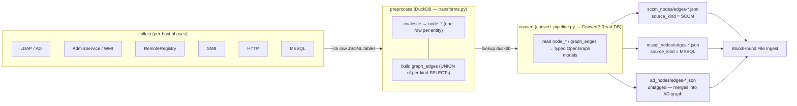
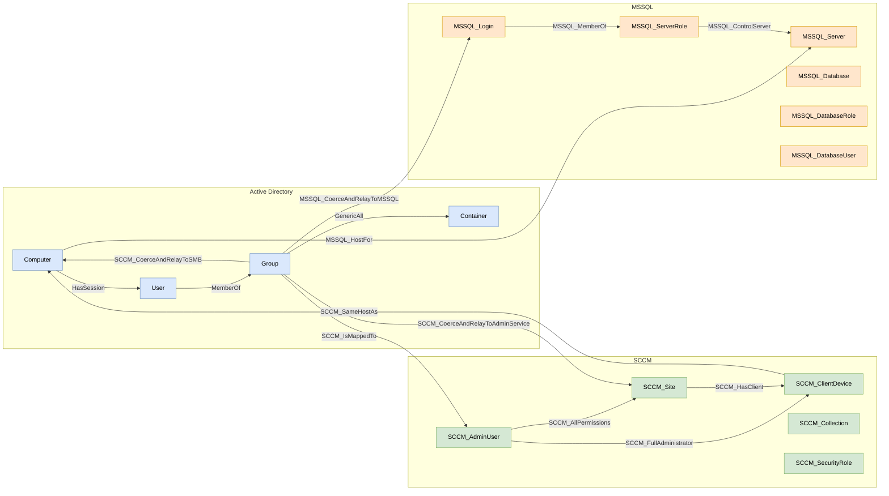
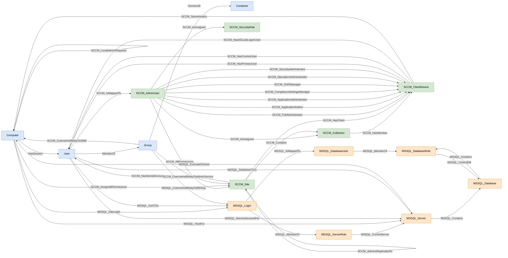

# The SCCM Collector for BloodHound


***ConfigManBearPig*** brings Microsoft Configuration Manager (formerly SCCM) attack paths to [BloodHound](https://github.com/SpecterOps/BloodHound) using [OpenGraph](https://specterops.io/opengraph). It is a Python rewrite of [ConfigManBearPig](https://specterops.io/blog/2026/01/13/introducing-configmanbearpig-a-bloodhound-opengraph-collector-for-sccm/), the PowerShell SCCM collector by Chris Thompson ([@_Mayyhem](https://x.com/_Mayyhem)) at [SpecterOps](https://x.com/SpecterOps). It is written on top of the [OpenHound](https://github.com/SpecterOps/openhound) collector framework by SpecterOps.

Where the PowerShell tool was a single self-contained script, this version runs on the OpenHound framework's three-stage pipeline (`collect` → `preprocess` → `convert`), producing an OpenGraph dataset you can upload to BloodHound's **File Ingest**.

Questions? Reach out on the [BloodHound Slack](http://ghst.ly/BHSlack) (@Mayyhem), on Twitter ([@_Mayyhem](https://x.com/_Mayyhem)), or [open an issue](https://github.com/SpecterOps/ConfigManBearPig/issues/new).

---

# Table of Contents

- [Quick Start](#quick-start)
- [Collection Overview](#collection-overview)
- [System Requirements](#system-requirements)
- [Assumptions](#assumptions)
  - [Assumed vs. confirmed graph content](#assumed-vs-confirmed-graph-content)
  - [Collection privilege tiers](#collection-privilege-tiers)
- [Limitations](#limitations)
- [Command Line Options](#command-line-options)
- [Automating the Upload](#automating-the-upload)
  - [Schemas — PUT /api/v2/extensions](#schemas--put-apiv2extensions)
  - [Saved queries — openhound searches upload](#saved-queries--openhound-searches-upload)
  - [Graph payloads](#graph-payloads)
- [Graph Model](#graph-model)
- [Node Reference](#node-reference)
  - [AD node naming](#ad-node-naming)
  - [Seed principals: what this collector creates vs. what it expects from AD collection](#seed-principals-what-this-collector-creates-vs-what-it-expects-from-ad-collection)
  - [Computer](#computer)
  - [Container](#container)
  - [Group](#group)
  - [User](#user)
  - [SCCM_AdminUser](#sccm_adminuser)
  - [SCCM_ClientDevice](#sccm_clientdevice)
  - [SCCM_Collection](#sccm_collection)
  - [SCCM_SecurityRole](#sccm_securityrole)
  - [SCCM_Site](#sccm_site)
  - [MSSQL_Database](#mssql_database)
  - [MSSQL_DatabaseRole](#mssql_databaserole)
  - [MSSQL_DatabaseUser](#mssql_databaseuser)
  - [MSSQL_Login](#mssql_login)
  - [MSSQL_Server](#mssql_server)
  - [MSSQL_ServerRole](#mssql_serverrole)
- [Edge Reference](#edge-reference)
  - [Entity-panel help properties](#entity-panel-help-properties)
  - [GenericAll](#genericall)
  - [HasSession](#hassession)
  - [MemberOf](#memberof)
  - [SCCM_AdminsReplicatedTo](#sccm_adminsreplicatedto)
  - [SCCM_AllPermissions](#sccm_allpermissions)
  - [SCCM_ApplicationAdministrator](#sccm_applicationadministrator)
  - [SCCM_ApplicationAuthor](#sccm_applicationauthor)
  - [SCCM_AssignAllPermissions](#sccm_assignallpermissions)
  - [SCCM_CoerceAndRelayToAdminService](#sccm_coerceandrelaytoadminservice)
  - [SCCM_CoerceAndRelayToSMB](#sccm_coerceandrelaytosmb)
  - [SCCM_ComplianceSettingsManager](#sccm_compliancesettingsmanager)
  - [SCCM_Contains](#sccm_contains)
  - [SCCM_FullAdministrator](#sccm_fulladministrator)
  - [SCCM_HasClient](#sccm_hasclient)
  - [SCCM_HasMember](#sccm_hasmember)
  - [SCCM_HasPrimaryUser / SCCM_HasCurrentUser / SCCM_HasADLastLogonUser](#sccm_hasprimaryuser--sccm_hascurrentuser--sccm_hasadlastlogonuser)
  - [SCCM_HasStoredAccount](#sccm_hasstoredaccount)
  - [SCCM_IsAssigned](#sccm_isassigned)
  - [SCCM_IsMappedTo](#sccm_ismappedto)
  - [SCCM_LocalAdminRequired](#sccm_localadminrequired)
  - [SCCM_OperationsAdministrator](#sccm_operationsadministrator)
  - [SCCM_OSDManager](#sccm_osdmanager)
  - [SCCM_SameHostAs](#sccm_samehostas)
  - [SCCM_SecurityAdministrator](#sccm_securityadministrator)
  - [MSSQL_CoerceAndRelayToMSSQL](#mssql_coerceandrelaytomssql)
  - [MSSQL_Contains](#mssql_contains)
  - [MSSQL_ControlDB](#mssql_controldb)
  - [MSSQL_ControlServer](#mssql_controlserver)
  - [MSSQL_ExecuteOnHost](#mssql_executeonhost)
  - [MSSQL_GetAdminTGS](#mssql_getadmintgs)
  - [MSSQL_GetTGS](#mssql_gettgs)
  - [MSSQL_HasLogin](#mssql_haslogin)
  - [MSSQL_HostFor](#mssql_hostfor)
  - [MSSQL_IsMappedTo](#mssql_ismappedto)
  - [MSSQL_MemberOf](#mssql_memberof)
  - [MSSQL_ServiceAccountFor](#mssql_serviceaccountfor)
  - [Attack path example — SQL sysadmin to SCCM site (mayyhem.com lab)](#attack-path-example--sql-sysadmin-to-sccm-site-mayyhemcom-lab)
  - [Attack path example — Full Administrator to client device (mayyhem.com lab)](#attack-path-example--full-administrator-to-client-device-mayyhemcom-lab)
- [Understanding the Codebase](#understanding-the-codebase)
- [Testing Changes](#testing-changes)
  - [Set up a development environment](#set-up-a-development-environment)
  - [If you are also editing the shared library](#if-you-are-also-editing-the-shared-library)
  - [Run the checks](#run-the-checks)
  - [Validate against a real hierarchy](#validate-against-a-real-hierarchy)
- [Contributing](#contributing)
- [Work in Progress](#-work-in-progress)
- [Reference Key](#reference-key)

---

# Quick Start

The collector is an OpenHound extension: it plugs into the `openhound` CLI as
`openhound collect sccm`.

> **Check this first: you want the PostgreSQL graph backend.** Switching to PostgreSQL is the only
> supported way to get **Search** and **Pathfinding** working with OpenGraph data — so on a Neo4j-backed
> instance the `SCCM_*` and `MSSQL_*` kinds will not turn up in the search box or in pathfinding results.
> Cypher still works either way, so a Neo4j instance can query this collector's graph; you are just
> limited to writing the queries yourself (the [saved queries](#3-upload-to-bloodhound) below help).
> https://bloodhound.specterops.io/get-started/custom-installation#postgresql

> **No SCCM lab handy?** [`sample_data/`](sample_data/) holds four real collections from the mayyhem.com
> test lab — privileged and unprivileged, each with and without `--disable-possible-edges` — as
> upload-ready zips, plus the full DEBUG log for each run. Enough to see the graph and read a
> collection end-to-end before building a hierarchy of your own.

### 1. Install

```powershell
uv tool install openhound --with configmanbearpig --prerelease=allow
```

That is the whole install. It pulls the OpenHound framework, this collector, and the
runtime dependencies (`ldap3`, `impacket`, `dnspython`, and — on Windows — `pywin32` and
`winkerberos`), and puts `openhound` on your PATH.

Prefer `pip`? `pip install openhound configmanbearpig` into a virtualenv, with no extra flag.
(`--prerelease=allow` is a `uv` requirement, not a broken package — see [Limitations](#limitations).)

**Working on the collector rather than using it?** Clone this repository and run
`uv sync --group dev` from its root; every `uv run openhound …` below then exercises your
checkout instead of the installed release. See [Testing Changes](#testing-changes).

### 2. Collect and build the graph

`--run-all` chains all three stages — collect, preprocess, convert — in one command. Run it from a
domain-joined Windows host and the domain and domain controller are auto-detected:

```powershell
uv run openhound collect sccm .\out --run-all -v
```

On Linux/macOS, or to authenticate as someone other than the current user, supply them explicitly:

```powershell
uv run openhound collect sccm .\out --run-all -d mayyhem.com --dc dc01.mayyhem.com -u "MAYYHEM\lowpriv" -p "Passw0rd!" -v
```

That writes everything into `.\out`:

| Path | What it is |
|---|---|
| `sccm\<table>\*.jsonl` | The raw collected tables, one directory per table |
| `lookup.duckdb` | The DuckDB lookup database `convert` reads |
| `graph\sccm_nodes-*.json`, `graph\sccm_edges-*.json` | **SCCM payload** — every `SCCM_*` node, and every edge with at least one SCCM endpoint (including SCCM↔MSSQL) |
| `graph\mssql_nodes-*.json`, `graph\mssql_edges-*.json` | **MSSQL payload** — every `MSSQL_*` node, and every edge whose endpoints are **both** MSSQL nodes |
| `graph\ad_nodes-*.json`, `graph\ad_edges-*.json` | **AD payload** — `Computer` / `User` / `Group` / `Container` nodes and every edge touching one (including AD↔MSSQL) |
| `graph\configmanbearpig_collection_<timestamp>.zip` | **Bundle** — every graph `.json` above, flat-zipped for one-shot upload (written by `--run-all` only) |
| `collect_full_<timestamp>.log` | The complete DEBUG trace, grouped host-by-host and resource-by-resource |
| `collect_issues_<timestamp>.log` | Warnings and errors with tracebacks — absent from a clean run |

Upload **all three** payloads together; they are three parts of one graph — or upload the single
`configmanbearpig_collection_<timestamp>.zip` bundle in their place, which contains the same files
flat-zipped for one-shot upload. `--run-all` prints that bundle's full path as the **last line** of
the run, so you can copy it straight out of the terminal:

```
--run-all complete. Output files:
    Output directory:    C:\...\out
    Raw data (JSONL):    C:\...\out\sccm
    Full log:            C:\...\out\collect_full_20260801_193720.log
    Issues log:          C:\...\out\collect_issues_20260801_193720.log  (9 warning(s)/error(s), with tracebacks)
    Lookup DB:           C:\...\out\lookup.duckdb
    OpenGraph files (6):
        C:\...\out\graph\ad_edges-1.json
        ...
    Upload to BloodHound: C:\...\out\graph\configmanbearpig_collection_20260801_193720.zip
``` Re-running into a directory that already holds a collection **merges**
the two collections — pass `--clean` to start fresh, and see [Limitations](#limitations) for why that matters.

If preprocess or convert fails, the raw data in `.\out` is left intact and the exact resume commands are
logged, so you never have to recollect. To run the three stages yourself, see
[Running the stages separately](#running-the-stages-separately).

### 3. Upload to BloodHound

Three uploads, all drag-and-drop in the BloodHound UI. Only the middle one repeats per run — and do the
schemas **first**, because ingesting before the kinds are registered leaves the `SCCM_*` and `MSSQL_*`
nodes unstyled and missing from the search and pathfinding menus.

| # | What | Where in the UI | How often |
|---|---|---|---|
| 1 | The two schema files | **Administration → OpenGraph Management → Upload File** | Once per BloodHound instance |
| 2 | The graph payloads from `.\out\graph` | **Administration → Data Collection → File Ingest → Upload File(s)** | Every run |
| 3 | The saved Cypher queries | **Explore → Cypher → Saved Queries** | Once |

**1. Register the schemas.** `schema_SCCM.json` covers every `SCCM_*` node and edge kind;
`schema_MSSQL.json` covers the `MSSQL_*` kinds this collector also emits (site-server SQL topology), so
uploading only the SCCM one leaves those unrenderable. Upload both under **Administration → OpenGraph
Management → Upload File** ([docs](https://bloodhound.specterops.io/opengraph/schema)).

Download them straight from this repository — [schema_SCCM.json](src/openhound_sccm/schema_SCCM.json) and
[schema_MSSQL.json](src/openhound_sccm/schema_MSSQL.json) — or take them from the copy that shipped with
your install, which is the one guaranteed to match the version you are running:

```powershell
# From a checkout: the files are in src\openhound_sccm\
# From an installed copy: ask the interpreter that has the package where it lives
uv run python -c "import openhound_sccm, pathlib; print(pathlib.Path(openhound_sccm.__file__).parent)"
```

**2. Ingest the graph.** Drag the contents of `.\out\graph` into **File Ingest** (or zip it first — it
accepts `.zip` as well as loose `.json`). Upload **both** payloads together: the `sccm_*` files carry the
SCCM and MSSQL kinds, and the `ad_*` files carry the AD nodes those attach to.

**3. Load the saved queries.** [cypher_queries/](cypher_queries/) holds 24 ready-made queries for this
graph — the `TAKEOVER`/`CRED`/`ELEVATE` attack chains, SCCM admin and infrastructure inventories, and the
site-database-service-account path. Drag the JSON files (or a zip of them) onto **Saved Queries**;
BloodHound validates each one and reports any it rejects.

Check out the [introductory blog post](https://specterops.io/blog/2026/01/13/introducing-configmanbearpig-a-bloodhound-opengraph-collector-for-sccm/)
for how to use each query.

Scripting this instead — for CI, or to re-upload queries across instances — is in
[Automating the Upload](#automating-the-upload).

---

# Collection Overview

`collect` runs in two stages, defined in [`collect_sccm`](src/openhound_sccm/main.py) and [`source.py`](src/openhound_sccm/source.py). These two **collection** stages come from the per-host collection framework plan, [`docs/superpowers/plans/2026-06-03-per-host-collection-framework.md`](docs/superpowers/plans/2026-06-03-per-host-collection-framework.md) (walkthrough: [`docs/per-host-collection-framework-tour.md`](docs/per-host-collection-framework-tour.md)). They are a different numbering from the graph-pipeline stages referred to elsewhere in this README — see the [Reference key](#reference-key).

```text
                            openhound collect sccm
                                       │
        ┌──────────────────────────────┴─────────────────────────────┐
        │  Stage 1 — Discovery (runs once)                           │
        │  LDAP · Local · DNS                                        │
        │  → seeds the work queue with candidate hosts               │
        └──────────────────────────────┬─────────────────────────────┘
                                       │
        ┌──────────────────────────────┴─────────────────────────────┐
        │  Stage 2 — Per-host phases (worker pool)                   │
        │  RemoteRegistry · MSSQL · AdminService · WMI · HTTP · SMB  │
        │  gated by --collection-methods                             │
        │  loops as new hosts are discovered                         │
        └──────────────────────────────┬─────────────────────────────┘
                                       │
                               raw JSONL on disk
                                       │
                     preprocess  →  DuckDB lookup database
                                       │
                      convert  →  OpenGraph nodes + edges
```

## Stage 1 — Discovery (once-phases)

These resources run a single time per collection and seed the per-host work queue. Each is gated by `--collection-methods` (`LDAP`, `DNS`, `Local`), so `--dc-only` (which forces `LDAP,DNS`) runs LDAP and DNS discovery while skipping local collection and every per-host phase.

| Discovery resource | What it does | Status |
|---|---|---|
| **LDAP** ([collectors/ldap.py](src/openhound_sccm/collectors/ldap.py)) | Queries the AD **System Management** container for SCCM **sites** (`mSSMSSite`), **management points** (`mSSMSManagementPoint`), the container **DACL**, network-boot servers, devices with the `CmRcService` SPN, and computers whose names/descriptions match SCCM naming patterns (`sccm`, `mecm`, `sms`, …). Registers discovered site systems as per-host targets. | ✅ Implemented |
| **Local** ([collectors/local.py](src/openhound_sccm/collectors/local.py)) | When run on an SCCM client: reads the `root\CCM` WMI namespace (`SMS_Authority`, `SMS_LookupMP`, `CCM_Client`) and parses CCM client logs to find management points / distribution points and the local client's SMSID. **Windows-only.** | ✅ Implemented (Windows) |
| **DNS** ([collectors/dns.py](src/openhound_sccm/collectors/dns.py)) | For each discovered site code, resolves the `_mssms_mp_<sitecode>._tcp.<domain>` SRV record (with an ADIDNS/LDAP fallback) to find management points published to DNS. | ✅ Implemented |

## Stage 2 — Per-host phases

Each discovered (or `--computers`-supplied) host runs through the ordered per-host phases in [`per_host_phases.py`](src/openhound_sccm/per_host_phases.py), concurrently across a worker pool (`--threads`). A phase only runs for a host when its name is enabled by `--collection-methods` (`method_enabled` in [context.py](src/openhound_sccm/context.py)).

| Phase | What it does | Status |
|---|---|---|
| **RemoteRegistry** ([collectors/registry.py](src/openhound_sccm/collectors/registry.py)) | Binds the remote registry over SMB (impacket `rrp`) to read SCCM keys under `HKLM\SOFTWARE\Microsoft\SMS` — site codes, component servers/roles, current users, and SQL/MSSQL settings. Retries the initial bind to absorb the RemoteRegistry trigger-start race. | ✅ Implemented |
| **MSSQL** ([collectors/mssql.py](src/openhound_sccm/collectors/mssql.py)) | Connects to the host's SQL Server (TCP/1433) and probes its **Extended Protection for Authentication (EPA)** enforcement using [clients/mssql_epa.py](src/openhound_sccm/clients/mssql_epa.py). | ✅ Implemented |
| **AdminService** ([collectors/privileged.py](src/openhound_sccm/collectors/privileged.py)) | Queries the SCCM AdminService REST API (`https://<provider>/AdminService/wmi/...`) over Negotiate and collects the site hierarchy, site definitions, reserved accounts, devices, users, **security groups** (`SMS_R_UserGroup` — each group's name *and* SID, used to resolve `SecurityGroupName` memberships to Group nodes offline), collections, security roles, admins, and site-system roles into raw `adminservice_*` tables, which `preprocess` reads to build the site, client-device, collection, admin-user and security-role families. | ✅ Implemented |
| **WMI** ([collectors/privileged.py](src/openhound_sccm/collectors/privileged.py)) | **Fallback for AdminService.** Shares the *same* collection helpers as the AdminService phase (one set, parameterized per transport in `privileged.py`); when AdminService is unreachable on a host, it reads the same SMS Provider classes directly in the `root\SMS\site_<code>` WMI namespace (over DCOM via impacket, or pywin32 for the current Windows user) and writes the matching `wmi_*` tables. Runs only on hosts AdminService did **not** already collect — gated by `should_run_phase` reading `TargetEntry.completed_phases`. | ✅ Implemented |
| **HTTP** ([collectors/http.py](src/openhound_sccm/collectors/http.py)) | **Unauthenticated** probing of the SCCM web endpoints over http then https — `SMS_MP/.sms_aut` (`MPKEYINFORMATION`/`MPLIST`/`SMSTRC`/`MPLIST1`), `SMS_DP_SMSPKG$`, `AdminService/wmi/SMS_Identification`, and the site-signing certificate — to identify **Management Point**, **Distribution Point**, **SMS Provider**, and **Site Server** roles from the 401/403/200 status codes. Enumerates and registers sibling MPs and the site server as new probe targets; writes raw `http_*` role tables. On a confirmed Management Point, also fetches `/CCM_Client/ccmsetup.exe` (still unauthenticated) and regexes the embedded version string out of the binary to fingerprint the site's SCCM build (the [SCCMVersionGuesser](https://github.com/synacktiv/SCCMVersionGuesser) technique) — feeds `SCCM_Site.version`/`versionCVEs` when privileged collection found no version, which in turn gates the [`SCCM_CoerceAndRelayToAdminService`](#sccm_coerceandrelaytoadminservice) edge. **Bandwidth/OPSEC note:** v1 downloads the entire `ccmsetup.exe` (multiple MB) rather than a bounded/`Range` fetch, which is a bigger and noisier footprint than every other probe in this row (those read a few KB of XML/JSON at most); a bounded fetch is a future optimization. Skipped on hosts AdminService/WMI already collected. | ✅ Implemented |
| **SMB** ([collectors/smb.py](src/openhound_sccm/collectors/smb.py)) | An **unauthenticated** SMB2-negotiate **signing-required** check (via [clients/smb.py](src/openhound_sccm/clients/smb.py)), then **authenticated** share enumeration (`NetShareEnum`) that classifies SCCM-specific shares — `SMS_SITE`/`SMS_<code>` (Site Server), `SMS_DP$` (Distribution Point), `REMINST` (PXE), `SCCMContentLib$`/`SMSPKG` (content library) — into site-system roles and a site code. Writes raw `smb_computers` / `smb_sites` tables. Skipped on hosts AdminService/WMI already collected. | ✅ Implemented |
| **DHCP** | Accepted as a `--collection-methods` token, but the per-host collector is not yet ported. | 🚧 Not yet ported |

## Running the stages separately

[Quick Start](#quick-start) uses `--run-all`, which chains the three stages in one process. Run them
individually when you want to re-derive the graph from data you already collected — the usual reason is
iterating on `preprocess`/`convert` without re-touching the network:

```powershell
uv run openhound collect sccm .\out -d mayyhem.com --dc dc01.mayyhem.com -u "MAYYHEM\lowpriv" -p "Passw0rd!"
uv run openhound preprocess sccm .\out .\out\lookup.duckdb
uv run openhound convert sccm .\out\sccm .\out\graph --lookup-file .\out\lookup.duckdb
```

Those three are exactly what `--run-all` does. `preprocess` loads the raw JSONL into DuckDB and builds
the derived tables `convert` reads (site hierarchies, SID resolution, role mappings, and so on);
`convert` turns those tables into the OpenGraph payloads. Because `preprocess` and `convert` only read
what `collect` already wrote, re-running the last two over a cached output directory is the cheapest way
to test a graph change — it holds collection constant, so the only thing that can move is your change.

Scoping a collection to specific phases and hosts is also useful on its own:

```powershell
# Only check the PS1 site database server for Extended Protection for Authentication
uv run openhound collect sccm .\out -d mayyhem.com -m RemoteRegistry,MSSQL -c ps1-db.mayyhem.com -v
```

**DC-only recon — map SCCM from AD without touching any host:**

```powershell
uv run openhound collect sccm .\out --dc-only --run-all -d mayyhem.com
```

Collects only LDAP + DNS from the domain controller, then preprocesses and converts that discovery data
into a graph (sites, management points, discovered computers, and LDAP-sourced edges such as
`GenericAll` on the System Management container) — with no connection to any SCCM site system or client.

---

# System Requirements

**Host running the collector:**

- **Python 3.13 or 3.14** (`requires-python = ">=3.13,<3.15"`) and [`uv`](https://docs.astral.sh/uv/).
- The **OpenHound framework** (`openhound>=0.2.12`, resolved from PyPI as a declared dependency — no separate install step).
- Network line of sight to a **domain controller** and to the SCCM systems you target.
- **Active Directory context.** On **Windows**, the domain and a domain controller are auto-detected from the current user's context (`USERDNSDOMAIN`, then a DNS SRV lookup). On **Linux/macOS** you must pass `-d/--domain` (and `-u`/`-p` for any phase that authenticates); `--dc` is still resolved via DNS SRV if omitted.
- **Windows-only features:** local WMI/log collection, and current-user integrated authentication (Kerberos via `winkerberos`, NTLM via SSPI/`pywin32`). On Linux, integrated auth needs `gssapi[kerberos]` installed separately; explicit credentials work everywhere.

**Privileges needed per phase:**

| Phase | Minimum privilege |
|---|---|
| LDAP discovery | Any authenticated domain user |
| DNS discovery | **None** — a plain SRV query, no AD authentication at all |
| HTTP | **None** — every SCCM web-endpoint probe (including the site-signing-certificate probe) runs anonymous; no domain credentials are ever presented |
| RemoteRegistry | **Depends on the key — most of the SCCM data needs only a domain user.** The `HKLM\SOFTWARE\Microsoft\SMS` keys the phase relies on for discovery — the site code (`Triggers`), the site-system roles (`COMPONENTS\SMS_SITE_COMPONENT_MANAGER\Component Servers` and `Multisite Component Servers`), and the logged-on user (`CurrentUser`) — are readable by **any authenticated domain user** with SMB access to the host. **Local administrator** is required only for the host-hardening values: SMB signing (`SYSTEM\CurrentControlSet\Services\LanManServer\Parameters`), the NTLM restrictions (`SYSTEM\CurrentControlSet\Control\Lsa` and `Lsa\MSV1_0`), and SQL Server's `SuperSocketNetLib` encryption settings. A non-admin run collects the former and skips the latter rather than failing the phase, reporting each host's refused reads as a single warning — see [What a low-privilege run looks like](#what-a-low-privilege-run-looks-like). Note that the SMS keys are readable by a plain domain user *by default*; a host with tightened ACLs can refuse those too, in which case the site code is unknown and the rest of the phase is skipped for that host. See [collectors/registry.py](src/openhound_sccm/collectors/registry.py). |
| MSSQL (EPA detection) | Any domain user can probe a reachable SQL Server; reading the setting via RemoteRegistry instead needs local admin on the DB host. The registry route covers **named instances** as well as the default one — it reads SQL Server's own instance inventory (`SOFTWARE\Microsoft\Microsoft SQL Server\Instance Names\SQL`) and derives each instance's settings path from it, so an instance like `CONFIGMGRSEC` is found rather than missed |
| SMB | The signing-required check is **unauthenticated** (anyone with TCP/445 line of sight); share enumeration needs an **authenticated** SMB session (any domain user — current Windows user via SSPI, or `-u`/`-p`, `--nt-hash`, `--ticket`) |

> See [Collection privilege tiers](#collection-privilege-tiers) under [Assumptions](#assumptions) for what a given combination of these phases actually builds in the graph.

**BloodHound side:**

- BloodHound with **OpenGraph** support.
- A **PostgreSQL** graph backend — the only supported way to get **Search** and **Pathfinding** working with OpenGraph data. Cypher works against the SCCM kinds on Neo4j too, but they will not surface in search or pathfinding there: https://bloodhound.specterops.io/get-started/custom-installation#postgresql

**A note on `uv` and Python on Windows:** [pyproject.toml](pyproject.toml) sets `python-preference = "only-system"`. uv-managed (`python-build-standalone`) builds ship a `libcrypto` without the `OPENSSL_Applink` cross-CRT shim, which aborts TLS handshakes mid-flight — so on Windows the collector deliberately prefers an official/system Python.

---

# Assumptions

The collector relies on these assumptions about the target environment and how its output is consumed. They hold for the overwhelming majority of real deployments, but violating one can corrupt the graph (see [Limitations](#limitations)).

- **Site codes are unique within an organization.** A site code is only three characters and SCCM provides no globally unique hierarchy identifier, so the collector uses the (hierarchy-root) **site code as the `environmentid`** for SCCM-native nodes — those with no AD-domain home (`SCCM_Site` today, and the other SCCM-specific kinds as the port adds them). If two distinct hierarchies in the same organization reuse a site code, their SCCM environments collide and merge. Microsoft likewise recommends against reusing site codes within a forest: https://learn.microsoft.com/en-us/intune/configmgr/core/servers/deploy/install/prepare-to-install-sites#bkmk_sitecodes
- **One organization per graph.** Do not load data collected from two different organizations into the same BloodHound graph. Because site codes are not globally unique across organizations, a shared site code would merge the two organizations' SCCM environments. Collect and ingest each organization into its own graph.

> AD-native nodes (`Computer`, `User`, `Group`) are unaffected by the above: they use their AD **domain SID** as `environmentid`, so they merge with existing SharpHound data by SID rather than by site code.

## Assumed vs. confirmed graph content

Everything the collector emits falls into one of two buckets: **confirmed** (built straight from observed
data — a probed setting, an ACL, a resource table) or **assumed** (templated/inferred, the way
ConfigManBearPig's own post-processing fills gaps it can't directly observe). Assumed nodes and edges stay
**traversable** — BloodHound's attack-path engine still follows them — but they carry a machine-readable
provenance stamp so an operator can tell the two apart: `assumed = true` and a human-readable
`assumptionBasis` string. A confirmed node/edge simply omits both (they show as absent/null in
BloodHound's entity panel, not `false`).

> **`collectionSource` names the collection phase, not the assumption.** Most assumed families also
> fold an `Assumed-<Family>` tag into `collectionSource`. The **MSSQL site-database scaffolding** no
> longer does: as of 2026-07-31 its `collectionSource` carries the originating collection phase
> instead — `RemoteRegistry-MultisiteComponentServers`, `AdminService-SiteDefinition`,
> `LDAP-MSSQLSvcSPN`, `MSSQL-ScanForEPA` — so a reader can see *which transport and therefore which
> privilege level* produced a node, which the old static `SCCM-SiteDBDefaultSchema` tag could not.
> Nothing is lost: assumedness still rides on `assumed` and `assumptionBasis` for that family exactly
> as for every other.

The table below is the full catalog — one row per assumed family — with its inference rule, the data it's
built from, whether `--disable-possible-edges` removes it, and the caveat that makes it a false-positive
risk:

| Family | Assumed because… | Built from | Removed by `--disable-possible-edges`? | False-positive caveat |
|---|---|---|---|---|
| `SCCM_ClientDevice` (possible, `is_confirmed_active_client = false`) + `SCCM_SameHostAs` + `SCCM_HasClient` to it | A `CmRcService` SPN in AD is treated as evidence of an enrolled client even with no confirmed SCCM enrollment record | LDAP (`ldap_cmrc_devices`) | **Yes** — not emitted at all | The SPN can linger in AD after a client was decommissioned, or belong to a device enrolled in a *different* hierarchy |
| `site_hierarchy` root, when 2+ untyped sites exist and none was observed as a CAS / `RootSiteCode` / parentless Primary | Picking one of several untyped sites as the hierarchy root is a guess, made alphabetically | LDAP `ldap_sites`, RemoteRegistry, HTTP, SMB, DNS (every source that reports only a bare site code, no type) | **Yes** — the root is left unresolved instead of guessed (SCCM-native node ids lose their `@<root>` scope) | The wrong root anchors every SCCM-native node id minted in the run; a **single** untyped site is deduction, not a guess, and is unaffected by the flag |
| MSSQL site-database identity via the `SPN+SCCM` basis — feeds `MSSQL_Server.SCCMSite`/`.SCCMInfra`/`.databases`, `MSSQL_Database`, `MSSQL_ServerRole`, `MSSQL_DatabaseRole`, `MSSQL_Login`, `MSSQL_DatabaseUser`, their `Contains`/`MemberOf`/`HasLogin`/`IsMappedTo`/`Control*` edges, and `MSSQL_GetTGS`/`MSSQL_GetAdminTGS` off that login | A host with an `MSSQLSvc` SPN that is *also* SCCM-related (carries an SMS role, or `sccm_infra`) is treated as **the** site database, not merely a co-located SQL Server | AD (`MSSQLSvc` SPN, via `mssql_server_instances.has_mssql_spn`) + `node_computer` site-system role tags | **Yes** — the whole basis is dropped; a **confirmed** site database (RemoteRegistry / AdminService / WMI) keeps its full scaffolding in **both** modes with **no** stamp, since the schema SCCM requires there follows from the confirmed fact, not a guess | Nothing confirms this SQL Server is *this* site's database rather than an unrelated one that merely happens to sit on an SCCM-tagged host |
| `SCCM_AssignAllPermissions` (`Computer` SMS Provider → `SCCM_Site`) | Hosting the SMS Provider role is templated as implying hierarchy-wide RBAC control, not read from an actual grant | RemoteRegistry / HTTP / LDAP role tag + site hierarchy | No — CMBP itself emits this family under its own `-DisablePossibleEdges` | A role tag attributed to the wrong site would overstate an admin's real reach |
| `SCCM_LocalAdminRequired` | Two rules, neither reading a local-group membership list. **Within a site:** co-location as site systems of the same site is templated as mutual local-administrator rights. **Parent primary → child secondary:** Microsoft's documented setup prerequisite (the parent primary's computer account is added to the secondary site server's Administrators group) is templated as still being in force | Role tags (RemoteRegistry/HTTP/LDAP) + site hierarchy; the cross-site rule additionally needs a **positively known** `siteType = 1` on the child | No | An admin who removed the default grant during a hardening pass, or a role tag attributed to the wrong site, makes this overstate real access. The cross-site rule is silent where secondary-ness could not be established, so at low privilege it emits nothing rather than guessing |
| `SCCM_CoerceAndRelayToAdminService` | An unset (`null`) inbound-NTLM restriction on the SMS Provider is treated as vulnerable — this **is** the Windows default (0 = allow all inbound NTLM), so it is a measured fact about the default rather than a guess | RemoteRegistry NTLM setting on the Provider + role/site topology | No — the "unset = vulnerable" reasoning holds in both modes | Suppressed on a site confirmed to run SCCM 2509+ (rejects NTLM); an unknown/unparseable version fails **open** and may false-positive |
| `SCCM_CoerceAndRelayToSMB` | Same NTLM reasoning as above; SMB signing itself is never assumed — it must still be **confirmed** not required | RemoteRegistry/SMB-negotiate signing check + NTLM setting + role/site topology | No | Same NTLM caveat as above |
| `MSSQL_CoerceAndRelayToMSSQL` | NTLM uses the same unconditional "unset = vulnerable" rule as the other two relay families. Extended Protection is different: a null/uncollected EPA setting is *also* treated as vulnerable by default (an actual assumption, not a Windows-default fact) | RemoteRegistry/MSSQL EPA probe (EPA) + RemoteRegistry NTLM (coerced host) | **Partially** — only the EPA half: with the flag, EPA must be **explicitly** `Off` | `assumed`/`assumptionBasis` are stamped **per row**, only when EPA was never measured — a measured `Off` is evidence, not an assumption, so those rows are unstamped even by default |

> **Known gap:** the Database→Site configuration of `SCCM_AssignAllPermissions` (a site database asserting
> control of its own site, see [Edge Reference](#sccm_assignallpermissions)) is built from the same
> `node_mssql_database` row that carries the `SPN+SCCM`/confirmed basis, but the edge builder does not
> currently copy that row's `assumed`/`assumptionBasis` onto the edge — so this specific edge shape never
> carries the stamp today, unlike its sibling SMS-Provider→Site configuration above. The underlying node it
> hangs off still reflects the correct confirmed/assumed status.

## Collection privilege tiers

Because `site_hierarchy` is now fed from every site-code source the collector has — not just
AdminService/WMI — a real graph builds up incrementally as more privilege becomes available, rather than
jumping from "almost nothing" to "everything" the moment AdminService is reachable:

| Privilege level | What it adds | Example flags |
|---|---|---|
| **Anonymous** — no domain credentials at all (HTTP + DNS, both unauthenticated) | A site code; Management Point / Distribution Point / SMS Provider / Site Server role tags from the unauthenticated HTTP probes (including the site-signing-certificate probe, the *only* credential-free way to identify the Site Server); DNS-discovered Management Points; the relay-feasibility edges those roles and the site hierarchy alone support (`SCCM_LocalAdminRequired`, `SCCM_CoerceAndRelayToAdminService`). Adding the SMB phase's signing-required check (also unauthenticated — `-m HTTP,DNS,SMB`) additionally **confirms** which of those site systems don't require SMB signing, which is what `SCCM_CoerceAndRelayToSMB` needs (that check is the only thing this edge never assumes). | `-m HTTP,DNS --sc <site_code> -c <known_mp_or_site_server>` |
| **+ domain user** — any authenticated account, no local-admin/AdminService rights | The LDAP-derived hierarchy with real type/parent/true root (LDAP management-point capabilities); the Fallback Status Point role; SMB share-based role/site discovery; RemoteRegistry-confirmed roles plus the current-user `HasSession` edge on any host the account happens to be a local admin on; the System Management container's `Container`/`GenericAll`/nested `MemberOf` graph; `MSSQLSvc`-SPN-based `MSSQL_Server`/`Computer` nodes (confirmed the moment the SPN exists, even with 1433 filtered) and the low-priv `MSSQL_ServiceAccountFor`/`HasSession`/`MSSQL_GetTGS`/`MSSQL_GetAdminTGS` edges off the SPN holder | `-m LDAP,RemoteRegistry,SMB,MSSQL,HTTP,DNS` (or `All`) |
| **+ AdminService/WMI** — SMS Provider or SCCM RBAC read access | Everything above, **plus** the SCCM-admin-only families below that no lower privilege level can produce at all | `-m All` (the default) |

> **Requires SCCM admin access.** Two groups need SMS Provider or SCCM RBAC read access, because
> nothing at a lower privilege level can produce them at all.
>
> **RBAC families** — `SCCM_FullAdministrator`, `SCCM_ApplicationAuthor`,
> `SCCM_ApplicationAdministrator`, `SCCM_ComplianceSettingsManager`, `SCCM_OSDManager`,
> `SCCM_OperationsAdministrator`, `SCCM_SecurityAdministrator`, `SCCM_AllPermissions`, `SCCM_IsAssigned`,
> `SCCM_IsMappedTo`, `SCCM_HasMember`, and the `SCCM_AdminUser` / `SCCM_SecurityRole` / `SCCM_Collection`
> nodes themselves have no AD/LDAP representation, and RemoteRegistry does not expose them either.
> `SCCM_Contains` edges that *target* one of those three node kinds inherit the same requirement — the
> edge cannot exist without its endpoint.
>
> **Device inventory** — `SCCM_HasPrimaryUser`, `SCCM_HasCurrentUser` and `SCCM_HasADLastLogonUser` come
> from the SCCM device record (user-device affinity, current logon user, AD last-logon user), which lives
> only in the site database. A domain user can enumerate the *computer* from AD but never SCCM's view of
> who uses it.
>
> Their absence from a low-privilege run is **correct behavior, not a bug**: do not expect them until you
> collect with AdminService/WMI reachable. The fixture suite skips rather than asserts them on such a run
> without you having to say so — [`--integration-privilege`](#testing) defaults to `auto`, which reads
> whether AdminService/WMI actually returned any rows.
>
> Not everything missing from a low-privilege run belongs here, though. `SCCM_HasClient`,
> `SCCM_SameHostAs` and `HasSession` are *intended* to work without SCCM admin — if they are absent, that
> is a collector gap rather than a privilege boundary.

Credential-free example against the `mayyhem.com` lab (no `-u`/`-p` at all — just HTTP and DNS against a
known management point):

```powershell
uv run openhound collect sccm .\out-anon -d mayyhem.com --dc dc01.mayyhem.com `
  -m HTTP,DNS --sc PS1 -c ps1-sms.mayyhem.com --run-all --clean
```

This alone yields a `PS1` site code, an `SMS Site Server@PS1` role on `ps1-sms`, and the
`SCCM_LocalAdminRequired` / `SCCM_CoerceAndRelayToAdminService` edges built off that role and site — with
zero domain credentials presented anywhere in the run.

---

# Limitations

- **Installing with `uv` needs `--prerelease=allow`.** The collector requires `ldap3>=2.10.2rc4`. That release candidate is the first to export `ENCRYPT` and `TLS_CHANNEL_BINDING` and to accept `session_security` on a `Connection` — the three things LDAP sign-and-seal and channel binding are built on, and therefore what it takes to bind to a domain controller that enforces signing or channel binding (increasingly the default). ldap3 has never shipped them in a final release: its latest stable is 2.9.1, and 2.10.2 exists only as release candidates. `pip` allows a pre-release automatically when the requirement itself names one; `uv` asks you to opt in. Without the flag, `uv tool install` reports *"only ldap3<2.10.2rc4 is available"*, which looks like a broken package and is not. (Inside this project — `uv sync`, `uv run` — no flag is needed: a project is allowed its own declared pre-release. See [Testing Changes](#testing-changes).)
- **Re-running into the same output directory silently merges two collections.** `collect` (via the underlying `dlt` framework) **appends** a new load package beside any already in the output directory rather than overwriting it, and `preprocess` then reads every package and **UNIONs** their rows into one graph. Nothing looks wrong when this happens — the command exits 0 and `graph\` gets fresh timestamps — but a table this run finds empty silently **keeps the previous run's rows**, so a decommissioned site system, a stale role, or a removed client can linger in the graph indefinitely. Pass `--clean` to remove `out\sccm`, `out\graph`, and `out\lookup.duckdb` before collecting (timestamped logs and integration/compare reports are always kept). Without the flag, a used directory still produces a loud console and `collect_issues_*.log` warning — naming how many prior load packages are present and when the oldest was written — but the collection proceeds and nothing is cleaned up for you. See [`--clean`](#--clean-and-re-running-into-a-used-output-directory).
- **Graph output covers graph-pipeline Stages 1–6 plus the low-privilege additions.** (Those are the increments of the preprocess/convert port — plans [`2026-06-16-sccm-preproc-convert-stage0.md`](docs/superpowers/plans/2026-06-16-sccm-preproc-convert-stage0.md) … [`2026-07-01-sccm-preproc-convert-stage7.md`](docs/superpowers/plans/2026-07-01-sccm-preproc-convert-stage7.md); see the [Reference key](#reference-key).) `convert` now emits fifteen node kinds and thirty-eight edge kinds (see the [Node Reference](#node-reference) and [Edge Reference](#edge-reference)). Richer edges from NAA secrets await the NAA-secret collector.
- **An AD node with no resolvable domain FQDN ships without a name.** `Computer` / `User` / `Group` / `Container` nodes merge into BloodHound's native AD graph by id, so any `name` this collector emits overwrites SharpHound's. Rather than risk replacing a correct label with a partial one, a node whose SharpHound-format name cannot be built is emitted with **no** `name` or `displayname`, and BloodHound displays its object id instead. In a standalone graph (no SharpHound data ingested) those nodes read as raw SIDs or GUIDs. Backfilled endpoint stubs are always in this state by design. Both are visible in the preprocess log as `sharphound_name: N <table> row(s) could not be given a SharpHound-format name`. See [AD node naming](#ad-node-naming).
- **The synthetic Authenticated Users node carries no membership.** It is seeded so the coerce-and-relay edges have a traversable start, but no `MemberOf` edges point into it — enumerating a domain's principals is an AD collection's job. Paths *from* Authenticated Users onward work standalone; paths *into* it from an arbitrary user require a SharpHound collection ingested alongside. `Everyone` and `Domain Computers` are deliberately not seeded at all. See [Seed principals](#seed-principals-what-this-collector-creates-vs-what-it-expects-from-ad-collection).
- **MSSQL logins, database users, and roles are inferred from SCCM topology, not enumerated from SQL.** The `MSSQL_Login` and `MSSQL_DatabaseUser` nodes (and the `sysadmin` / `db_owner` role nodes) are built from SCCM's knowledge of which computers are Primary Site Servers or SMS Providers for a given site — the same inference CMBP makes. No live SQL connection is opened during `preprocess` or `convert`; the collector's MSSQL phase only probes EPA. This means logins/users/roles are only created for SCCM-linked SQL servers, and only for the machine accounts SCCM architecturally grants `sysadmin` access.
- **Non-SCCM SQL servers appear as bare `MSSQL_Server` nodes.** SQL servers discovered by the EPA scan or RemoteRegistry that are not referenced by any SCCM site produce an `MSSQL_Server` node (with `MSSQL_HostFor` / `MSSQL_ExecuteOnHost` edges) but no `MSSQL_Database`, `MSSQL_Login`, or role nodes — CMBP likewise skips these and the collector follows suit.
- **MSSQL nodes and MSSQL-only edges get their own `source_kind`.** The six MSSQL node kinds are written to `mssql_nodes-*.json` / `mssql_edges-*.json` (tagged `source_kind = "MSSQL"`, matching `schema_MSSQL.json`), together with every edge whose endpoints are **both** MSSQL nodes (`MSSQL_Contains`, `MSSQL_ControlServer`, `MSSQL_ControlDB`, `MSSQL_MemberOf`, `MSSQL_IsMappedTo`). Edges that touch an AD node — `MSSQL_HostFor`, `MSSQL_ExecuteOnHost`, `MSSQL_HasLogin`, `MSSQL_GetTGS`, `MSSQL_ServiceAccountFor`, `MSSQL_GetAdminTGS`, and `MSSQL_CoerceAndRelayToMSSQL` — stay in `ad_edges-*.json`; the MSSQL↔SCCM edge `SCCM_AssignAllPermissions` (database → site) stays in `sccm_edges-*.json`. Upload all three file sets together.
- **Some node properties are deferred to later collectors or stages.** The following properties appear in ConfigManBearPig but are not yet emitted because the required collector does not exist or the data is coupled to a later pipeline stage:
  - **DHCP/PXE fields on `Computer`** (`pxe_vendor_class`, `pxe_next_server`, `pxe_boot_file`, `tftp_reachable`, `is_dhcp_server`) — blocked on a DHCP/PXE collector (gtk tickets `Ope-o6bh` / `Ope-gqwo`). The collector can detect *whether* a host is PXE-enabled (SMB `REMINST` share → `SCCMIsPXESupportEnabled`) but not the DHCP/PXE configuration parameters.
  - **NAA flag on `User`** (`is_sccm_network_access_account`) — requires NAA secret decryption (`--enable-bad-opsec`) and a dedicated NAA collector, neither of which is implemented yet.
  - **Group DN / SAM account name** (`distinguishedName` and `SamAccountName` on `Group` — note the PascalCase `S`, matching ConfigManBearPig's own Group output, unlike `Computer`/`User`) — both fields exist on the model but stay `null` today: groups are built from name-only lists resolved to SIDs, with no LDAP group-object lookup. They will carry a value once such a lookup is added.
  - (`currentManagementPoint` and `previousSMSID` were in this list previously but are now emitted — see the [`SCCM_ClientDevice`](#sccm_clientdevice) node reference. `distinguishedName`, `dNSHostName`, and `domain` were also in this list previously; they are now emitted too, joined in from the device's underlying `Computer` node — see below.)
- **One per-host phase is not yet ported.** RemoteRegistry, MSSQL, AdminService, WMI, HTTP, and SMB all collect real data, and all six feed the graph through `preprocess`. **DHCP** is accepted as a `--collection-methods` token but has no collector behind it.
- **Possible-client nodes are inferred, not confirmed.** Devices with a `CmRcService` SPN in AD but no confirmed SCCM enrollment are emitted as `SCCM_ClientDevice` nodes with `is_confirmed_active_client = false`. They will **not** appear in the ConfigMgr console Devices tab (they were never enrolled — the SPN can linger in AD after a client is removed, or belong to a machine reporting to another hierarchy). Their `SCCM_HasClient` edge starts from a Primary site (never the CAS). Pass `--disable-possible-edges` at collection time to suppress them (the flag is persisted in the `collection_settings` table and gated in preprocess). See [Assumed vs. confirmed graph content](#assumed-vs-confirmed-graph-content) for the full catalog of assumed families, not just this one.
- **`SCCM_ClientDevice`'s AD-attribute properties (`CN`, `DNSHostName`, `distinguishedName`, `domain`, `objectClass`, `samAccountName`, `servicePrincipalName`) mirror the underlying `Computer` node, not a second lookup.** They're joined in from `node_computer` by `ADDomainSID` during preprocess, so they're only populated when that computer independently resolved those attributes (see the AD-resolution caveat under [`Computer`](#computer)) — a client device whose underlying computer was never itself AD-resolved during the run stays `null` in all seven, exactly as it did before this join existed.
- **`MemberOf` covers direct memberships only**, except for the System Management container's own DACL groups, whose full nested membership chain **is** captured (see [`MemberOf`](#memberof) below). Everywhere else, SCCM's `security_group_name` field carries only direct groups; merge with a SharpHound collection for full nested-group paths elsewhere (the Group nodes key on AD SID, so the two datasets join cleanly).
- **`SCCM_AdminsReplicatedTo` needs a *typed* CAS, and a CAS has no management point of its own.** Only LDAP management-point capabilities and AdminService/WMI ever report a site's type directly, and a Central Administration Site has no MP to report capabilities *from* — so the collector infers a CAS from being the parent of a site otherwise typed Primary (and, symmetrically, a Secondary from being the child of a Primary). This is a deduction, not a guess, and applies in both flag modes. It still has a blind spot: a `SEC`-style site (a Secondary with no parent ever recorded in this run) stays untyped rather than being misclassified, which means it also stays outside `SCCM_AdminsReplicatedTo`'s Primary↔Secondary edge until a source reports its parent.
- **Site code is used as the site identity.** A `SCCM_Site` node's id (and `environmentid`) is the **site code** ([models/sccm_site.py](src/openhound_sccm/models/sccm_site.py)). SCCM hierarchies have no globally unique id, so two distinct hierarchies that happen to reuse the same site code will **merge** in the graph, producing false positives. Microsoft recommends against reusing site codes within a forest: https://learn.microsoft.com/en-us/intune/configmgr/core/servers/deploy/install/prepare-to-install-sites#bkmk_sitecodes
- **EPA "Allowed" vs "Required" is indistinguishable under integrated auth.** When EPA is detected using the current Windows user (SSPI), Windows always emits the channel-binding and target-name AV pairs, so the collector cannot tell `Allowed` from `Required` and reports the literal `Allowed/Required`. Explicit-credential and pass-the-hash paths (via impacket) *can* distinguish them. See [clients/mssql_epa.py](src/openhound_sccm/clients/mssql_epa.py) and the EPA matrix harness described under [Understanding the Codebase](#understanding-the-codebase).
- **`extension.yaml` describes the CLI, it does not drive it.** The `credentials`/`parameters` blocks in [src/openhound_sccm/extension.yaml](src/openhound_sccm/extension.yaml) accurately document the collector's real flags, but nothing in the collector reads them — OpenHound parses the file for extension *metadata* only (see [tests/extension_metadata_test.py](tests/extension_metadata_test.py)). Supplying values there configures nothing; pass configuration via CLI flags or `SOURCES__SCCM__*` env vars.
- **`--proxy` cannot tunnel live current-user SSPI / OS-Kerberos, and carries no UDP.** Windows SSPI Negotiate and OS-Kerberos make their KDC/DCOM connections inside the OS (LSASS/win32com), not this process, so a userland socket hook cannot pull them through the pivot. Use `--ticket` (pass-the-ticket, which tunnels completely) or set up OS-level transparent proxying (tun2socks / Proxifier) on the outside box. Separately, DNS is forced onto TCP to ride the tunnel — SOCKS5 CONNECT is TCP-only, so no other UDP traffic is carried. See [Proxying / pivoting](#proxying--pivoting).

---

# Command Line Options

The collector adds CMBP-style flags to the framework's `collect` command. Every flag also has an environment-variable equivalent (`SOURCES__SCCM__<NAME>`), and CLI flag values take precedence. Run `uv run openhound collect sccm --help` for the authoritative list.

```text
uv run openhound collect sccm <output_path> [resources...] [options]
```

`<output_path>` (positional, required) is the directory raw JSONL is written to. `resources...` (optional) limits collection to a subset of resource names.

The flag groups below mirror the panels shown in `--help`: **Authentication**, **Collection**, **Performance**, **Output**, **Testing**, and **Logging**.

### Authentication

| Option | Description |
|---|---|
| `-d`, `--domain` | AD domain (e.g. `mayyhem.com`). Auto-detected from the Windows current-user context; **required** on Linux/macOS. |
| `--dc`, `--domain-controller` | DC hostname or IP. If omitted, resolved from the domain via DNS SRV (`_ldap._tcp.dc._msdcs.<domain>`). |
| `-u`, `--username` | `DOMAIN\user` for explicit authentication. Omit to use the current Windows user (integrated auth). |
| `-p`, `--password` | Password for explicit authentication. |
| `--nt-hash` | NT hash for pass-the-hash (bare 32-hex; empty LM half assumed). Used by LDAP, AdminService Kerberos (as the RC4 key) and NTLM, the SMB-based phases (RemoteRegistry, SMB) via impacket, and the MSSQL EPA probe. |
| `--ticket` | Base64 Kerberos ticket (`.kirbi` / KRB-CRED) for pass-the-ticket. Kerberos only — no NTLM fallback. Honored by LDAP, AdminService/WMI, and the SMB-based phases (RemoteRegistry, SMB). Not used for the MSSQL EPA probe — pass-the-ticket can't probe channel binding, so a ticket-only run logs a warning and skips EPA (use `-p`/`--nt-hash` there). |
| `--ldap-port` | Pin the LDAP port. Omit to auto-detect (LDAPS:636 → StartTLS:389 → LDAP:389 with sign-and-seal). |

#### Authentication methods

The shared HTTP client ([clients/http.py](src/openhound_sccm/clients/http.py)) authenticates to the SCCM AdminService with **Negotiate**, in this precedence:

1. **Explicit credentials win** — `-u` plus one of `-p` / `--nt-hash` / `--ticket`. Kerberos is tried first (a service ticket for `HTTP/<fqdn>`, built from the password, the NT hash as the RC4 key, or the supplied ticket), with an automatic **NTLM fallback** on protocol failure. A bare-IP target skips Kerberos (no SPN can be formed) and uses NTLM directly.
2. **Current-user Windows SSO** — passwordless SSPI Negotiate, when no credentials are supplied (Windows only).
3. **Anonymous** — no `Authorization` header. This is what the HTTP role-probe uses, so it can read the unauthenticated `401`/`403` that reveal site-system roles.

PKI / HTTPS-only sites are **detected** (e.g. a `403` on a probe endpoint), not satisfied — OpenHound does not present a client certificate. The KDC reuses `--dc`; there is no separate `--kdc` flag.

The **WMI fallback** ([clients/wmi.py](src/openhound_sccm/clients/wmi.py)) reuses this *exact* credential precedence (`choose_auth`), but realizes each rung over a WMI transport: pass-the-ticket / Kerberos / NTLM (incl. pass-the-hash) over **DCOM** via impacket, current-user **SSPI** via pywin32, and it skips the anonymous rung (DCOM always requires authentication). So `-u`/`-p`/`--nt-hash`/`--ticket` and passwordless current-user collection all work identically whether a host answers over AdminService or only over WMI.

The **SMB-based phases** — RemoteRegistry ([collectors/registry.py](src/openhound_sccm/collectors/registry.py)) and SMB ([collectors/smb.py](src/openhound_sccm/collectors/smb.py)) — authenticate through the shared `connect_smb` ([clients/smb_sso.py](src/openhound_sccm/clients/smb_sso.py)), which honors the same credential set over SMB: **pass-the-ticket** (`kerberosLogin` with the supplied TGT), **pass-the-hash** (`--nt-hash`), explicit **password** NTLM, current-user **SSPI** Negotiate, then an anonymous **null session**. SMB's signing-required check is unauthenticated (negotiate-only) and so works regardless of the credential method.

The **LDAP discovery phase** ([clients/ad.py](src/openhound_sccm/clients/ad.py)) honors the same credential set over `ldap3` through the shared lockout-safe waterfall: **pass-the-ticket** (GSSAPI bind via a private ccache) → **pass-the-hash** (`--nt-hash`, ldap3 `LM:NT` NTLM bind) → explicit **password** NTLM → integrated **Kerberos** / current-user **SSPI** → anonymous, each auto-detecting the transport (LDAPS:636 → StartTLS:389 → LDAP:389 sign-and-seal). Only genuine bad-credential result-49 subcodes halt the waterfall, so transport fallbacks never increment `badPwdCount`.

```bash
# Passwordless, as the current domain user (domain-joined collector):
uv run openhound collect sccm ./out -d mayyhem.com -c ps1-sms.mayyhem.com

# Pass-the-hash against a specific SMS provider:
uv run openhound collect sccm ./out -d mayyhem.com -u MAYYHEM\\sccmadmin \
    --nt-hash 8846f7eaee8fb117ad06bdd830b7586c -c ps1-sms.mayyhem.com

# Pass-the-ticket (base64 .kirbi):
uv run openhound collect sccm ./out -d mayyhem.com -u MAYYHEM\\sccmadmin \
    --ticket "$(base64 -w0 ticket.kirbi)" -c ps1-sms.mayyhem.com

# LDAP-only, pass-the-hash (bind to the DC with an NT hash — no cleartext password):
uv run openhound collect sccm ./out -d mayyhem.com --dc dc.mayyhem.com \
    -u MAYYHEM\\domainadmin --nt-hash 8846f7eaee8fb117ad06bdd830b7586c -m LDAP

# LDAP-only, pass-the-ticket (bind with a base64 .kirbi):
uv run openhound collect sccm ./out -d mayyhem.com --dc dc.mayyhem.com \
    --ticket "$(base64 -w0 ticket.kirbi)" -m LDAP
```

> **Status:** the auth client is implemented and unit- and live-validated against the lab AdminService. The **AdminService**, **WMI**, and **HTTP** per-host phases are implemented (collect-only); see [`--collection-methods`](#collection). HTTP uses the client's **anonymous** mode — it reads the unauthenticated 401/403/200 that reveal site-system roles.

### Collection

| Option | Description |
|---|---|
| `-m`, `--collection-methods` | Comma-separated methods (see the table below). Default `All`. |
| `--dc-only` | Recon mode: collect only LDAP + DNS from the domain controller and skip all per-host probing. Mutually exclusive with `-m`/`--collection-methods`. |
| `-c`, `--computers` | Comma-separated computer targets. |
| `--cf`, `--computer-file` | Path to a file of computer targets, one per line. |
| `--sc`, `--site-codes` | Site codes for DNS collection (CSV or file path). |
| `-x`, `--proxy` | Route **all** collection traffic (discovery + every per-host protocol) through a SOCKS5 proxy. Forms: `socks5://[user:pass@]host:port` or bare `host:port`. Requires `--dc` or `--dns`. See [Proxying / pivoting](#proxying--pivoting). |
| `--dns`, `--dns-resolver` | DNS nameserver IP used for all lookups (DC discovery, SRV probes). Omit to use the system default. |
| `--enable-bad-opsec` | Enable noisy operations (e.g. NAA decryption) likely to trip EDR *(consumed by not-yet-ported phases)*. |

Use `-c`/`--computers <host>` to scope a run to specific hosts (e.g. an SMS Provider). `-x`/`--proxy` and `--dns` steer how that collection traffic is routed and resolved, which is why they sit with the other Collection controls.

**`--collection-methods` tokens** (case-insensitive; matched in [context.py](src/openhound_sccm/context.py)). The Stage 1 / Stage 2 below are the two **collection** stages — discovery, then per-host phases — from the per-host collection framework plan, [`docs/superpowers/plans/2026-06-03-per-host-collection-framework.md`](docs/superpowers/plans/2026-06-03-per-host-collection-framework.md); see the [Reference key](#reference-key):

| Token | Status |
|---|---|
| `All` | Default — enables every phase |
| `LDAP`, `Local`, `DNS` | ✅ Discovery phases (Stage 1) |
| `RemoteRegistry`, `MSSQL`, `AdminService`, `WMI` | ✅ Per-host phases (Stage 2). `WMI` is the AdminService fallback — it runs on a host only when AdminService could not reach it. |
| `HTTP` | ✅ Per-host phase (Stage 2). Unauthenticated role probing of the SCCM web endpoints; runs on a host only when AdminService/WMI did not already collect it. |
| `SMB` | ✅ Per-host phase (Stage 2). SMB-signing check + SCCM share-role enumeration; runs on a host only when AdminService/WMI did not already collect it. |
| `DHCP` | 🚧 Accepted but not yet ported |

### Performance

| Option | Description |
|---|---|
| `-t`, `--threads` | Per-host worker-pool size. Default `10`. |

### Output

| Option | Description |
|---|---|
| `--clean` | Discard a previous collection in `OUTPUT_PATH` before collecting: removes the `sccm/` dataset dir, `graph/`, and `lookup.duckdb`. Timestamped per-run logs and integration/compare reports are always kept. See [below](#--clean-and-re-running-into-a-used-output-directory). |
| `--run-all` | After collecting, automatically run **preprocess** and **convert** in-process, producing the OpenGraph files in a single command. All paths are derived from `OUTPUT_PATH`: `lookup.duckdb`, the `sccm/` dataset dir, and `graph/`. The run also writes `graph\configmanbearpig_collection_<timestamp>.zip` — a single upload-ready archive of the graph `.json` files for BloodHound File Ingest (the loose files are kept too; `<timestamp>` matches the run's `collect_full_<ts>.log`). On completion it logs a consolidated list of the run's output files — raw JSONL, the lookup DB, each OpenGraph JSON, and the collect logs (`collect_full_*`, and `collect_issues_*` when a warning/error occurred) — so you don't have to scroll back through the run. The **last line of that block is the `.zip`**, the one artifact you upload. Omit the flag to run the three stages manually (the default; a "next steps" hint is printed). |
| `--progress` | Progress backend. `off` (default) silences dlt's per-resource progress counters so only the collector's own `[target][phase]` logs print; pass `tqdm`, `log`, or `alive_progress` to re-enable a live tracker. |
| `--disable-possible-edges` | Remove or tighten the *assumed* node/edge families (see [Assumed vs. confirmed graph content](#assumed-vs-confirmed-graph-content) and [below](#--disable-possible-edges-and-the-coerce-and-relay-edges)); never removes confirmed data. The flag is persisted at collect time in the `collection_settings` table and read by preprocess — it has no effect if set after collection. |
| `--show-cleartext-passwords` | Display cleartext passwords when discovered *(consumed by not-yet-ported phases)*. |
| `--tables` / `--columns` / `--data-type` | DLT schema contracts for new tables / unknown columns / type mismatches. |

#### `--clean` and re-running into a used output directory

`collect` writes into `OUTPUT_PATH` through `dlt`, which **appends** a new load package beside whatever
is already there rather than overwriting it — and `preprocess` reads every package in every table
directory, so a second run's rows are **UNIONed** with the first run's. Measured on a real re-run: 11 of
24 raw tables ended up holding rows from two different collection dates at once. The failure mode that
matters most is silent: a table this run finds **empty** simply keeps the **old** rows, so a
decommissioned site system, a role that no longer applies, or a client that was removed can linger in
the graph indefinitely — and nothing about the exit code or `graph/`'s file timestamps gives it away.

Pass `--clean` to remove the reusable artifacts (`sccm/`, `graph/`, `lookup.duckdb`) before collecting.
It always keeps the timestamped `collect_full_*`/`collect_issues_*` logs and any
`integration_results-*`/`compare-*` reports, since those are uniquely named per run and are often what
you want to diff a fresh collection against. Without the flag, `collect` still warns (naming the load
package count and the oldest package's date) rather than staying silent — but it does not stop or clean
up anything for you. If `--clean` can't remove something (e.g. `lookup.duckdb` open in another tool), it
aborts rather than collecting onto stale data.

```powershell
# Discard whatever was in .\out before this run
uv run openhound collect sccm .\out -d mayyhem.com --dc dc01.mayyhem.com -u "MAYYHEM\lowpriv" -p "Passw0rd!" --clean --run-all
```

#### `--disable-possible-edges` and the coerce-and-relay edges

`--disable-possible-edges` is **tightening-only**: every family it affects is an *assumed* one (see the
full catalog under [Assumed vs. confirmed graph content](#assumed-vs-confirmed-graph-content)); it never
removes anything the collector actually confirmed. Of the three graph-pipeline Stage 6 coerce-and-relay edges, only one
is actually gated by this flag today:

- **`MSSQL_CoerceAndRelayToMSSQL`** — its two conditions are treated differently. The **NTLM**-restriction
  check on the coerced computer is *not* gated by the flag at all: an unset `restrictReceivingNtlmTraffic`
  **is** Windows's default (0 = allow all inbound NTLM), so it counts as vulnerable in **both** modes —
  that is a measured fact about the default, not a guess. The **Extended Protection** check on the SQL
  Server *is* gated: by default a null/uncollected EPA setting is treated as vulnerable (matching
  ConfigManBearPig); with `--disable-possible-edges`, EPA must be **explicitly** `Off`.
- **`SCCM_CoerceAndRelayToAdminService`** and **`SCCM_CoerceAndRelayToSMB`** are **not affected by this flag
  at all**. Their NTLM-restriction check uses the same "unset = Windows default = vulnerable" reasoning as
  above in both modes, and `SCCM_CoerceAndRelayToSMB`'s SMB-signing check has always required a
  **confirmed** `false` (no assumed-vulnerable case for signing itself) regardless of the flag. An earlier
  draft of this README claimed the flag tightened these two — that was wrong, the code never gated them,
  and it shouldn't: ConfigManBearPig itself emits these same families under its own `-DisablePossibleEdges`
  switch.

All three families are still tagged `assumed = true` with a human-readable `assumptionBasis` (see the
catalog) regardless of whether the flag suppresses anything — they template a relay/permission conclusion
from role topology rather than reading it out of an ACL or RBAC table, which is worth flagging to an
operator even when it isn't removed.

`--disable-possible-edges` also affects three other families that have nothing to do with relays: the
inferred "possible" `SCCM_ClientDevice` nodes (+ their `SCCM_SameHostAs`/`SCCM_HasClient` edges); the
MSSQL site-database scaffolding that rests on the `SPN+SCCM` inference rather than a
RemoteRegistry/AdminService/WMI-confirmed site database; and — only in the rare case of 2+ untyped sites
with no observed CAS/root — the `site_hierarchy` root guess, which the flag declines to make rather than
guessing alphabetically (see the catalog for all three).

Use the default run for a full speculative-path view; use `--disable-possible-edges` when you want only
confirmed-vulnerable paths:

```bash
# Default — collect WITHOUT the flag; speculative relays and SPN+SCCM-inferred site DBs included
uv run openhound collect sccm .\out -d mayyhem.com --dc dc01.mayyhem.com -u "MAYYHEM\lowpriv" -p "Passw0rd!" --clean
openhound preprocess sccm .\out .\out\lookup.duckdb
openhound convert sccm .\out\sccm .\graph --lookup-file .\out\lookup.duckdb

# High-confidence — collect WITH --disable-possible-edges; only confirmed relay/site-DB evidence
uv run openhound collect sccm .\out-confirmed -d mayyhem.com --dc dc01.mayyhem.com -u "MAYYHEM\lowpriv" -p "Passw0rd!" --disable-possible-edges --clean
openhound preprocess sccm .\out-confirmed .\out-confirmed\lookup.duckdb
openhound convert sccm .\out-confirmed\sccm .\graph-confirmed --lookup-file .\out-confirmed\lookup.duckdb
```

> **Note:** `--disable-possible-edges` is a **collect-time** flag. `collect` persists it to the `collection_settings` table, which `preprocess` reads; it is **not** accepted by `preprocess` or `convert`. To tighten an **existing** raw collection into high-confidence mode without re-collecting, set the same environment variable `collect` uses internally for the flag and re-run `preprocess`:
> ```bash
> SOURCES__SCCM__DISABLE_POSSIBLE_EDGES=true openhound preprocess sccm .\out .\out\lookup.duckdb
> ```
> This override is **tightening-only** — a truthy value forces possible edges off, but it can never re-enable possible edges that were already disabled at collect time. It has no effect (behavior is unchanged) when unset.

### Testing

| Option | Description |
|---|---|
| `--run-integration-tests` | Implies `--run-all`; asserts the collected graph against the built-in mayyhem lab fixtures — build that lab with [Mayyhem/ludus_sccm](https://github.com/Mayyhem/ludus_sccm) (see [Validate against a real hierarchy](#validate-against-a-real-hierarchy)). Prints PASS/FAIL/SKIP + summary + coverage, writes `integration_results-<ts>.json`, exits non-zero on any failure. |
| `--integration-privilege <auto\|high\|low>` | Which fixture set `--run-integration-tests` asserts. Describes the **collection**, not the fixtures. `auto` (the default) decides from whether any `adminservice_*` / `wmi_*` table actually returned rows this run. `low` skips the cases marked `requires_privilege` — the SCCM-admin-only RBAC families (`SCCM_FullAdministrator`, `SCCM_IsAssigned`, `SCCM_IsMappedTo`, `SCCM_AllPermissions` and the `SCCM_AdminUser` / `SCCM_SecurityRole` / `SCCM_Collection` nodes), which have no AD/LDAP representation and which RemoteRegistry does not expose — see [Collection privilege tiers](#collection-privilege-tiers). `high` asserts every case. Everything outside that set is asserted in all modes, so a low-privilege run stays a real gate. |
| `--compare-to-zip <path>` | Implies `--run-all`; deep-diffs this run's graph against an arbitrary node/edge payload (a CMBP zip or another OpenHound run) down to property name/value, with a by-kind rollup. The saved payload is the **baseline**; this run is the candidate. Writes `compare-<ts>.json` and **exits non-zero if this run lost anything the baseline had**. |

> **Which privilege mode?** Normally none — `auto` reads this run's own AdminService/WMI row counts
> and picks. Reach for `--integration-privilege low` when a run did reach those services but you know
> the data is unrepresentative, and `high` when a partially privileged run should still be held to the
> full fixture set. The verdict and the evidence behind it are logged either way.

**Examples (mayyhem.com lab):**
```bash
# Assert this collection matches the known-good SCCM graph (implies --run-all).
# These credentials are a plain domain user, so AdminService/WMI never collect --
# auto detects that and skips the SCCM-admin-only cases instead of failing them:
uv run openhound collect sccm ./out -d mayyhem.com --dc dc01.mayyhem.com -u "MAYYHEM\lowpriv" -p "Passw0rd!" --run-integration-tests

# Hold a partially privileged run to the full fixture set, SCCM-admin-only cases included:
uv run openhound collect sccm ./out -d mayyhem.com --dc dc01.mayyhem.com -u "MAYYHEM\sccmadmin" -p "Passw0rd!" --run-integration-tests --integration-privilege high

# Diff this collection against a saved payload. The zip is the BASELINE; this run is the
# candidate. Exits non-zero if this run lost anything the zip had -- which a CMBP zip always
# will, since the two tools emit different sets. That is a true statement about the two
# payloads, not a defect in the run:
uv run openhound collect sccm ./out -d mayyhem.com --dc dc01.mayyhem.com -u "MAYYHEM\lowpriv" -p "Passw0rd!" --compare-to-zip ./bloodhound-sccm-baseline.zip
```

### Logging

| Option | Description |
|---|---|
| `-v`, `--verbose` | Raise the console to VERBOSE (per-resolution / per-node / per-edge traces; PS1 `[Verbose]` parity). Without it the console is INFO (step summaries). |
| `--silent` | Silence **all** console output. The two on-disk logs (`collect_full_*` = complete DEBUG trace, `collect_issues_*` = warnings/errors with tracebacks) are still written. Also forces `--progress off`. |
| `--debug` | DEBUG level (very chatty; includes `dlt` and `ldap3` internals). Outranks `-v`. |

Whatever the console level, **every run writes both on-disk logs** into the output directory.
`collect_full_<timestamp>.log` is the complete DEBUG trace in human-readable order — grouped
host-by-host for the per-host phases and resource-by-resource for discovery — so the full story is
readable after the fact without re-running. `collect_issues_<timestamp>.log` holds only warnings and
errors, each with a traceback, and is not created at all by a clean run. `--debug` additionally folds
the `dlt`/`ldap3` internals into the full log.

#### What a low-privilege run looks like

Collecting as a plain domain user is a supported, first-class mode — see
[Collection privilege tiers](#collection-privilege-tiers) for what it builds. It is **not** meant to
look like a failing run, so two things that are expected at low privilege are deliberately kept off
the console:

- **Refused registry reads.** Roughly a dozen reads per site system are admin-gated (the SMB-signing,
  NTLM and SQL Server keys). Each denied read is logged at VERBOSE into `collect_full_<timestamp>.log`,
  and each host then emits **one** warning naming what it could not collect:

  ```
  WARNING [cas-db.mayyhem.com][RemoteRegistry] 13 registry read(s) denied on cas-db.mayyhem.com --
          not collected: SCCM site code, site-system roles and logged-on user; SMB signing requirement;
          NTLM restrictions and loopback-check setting; SQL Server encryption / Extended Protection
          settings. The host-hardening and SQL Server keys require local Administrators on the target;
          re-run with an administrative account to collect them. Per-read detail is in the full log.
  ```

  Re-running as a local administrator on those hosts is what fills the gap; nothing else is wrong.

- **impacket's Kerberos-cache notice.** When the WMI phase tries Kerberos without `--ticket`, impacket
  looks for a credential cache in `KRB5CCNAME` (a Unix convention, effectively never set on Windows),
  logs `CRITICAL: CCache file is not found. Skipping...`, and then requests a fresh ticket with your
  password and carries on. Only the *cache lookup* is skipped, never collection, so the collector
  demotes that record to DEBUG and logs its own VERBOSE line explaining what happened. Any **other**
  impacket CRITICAL still reaches you unchanged.

The practical consequence: on a healthy low-privilege run, `collect_issues_<timestamp>.log` holds the
handful of things you can actually act on, instead of a hundred access-denied lines. An `ERROR` in that
file means something genuinely went wrong.

#### Capturing console output (CI, `> log.txt`, piping)

Two things about the console stream will surprise you if you try to capture it, and both come from
the OpenHound framework's logging setup rather than this collector:

- **On a terminal, console logs go to stderr, not stdout.** The framework binds its Rich handler to
  `Console(stderr=True)`, so `openhound collect sccm ... > out.txt` captures *nothing* while the
  same run prints normally to your screen. Redirect stderr (`2>`) or both (`> out.txt 2>&1`).
- **Redirecting stdout at all silences the console entirely.** The framework picks its logging mode
  by asking `sys.stdout.isatty()`: a TTY gets the Rich console handler, and anything else falls
  through to *service* mode, which installs **only** a file handler. So a redirected or piped run
  produces zero console output no matter which stream you capture — the handler does not exist.

Set **`LOG_CONTAINER=1`** to force the framework into container mode, which logs to stdout with a
plain `StreamHandler` and is therefore capturable:

```bash
# Nothing captured -- service mode, no console handler at all:
uv run openhound collect sccm ./out -d mayyhem.com > run.log 2>&1     # run.log is empty

# Captured -- container mode logs to stdout:
LOG_CONTAINER=1 uv run openhound collect sccm ./out -d mayyhem.com > run.log 2>&1
```

```powershell
# PowerShell equivalent
$env:LOG_CONTAINER = "1"
uv run openhound collect sccm .\out -d mayyhem.com *> run.log
```

Either way the on-disk logs in the output directory are always written, so
`collect_full_<timestamp>.log` remains the most complete record — reach for it before fighting the
console stream. This matters most in CI, where an empty job log next to a non-zero exit code looks
like a crash and is really just service mode.

### Proxying / pivoting

Run the collector on an outside box and tunnel **everything** through a SOCKS5
pivot inside the target network:

```bash
openhound collect sccm ./out \
  -d mayyhem.com --dc dc.mayyhem.com \
  -u lowpriv -p 'Password123!' \
  --proxy socks5://127.0.0.1:1080
```

All discovery (LDAP/DNS/DC) and every per-host protocol (RemoteRegistry, MSSQL,
AdminService, WMI, HTTP, SMB) egress at the proxy. Destination names resolve at
the proxy (socks5h); our own DNS lookups are forced onto TCP so they ride the
tunnel too.

**`--dc` or `--dns` is required** with `--proxy`: internal names can't be
resolved from the outside box, so pin the DC (`--dc`) or point at an internal
resolver reachable through the pivot (`--dns`).

**Authentication through a pivot.** Explicit credentials, pass-the-hash
(`--nt-hash`) and pass-the-ticket (`--ticket`) tunnel completely — including the
Kerberos KDC exchange, which impacket performs in-process. **Live current-user
single sign-on (SSPI) cannot be tunneled by the tool**: Windows itself contacts
the KDC, and that traffic never touches our sockets. To use a logged-in identity
through the pivot, export its Kerberos ticket and pass `--ticket`, or set up
OS-level transparent proxying (tun2socks / Proxifier) on the outside box.

---

# Automating the Upload

[Quick Start](#quick-start) uploads through the BloodHound UI, which is the right choice for a one-off
assessment. Scripting it instead pays off when you re-run against the same hierarchy, seed several
instances, or wire the collector into CI.

The collector itself does **not** upload — the direct BloodHound CE upload and its sixteen CLI options
were deliberately removed (see the changelog in [ARCHITECTURE.md](ARCHITECTURE.md)), so `--run-all`
stops at writing files. Uploading is a separate, explicit step.

Both commands below need a BloodHound URL and a JWT. Take the JWT from your browser session, without the
`Bearer` prefix.

## Schemas — `PUT /api/v2/extensions`

Each schema file is already in the shape BloodHound's OpenGraph extension endpoint expects (`schema`,
`node_kinds`, `relationship_kinds`, `environments`), so it uploads as-is — one call per file:

```bash
curl -X PUT "$BHURL/api/v2/extensions" -H "Authorization: Bearer $BHTOKEN" \
     -H "Content-Type: application/json" --data-binary @schema_SCCM.json
curl -X PUT "$BHURL/api/v2/extensions" -H "Authorization: Bearer $BHTOKEN" \
     -H "Content-Type: application/json" --data-binary @schema_MSSQL.json
```

It is an upsert, so re-running it after editing a kind's `icon` or `color` updates the existing
registration rather than erroring. BloodHound marks this endpoint **experimental** — check it against
your version: https://bloodhound.specterops.io/opengraph/schema

## Saved queries — `openhound searches upload`

The files in [cypher_queries/](cypher_queries/) are already in BloodHound's saved-query format, so the
`openhound` CLI uploads the whole directory:

```powershell
uv run openhound searches upload .\cypher_queries
```

It reads the target instance from your dlt secrets, `~/.dlt/secrets.toml`:

```toml
[destination.bloodhound]
url = "https://bloodhound.example.com"
token = "<BloodHound JWT, no 'Bearer' prefix>"
```

A query whose name already exists is **skipped** by default; pass `--strategy overwrite` to replace it.
That default is what makes the command safe to re-run — it will not duplicate the library on a second
invocation.

## Graph payloads

The payloads themselves go through BloodHound's file-upload job API — create a job, upload each file to
it, then close it. See
[Create file upload job](https://bloodhound.specterops.io/reference/collection-uploads/create-file-upload-job)
and [Upload file to job](https://bloodhound.specterops.io/reference/collection-uploads/upload-file-to-job).
Remember to send both the `sccm_*` and `ad_*` files.

---

# Graph Model

The collector follows OpenHound's standard three-phase pipeline:

| Phase | Command | Role |
|---|---|---|
| **collect** | `openhound collect sccm` | Talk to LDAP/SCCM/SQL/SMB and write raw JSONL tables. |
| **preprocess** | `openhound preprocess sccm` | Load the JSONL into DuckDB and build lookup + derived tables ([transforms.py](src/openhound_sccm/transforms.py), [lookup.py](src/openhound_sccm/lookup.py)). |
| **convert** | `openhound convert sccm` | Read the JSONL + DuckDB lookup and emit OpenGraph nodes/edges. |

**Node identity.** Every node carries a stable string id and an `environmentid` tying it to its collected environment. AD-native nodes (`Computer`, `User`, `Group`) use the **AD SID** as the id and the **AD domain SID** (the `S-1-5-21-X-Y-Z` prefix stripped of the trailing RID) as `environmentid`, so they merge with SharpHound data by SID. `SCCM_Site` uses the **site code** as both id and `environmentid` (scoped to the hierarchy root site code). The common node/property base classes live in [graph.py](src/openhound_sccm/graph.py) (`SCCMNode`, property dataclasses); node and edge kind strings live in [kinds/nodes.py](src/openhound_sccm/kinds/nodes.py) and [kinds/edges.py](src/openhound_sccm/kinds/edges.py).

**Kinds emitted** (declared in [kinds/nodes.py](src/openhound_sccm/kinds/nodes.py)). `convert` emits **15 node kinds**. Every AD-native node additionally carries the secondary `Base` label so BloodHound treats it as a first-class principal:

- AD-native: `Computer`, `User`, `Group`, `Container` (each also labeled `Base`) — `Container` is a standard BloodHound base kind (System Management container), not in `schema_SCCM.json`
- SCCM: `SCCM_Site`, `SCCM_ClientDevice`, `SCCM_Collection`, `SCCM_AdminUser`, `SCCM_SecurityRole`
- MSSQL: `MSSQL_Server`, `MSSQL_Login`, `MSSQL_Database`, `MSSQL_DatabaseUser`, `MSSQL_ServerRole`, `MSSQL_DatabaseRole`

The synthetic *Authenticated Users* node added by graph-pipeline Stage 6 — the coerce-and-relay increment of the preprocess/convert port, [`docs/superpowers/plans/2026-06-30-sccm-preproc-convert-stage6.md`](docs/superpowers/plans/2026-06-30-sccm-preproc-convert-stage6.md) — is an instance of the existing `Group` kind (id `UPPER(FQDN)-S-1-5-11`), not a 16th kind.

**Convert-time enrichment.** Nodes are built from coalesced DuckDB tables (`node_computer`, `node_user`, `node_group`, `node_site`) computed by `preprocess`. Each table unions multiple raw collected sources (AdminService, WMI, LDAP, RemoteRegistry, SMB, HTTP) into one row per identity, so a node's richness grows as more collection phases come online, without changing the model.

**Three output payloads.** `convert` writes the graph as **three file sets** into the same output directory:

| Files | `metadata.source_kind` | Contents |
|---|---|---|
| `sccm_nodes-*.json`, `sccm_edges-*.json` | `"SCCM"` | SCCM-specific nodes (`SCCM_Site`, `SCCM_Collection`, `SCCM_AdminUser`, `SCCM_SecurityRole`, `SCCM_ClientDevice`) and edges where **at least one** endpoint is an SCCM node. |
| `mssql_nodes-*.json`, `mssql_edges-*.json` | `"MSSQL"` | MSSQL nodes (`MSSQL_Server`, `MSSQL_Database`, `MSSQL_ServerRole`, `MSSQL_DatabaseRole`, `MSSQL_Login`, `MSSQL_DatabaseUser`) and edges where **both** endpoints are MSSQL nodes (`MSSQL_Contains`, `MSSQL_ControlServer`, `MSSQL_ControlDB`, `MSSQL_MemberOf`, `MSSQL_IsMappedTo`). |
| `ad_nodes-*.json`, `ad_edges-*.json` | *(none — no `metadata` block)* | AD-native nodes (`Computer`, `User`, `Group`, `Container`, and backfill stubs) and every edge where **either** endpoint is an AD node (AD↔AD, AD↔SCCM, and AD↔MSSQL). |

The AD payload deliberately carries **no `source_kind`** so BloodHound merges those nodes into its **native AD graph** by SID — augmenting existing SharpHound data rather than registering a separate SCCM-owned copy. The MSSQL payload carries its own `source_kind="MSSQL"` so re-ingesting or deleting the SCCM source never touches SQL topology, even though this collector emits it — the separate MSSQL OpenGraph schema (`schema_MSSQL.json`) owns it. An AD↔SCCM or AD↔MSSQL edge lives in the AD payload but references an `SCCM_*` or `MSSQL_*` node defined in a different payload; BloodHound resolves the reference by id across all ingested files, so **upload all three** file sets (the whole output directory) to File Ingest.

### Pipeline



### Graph model — clustered overview

Representative cross-cluster edges only; the [Edge Reference](#edge-reference) section below carries the exhaustive, per-shape detail for all 38 edge kinds.



### Graph model — complete edge reference

> Every edge kind the collector emits. Node color = cluster (AD / SCCM / MSSQL). Some kinds
> (`MSSQL_Contains`, `MSSQL_MemberOf`, `SCCM_IsAssigned`) have more than one endpoint shape;
> extra shapes are drawn so all node kinds appear.



---

# Node Reference

> **Currently emitted: 15 node kinds** — `Computer`, `User`, `Group`, `Container`, `SCCM_Site`, `SCCM_ClientDevice`, `SCCM_Collection`, `SCCM_AdminUser`, `SCCM_SecurityRole`, `MSSQL_Server`, `MSSQL_Database`, `MSSQL_ServerRole`, `MSSQL_DatabaseRole`, `MSSQL_Login`, and `MSSQL_DatabaseUser`. Graph-pipeline Stage 6 — the coerce-and-relay increment of the preprocess/convert port, [`docs/superpowers/plans/2026-06-30-sccm-preproc-convert-stage6.md`](docs/superpowers/plans/2026-06-30-sccm-preproc-convert-stage6.md); see the [Reference key](#reference-key) — adds a synthetic **Authenticated Users** `Group` node for each domain that produces a coerce-and-relay edge (see the [`Group`](#group) section).

All AD-native nodes (`Computer`, `User`, `Group`) use the **AD SID** as the node id and the **AD domain SID** (`S-1-5-21-X-Y-Z`) as `environmentid`. Builtin or well-known SIDs that have no domain part are qualified with a co-occurring domain SID where available; nodes that cannot be placed in a domain environment are dropped and logged. `Container` is also AD-native but is keyed by `objectGUID` rather than a SID (it has none) — see its own section below. Property keys use ConfigManBearPig's original casing (camelCase/PascalCase), not snake_case — see [graph.py](src/openhound_sccm/graph.py).

The icon under each heading is the glyph BloodHound renders that kind with. For the `SCCM_*` and `MSSQL_*` kinds it comes from this collector's hand-maintained [schema_SCCM.json](src/openhound_sccm/schema_SCCM.json) / [schema_MSSQL.json](src/openhound_sccm/schema_MSSQL.json) — change an `icon` or `color` there and update the image here in the same commit. The four AD-native kinds use BloodHound's own built-in base-kind icons, which this collector does not define.

## AD node naming

The four AD-native kinds are named in **SharpHound's own format**, uppercase:

| Kind | Format | Example |
|---|---|---|
| `User` | `SAMACCOUNTNAME@DOMAIN.FQDN` | `DOMAINUSER@MAYYHEM.COM` |
| `Group` | `SAMACCOUNTNAME@DOMAIN.FQDN` | `DOMAIN ADMINS@MAYYHEM.COM` |
| `Computer` | `HOSTNAME.DOMAIN.FQDN` | `PS1-MP.MAYYHEM.COM` |
| `Container` | `NAME@DOMAIN.FQDN` | `SYSTEM MANAGEMENT@MAYYHEM.COM` |

**Why this matters, and why a name is sometimes absent.** These nodes are emitted *untagged* (no
`source_kind`) so BloodHound merges them into its native AD graph by id — SIDs for principals,
`objectGUID` for the container — rather than shadowing a SharpHound collection with a competing copy.
Merging by id means this collector writes into a node that may already exist and already be correct, so
**every property it emits overwrites SharpHound's**. A name in any other format (a bare `PS1-MP`, an SCCM
`mayyhem\Domain Admins`, a full DN, or the object's own SID) would therefore *replace* a correct
SharpHound label with a worse one, and the operator's graph would get worse after ingesting SCCM data.

So the rule is: emit the SharpHound form, or emit nothing. When the domain FQDN cannot be resolved, the
`name` and `displayname` properties are **omitted entirely** rather than falling back to a partial name.
BloodHound then displays the object id, and any SharpHound-collected label survives untouched. The same
applies to backfilled stub nodes, which have no name at all by design.

The domain FQDN is resolved from the object's own `domain` attribute, else from its DN's `DC=`
components, else from a domain-SID → FQDN map built from every LDAP-resolved principal in the run. That
last fallback is what lets principals discovered from a non-LDAP direction still be named — the SCCM site
database's SQL service account, for instance, arrives from SQL Server as a bare account name plus a SID
and is never looked up in AD, but its SID shares a domain prefix with principals that were.

If a run emits unnamed AD nodes, check the preprocess log for an `ad_props is empty` or
`domain_fqdn_by_sid is empty` warning — both mean no LDAP-resolved principal was available to supply
domain context.

## Seed principals: what this collector creates vs. what it expects from AD collection

SCCM attack paths commonly originate from a well-known group (`Authenticated Users` → coerce a site
server → relay to a management point). For those paths to be traversable, the group node must exist. The
decision per principal:

| Principal | Seeded by this collector? | Rationale |
|---|---|---|
| **Authenticated Users** | **Yes**, synthetically | It is the `start` of all three coerce-and-relay edge kinds, which this collector is the only source of. Without it those edges dangle and BloodHound drops them, so the collector's headline attack paths would be invisible standalone. One node per domain that actually produces a relay edge, keyed `UPPER(FQDN)-S-1-5-11` to merge with SharpHound's. |
| **Everyone** | **No** | This collector emits no edge that starts at `Everyone`. A node with no traversable edge is graph noise: true, but useless for pathfinding, and it would still overwrite SharpHound's label on merge. If a future edge kind starts at `Everyone`, seed it then, on the same lazy per-domain basis as Authenticated Users. |
| **Domain Computers** | **No** | Same reasoning. `Domain Computers` appears in this graph only as the *end* of `MemberOf` edges whose start this collector discovered, and those ends are already covered — either by a real node built from `ad_props`, or by an endpoint stub. Seeding it eagerly would add a node the collector cannot say anything useful about. |

**What a standalone graph therefore does *not* have:** real membership for the seeded Authenticated Users
node. It is emitted with the relay edges that need it, but no `MemberOf` edges point into it, because
enumerating "every principal in the domain" is an AD collection's job, not an SCCM collector's. Paths
*through* Authenticated Users from an arbitrary user therefore require a SharpHound collection ingested
alongside this one. Paths *from* Authenticated Users onward — the coerce-and-relay chain this tool
exists to surface — are fully traversable standalone.

## Computer


An AD computer account observed in SCCM — collected from AdminService/WMI resource tables, LDAP, RemoteRegistry, SMB, and HTTP sources and coalesced into one row per SID. Model: [models/computer.py](src/openhound_sccm/models/computer.py).

- **Node id:** the AD SID (uppercased, e.g. `S-1-5-21-11-22-33-1104`).
- **`environmentid`:** the AD domain SID (`S-1-5-21-11-22-33`).
- **Kinds:** `["Computer", "Base"]`.
- **`name` / `displayname`:** SharpHound's form — the uppercase DNS host name, e.g. `PS1-MP.MAYYHEM.COM`. Omitted entirely if that form cannot be built; see [AD node naming](#ad-node-naming).

| Property | Type | Description |
|---|---|---|
| `collectionSource` | list\<string\> | Collection sources that contributed to this node. |
| `SCCMSiteSystemRoles` | list\<string\> | SCCM site-system roles observed on this host (e.g. `SMS Provider`, `SMS Distribution Point`). |
| `SCCMResourceIDs` | list\<string\> | SCCM resource IDs in `"<id>@<site_code>"` format, one per site that enrolled this device. |
| `SCCMInfra` | bool | `true` if this computer is an SCCM infrastructure host (site system, server). |
| `SCCMClientDeviceIdentifier` | string | The SCCM client GUID (`sms_unique_identifier` / `GUID:…`). |
| `SMBSigningRequired` | bool | `true` if SMB signing is required on this host (from RemoteRegistry or SMB signing-check). |
| `SCCMHasClientRemoteControlSPN` | bool | `true` if the host has a `CmRcService` SPN in AD (LDAP-discovered). |
| `networkBootServer` | bool | `true` if the host was discovered as a network boot server in AD. |
| `disableLoopbackCheck` | bool | `true` if the loopback check is disabled (RemoteRegistry). |
| `restrictReceivingNtlmTraffic` | string | NTLM restriction policy value (e.g. `Off`, `Deny_All`) from RemoteRegistry. |
| `SCCMClientCertificateRequired` | bool | `true` if the host's SCCM site systems require a client certificate (from HTTP probing). |
| `SCCMHostsContentLibrary` | bool | `true` if an SCCM content library share was found on this host (SMB). |
| `SCCMIsPXESupportEnabled` | bool | `true` if PXE support was found on this host (SMB `REMINST` share). |
| `dNSHostName` | string | DNS hostname of this computer (from AdminService resource tables, LDAP, and SMB sources). |
| `samAccountName` | string | AD `sAMAccountName` of this computer account (from LDAP and HTTP sources). |
| `distinguishedName` | string | AD distinguished name (from LDAP and SMB sources). |
| `Domain` | string | AD domain (e.g. `lab.local`) this computer's account belongs to; `null` if the account was never resolved against AD. |
| `Enabled` | bool | `true`/`false` if this computer account is enabled/disabled in AD; `null` if it was never resolved against AD. |
| `IsDomainPrincipal` | bool | `true` if this computer was successfully resolved to a real AD object via LDAP; `null` if it wasn't (unknown, not "no"). |
| `Type` | string | AD object type this computer resolved to (e.g. `Computer`); `null` if never resolved against AD. |
| `objectClass` | list\<string\> | AD `objectClass` values for this computer's account (e.g. `["top", "person", "computer"]`); `null` if never resolved against AD. |
| `servicePrincipalName` | list\<string\> | Kerberos SPNs published on this computer's AD account; `null` if never resolved against AD. |
| `CN` | string | AD `cn` (Common Name) attribute for this computer's account; `null` if never resolved against AD. |

> **AD-resolution properties** (`Domain`, `Enabled`, `IsDomainPrincipal`, `Type`, `objectClass`, `servicePrincipalName`, `CN`). These come from the AD attributes captured whenever this computer was actually resolved against Active Directory during collection — the same LDAP lookups the collector already performs to turn a name/SID/DN into an AD object (finding a site server, an SCCM admin, a device's referenced user, and so on). They're populated only when a lookup like that happened to hit this computer; a computer SCCM knows about that collection never needed to resolve against AD stays `null` in all seven fields. See [ARCHITECTURE.md](ARCHITECTURE.md#11j-ad-object-attribute-capture-via-the-per-host-resolution-cache) for how this cache is captured and joined. The same seven properties, and the same caveat, apply to [`User`](#user) and [`Group`](#group) below.

> **Properties not yet emitted:** DHCP/PXE detail fields (`pxe_vendor_class`, `pxe_next_server`, `pxe_boot_file`, `tftp_reachable`, `is_dhcp_server`) — blocked on a DHCP/PXE collector; see [Limitations](#limitations).

## Container


The AD **System Management** container — the object under which SCCM publishes its site/management-point
objects and whose DACL is the "who can control SCCM via AD" attack surface. Sourced from
`ldap_system_management_dacl`, which the collector always read for its DACL but (before the low-privilege
work) fed no node at all — only the [`GenericAll`](#genericall) edges pointing at it existed. Model:
[models/container.py](src/openhound_sccm/models/container.py).

`Container` is a **standard BloodHound base kind**, not an SCCM-specific one — it is deliberately **not**
listed in `schema_SCCM.json` so it composes with a SharpHound collection's own `Container` node for the
same AD object rather than registering a competing SCCM-owned copy.

- **Node id:** the container's own `objectGUID`, uppercased to match SharpHound's own id form for the same object (so the two merge).
- **`environmentid`:** the AD domain SID, derived from any co-occurring `GenericAll` principal's domain-relative SID (the container itself has no SID of its own to derive a domain from) — the same "co-occurring domain SID" fallback `Group` uses for well-known SIDs above.
- **Kinds:** `["Container", "Base"]`.
- **`name` / `displayname`:** SharpHound's form — uppercase `NAME@DOMAIN.FQDN`, e.g. `SYSTEM MANAGEMENT@MAYYHEM.COM`, built from the DN's leading `CN=` and its `DC=` components. Omitted entirely if the DN wasn't captured; see [AD node naming](#ad-node-naming). (The DN itself remains available as the `distinguishedname` property below.)

| Property | Type | Description |
|---|---|---|
| `distinguishedname` | string | The container's AD distinguished name (e.g. `CN=System Management,CN=System,DC=mayyhem,DC=com`); `null` if the DN wasn't captured. |

The container carries no SCCM-specific properties — it's a plain BloodHound `Container`. Note the
**lowercase** `distinguishedname`: this is the one node kind whose property key deliberately does *not*
follow ConfigManBearPig's camelCase, because ConfigManBearPig never emitted a `Container` node at all (it
only read the container's DACL to discover scan targets), so there is no original casing to match. What
this node does have to match is SharpHound, which it merges with by `objectGUID` and which writes AD node
properties in lowercase. Cypher property lookups are case-sensitive, so a camelCase key here would be
unreachable from any query written against a SharpHound-collected graph.

> **Confirmed, both flag modes.** This node is built directly from an ACL read off AD, not a template, so it is emitted identically regardless of `--disable-possible-edges`.

## Group


An AD group observed in SCCM — either named in a device's or user's `security_group_name` list or present directly in the SCCM admins tables. Model: [models/group.py](src/openhound_sccm/models/group.py).

`security_group_name` carries only group **names**; the SIDs come from the `SMS_R_UserGroup` resource (AD Security Group Discovery mirrors each group, with its SID, into `adminservice_user_group` / `wmi_user_group`). `preproc` folds those `(name, SID)` pairs into the `principal_by_name` lookup, so a name→SID join resolves each membership **offline** — replacing ConfigManBearPig's live per-name Active Directory lookup. (A name shared by two distinct groups can't be disambiguated from the name alone, so both resolve.)

- **Node id:** the AD SID (uppercased).
- **`environmentid`:** the AD domain SID; builtin SIDs use a co-occurring domain SID as a fallback.
- **Kinds:** `["Group", "Base"]`.
- **`name` / `displayname`:** SharpHound's form — uppercase `SAMACCOUNTNAME@DOMAIN.FQDN`, e.g. `DOMAIN ADMINS@MAYYHEM.COM`. Omitted entirely if that form cannot be built; see [AD node naming](#ad-node-naming).

| Property | Type | Description |
|---|---|---|
| `collectionSource` | list\<string\> | Collection sources that contributed to this node. |
| `SCCMInfra` | bool | `true` if this group appears in the SCCM admins tables. |
| `SCCMResourceIDs` | list\<string\> | SCCM resource IDs in `"<id>@<site_code>"` format. |
| `Domain` | string | AD domain (e.g. `lab.local`) this group belongs to; `null` if never resolved against AD. |
| `Enabled` | bool | Always `null` in practice — AD groups have no `ACCOUNTDISABLE` bit — but present for schema symmetry with `Computer`/`User`. |
| `IsDomainPrincipal` | bool | `true` if this group was successfully resolved to a real AD object via LDAP; `null` if it wasn't (unknown, not "no"). |
| `Type` | string | AD object type this group resolved to (e.g. `Group`); `null` if never resolved against AD. |
| `objectClass` | list\<string\> | AD `objectClass` values for this group (e.g. `["top", "group"]`); `null` if never resolved against AD. |
| `servicePrincipalName` | list\<string\> | Kerberos SPNs published on this group's AD object; `null` if never resolved against AD (groups rarely carry SPNs, but the field is present for schema symmetry). |
| `CN` | string | AD `cn` (Common Name) attribute for this group; `null` if never resolved against AD. |

> **AD-resolution properties** (`Domain`, `Enabled`, `IsDomainPrincipal`, `Type`, `objectClass`, `servicePrincipalName`, `CN`) — populated only for groups the collector actually resolved against AD during this run; see the note under [`Computer`](#computer) above for how and why.

> **Deliberately absent from the table:** the `Group` model also declares `SamAccountName` (PascalCase here, matching ConfigManBearPig's Group output) and `distinguishedName`, but both are always `null` today — see [Limitations](#limitations) for why.

> **Synthetic Authenticated Users nodes (graph-pipeline Stage 6 — see the [Reference key](#reference-key)).** For each domain that produces a coerce-and-relay edge, `preprocess` synthesises one `Group` node representing the Windows **Authenticated Users** well-known group for that domain. The node id follows SharpHound's well-known-SID form so it merges with any SharpHound-collected node for the same domain: `UPPER(<FQDN>)-S-1-5-11` (e.g. `MAYYHEM.COM-S-1-5-11`). The node is created lazily — only domains that actually have at least one relay edge start node get a node — and it carries `collectionSource = []` (the Group model does not populate a collection source for this synthetic node). Because the SID `S-1-5-11` has no domain part of its own, the `environmentid` is resolved from a co-occurring domain computer's AD domain SID. These nodes are the `start` of all three coerce-and-relay edge kinds (`SCCM_CoerceAndRelayToAdminService`, `MSSQL_CoerceAndRelayToMSSQL`, `SCCM_CoerceAndRelayToSMB`).

## User


An AD user account observed in SCCM — collected from AdminService/WMI user resource tables, admin tables, reserved-account tables, and RemoteRegistry. Model: [models/user.py](src/openhound_sccm/models/user.py).

- **Node id:** the AD SID (uppercased).
- **`environmentid`:** the AD domain SID.
- **Kinds:** `["User", "Base"]`.
- **`name` / `displayname`:** SharpHound's form — uppercase `SAMACCOUNTNAME@DOMAIN.FQDN`, e.g. `DOMAINUSER@MAYYHEM.COM`. Omitted entirely if that form cannot be built; see [AD node naming](#ad-node-naming).

| Property | Type | Description |
|---|---|---|
| `collectionSource` | list\<string\> | Collection sources that contributed to this node. |
| `SCCMResourceIDs` | list\<string\> | SCCM resource IDs in `"<id>@<site_code>"` format. |
| `SCCMInfra` | bool | `true` if this account appears in the SCCM admins tables (an SCCM admin user). |
| `storedInSCCMSite` | string | Site code of the SCCM site that stores this account as a reserved/stored credential (`SMS_SCI_Reserved`). |
| `distinguishedName` | string | AD distinguished name from the SCCM user resource record (`SMS_R_User`). |
| `userPrincipalName` | string | AD user principal name (UPN) from the SCCM user resource record. |
| `samAccountName` | string | AD `sAMAccountName` (the pre-Windows-2000 logon name, e.g. `sqlsccmsvc`), camelCase to match `Computer.samAccountName`. **Load-bearing:** every edge keyed on a user (`HasSession`, `MSSQL_GetTGS`/`MSSQL_GetAdminTGS`/`MSSQL_ServiceAccountFor`, `SCCM_HasPrimaryUser`/`SCCM_HasADLastLogonUser`/`SCCM_IsMappedTo`) resolves its `User` endpoint by this key. |
| `Domain` | string | AD domain (e.g. `lab.local`) this user's account belongs to; `null` if never resolved against AD. |
| `Enabled` | bool | `true`/`false` if this user account is enabled/disabled in AD; `null` if never resolved against AD. |
| `IsDomainPrincipal` | bool | `true` if this user was successfully resolved to a real AD object via LDAP; `null` if it wasn't (unknown, not "no"). |
| `Type` | string | AD object type this user resolved to (e.g. `User`); `null` if never resolved against AD. |
| `objectClass` | list\<string\> | AD `objectClass` values for this user's account (e.g. `["top", "person", "user"]`); `null` if never resolved against AD. |
| `servicePrincipalName` | list\<string\> | Kerberos SPNs published on this user's AD account; `null` if never resolved against AD. |
| `CN` | string | AD `cn` (Common Name) attribute for this user's account; `null` if never resolved against AD. |

> **AD-resolution properties** (`Domain`, `Enabled`, `IsDomainPrincipal`, `Type`, `objectClass`, `servicePrincipalName`, `CN`) — populated only for users the collector actually resolved against AD during this run; see the note under [`Computer`](#computer) above for how and why.

> **Not yet emitted:** `is_sccm_network_access_account` — this property is set only when NAA secrets are decrypted, which requires the `--enable-bad-opsec` flag and the NAA-secret collector, neither of which is implemented yet.

---

## SCCM_AdminUser


An SCCM RBAC administrator — an AD user or group that has been granted SCCM administrative rights. Sourced from `SMS_Admin` via AdminService/WMI. Model: [models/sccm_admin_user.py](src/openhound_sccm/models/sccm_admin_user.py).

- **Node id:** `<UPPER_LOGON_NAME>@<root_site_code>` (e.g. `MAYYHEM\SCCMADMIN@PS1`).
- **`environmentid`:** the hierarchy root site code.
- **Kinds:** `["SCCM_AdminUser"]`.
- **`name` / `displayname`:** the logon name / display name from the SCCM admin record.

| Property | Type | Description |
|---|---|---|
| `collectionSource` | list\<string\> | Collection sources that contributed to this node. |
| `adminID` | string | SCCM internal admin ID. |
| `adminSid` | string | AD SID of this admin account or group. |
| `distinguishedName` | string | AD distinguished name (if available). |
| `isGroup` | bool | `true` if this admin entry is an AD group rather than a user. |
| `accountType` | int | SCCM account type integer. |
| `displayName` | string | Display name from the SCCM admin record. |
| `rootSiteCode` | string | Hierarchy root site code for this admin-user's site hierarchy. |
| `sourceSiteCode` | string | Site code of the site that owns this admin record. |
| `createdBy` | string | Logon name of the account that created this admin entry. |
| `createdDate` | string | Timestamp when this admin entry was created. |
| `lastModifiedBy` | string | Logon name of the account that last modified this admin entry. |
| `lastModifiedDate` | string | Timestamp of the last modification to this admin entry. |
| `collectionIds` | list\<string\> | Collection node IDs (`COLLECTION_ID@SITE`) this admin is assigned to (resolved via collection name). |
| `roleIDs` | list\<string\> | Raw security role IDs assigned to this admin (e.g. `SMS0001R`). |
| `memberOf` | list\<string\> | Node IDs of the collections this admin is scoped to (derived from `SCCM_IsAssigned` edges). |
| `SCCMInfra` | bool | Always `true` for an admin-user. |

## SCCM_ClientDevice


An SCCM-managed client device, sourced from the AdminService or WMI `SMS_R_System` resource with `is_client = True` and `is_obsolete = False`. Coalesced into `node_client_device` by `preprocess`. Devices that have a `CmRcService` SPN in AD but no confirmed SCCM enrollment are emitted as inferred clients (`is_confirmed_active_client = false`, inferred from `ldap_cmrc_devices`), unless `--disable-possible-edges` was set at collection time. When an inferred client shares an `ADDomainSID` with a confirmed real client, the two are merged in `_dedup_client_device` (graph-pipeline Stage 4 — see the [Reference key](#reference-key)) and only the confirmed survivor is kept. Model: [models/sccm_client_device.py](src/openhound_sccm/models/sccm_client_device.py).

- **Node id:** the SMSID (uppercased, e.g. `GUID:3F8A...`) for confirmed clients (`is_confirmed_active_client = true`); `<UPPER_OBJECT_SID>@<root_site_code>` for inferred clients (`is_confirmed_active_client = false`).
- **`environmentid`:** the hierarchy root site code.
- **Kinds:** `["SCCM_ClientDevice"]`.
- **`name` / `displayname`:** the device name qualified with site code (e.g. `WORKSTATION1@PS1`).

| Property | Type | Description |
|---|---|---|
| `collectionSource` | list\<string\> | Collection sources that contributed to this node. |
| `SMSID` | string | The SCCM unique identifier (e.g. `GUID:3F8A…`). |
| `resourceID` | string | SCCM resource ID in `"<id>@<site_code>"` format. |
| `siteCode` | string | The enrolling site code. |
| `deviceOS` | string | Operating system string reported by SCCM. |
| `deviceOSBuild` | string | OS build string. |
| `isVirtualMachine` | bool | `true` if SCCM reports this device as a virtual machine. |
| `coManaged` | bool | `true` if the device is co-managed with Intune. |
| `AADDeviceID` | string | Azure AD device ID (if known). |
| `AADTenantID` | string | Azure AD tenant ID (if known). |
| `lastReportedMPServerName` | string | Hostname of the management point last reported by this client. |
| `primaryUser` | string | Primary user name (from SCCM user-device affinity). |
| `currentLogonUser` | string | Name of the user currently logged on. |
| `ADLastLogonUser` | string | Name of the last AD-logged-on user. |
| `is_confirmed_active_client` | bool | `true` for confirmed real SCCM-managed clients (AdminService/WMI source); `false` for inferred clients seen only via a CmRcService remote-control SPN. |
| `ADDomainSID` | string | AD domain SID of the device (used for graph-pipeline Stage 4 `SCCM_SameHostAs` dedup). |
| `ADLastLogonTime` | string | Timestamp of the device's last AD logon as reported by SCCM. |
| `ADLastLogonUserDomain` | string | Domain of the last AD-authenticated user (from `UserDomainName` in the device resource). |
| `rootSiteCode` | string | Hierarchy root site code for this device's site hierarchy. |
| `sourceSiteCode` | string | Site code of the site that enrolled this device. |
| `primaryUserSID` | string | AD SID of the primary user (resolved from `primaryUser` via the name lookup). |
| `currentLogonUserSID` | string | AD SID of the currently logged-on user (resolved from `currentLogonUser`). |
| `ADLastLogonUserSID` | string | AD SID of the last AD-authenticated user (resolved from `user_name`). |
| `lastReportedMPServerSID` | string | AD SID of the management point host last reported by this client (resolved from `last_mp_server_name`). |
| `collectionIds` | list\<string\> | Raw collection IDs this device belongs to (e.g. `SMS00001`). |
| `collectionNames` | list\<string\> | Display names of the collections this device belongs to. |
| `lastActiveTime` | string | Timestamp of the device's last active check-in (`LastActiveTime`). |
| `lastOnlineTime` | string | Timestamp the device was last seen online (`CNLastOnlineTime`). |
| `lastOfflineTime` | string | Timestamp the device last went offline (`CNLastOfflineTime`). |
| `SCCMInfra` | bool | `true` if this device is itself part of the SCCM infrastructure (rare for a client device; usually `false`). |
| `currentManagementPoint` | string | Name of the Management Point this device currently uses, from AdminService/WMI or (for the collector's own host) the Local `SMS_Authority` reading. |
| `currentManagementPointSID` | string | AD SID of the computer named in `currentManagementPoint` (resolved). |
| `previousSMSID` | string | This device's previous SMS unique identifier, if SCCM re-issued it a new one (Local-only; `CCM_Client`'s `PreviousClientId`). |
| `previousSMSIDChangeDate` | string | Timestamp SCCM recorded when `previousSMSID` changed to the current `SMSID` (Local-only; `CCM_Client`'s `ClientIdChangeDate`). |
| `userName` | string | Name of the user Active Directory's `lastLogon`/`lastLogonTimestamp` attributes show most recently signed in to this device. Mirrors `ADLastLogonUser` — CMBP emits the same collected value under both output keys. |
| `userDomainName` | string | AD domain of the user in `userName`. Mirrors `ADLastLogonUserDomain`. |
| `CN` | string | AD `cn` of the *underlying computer* this device runs on (joined by `ADDomainSID`); `null` if that computer was never itself AD-resolved during the run. |
| `DNSHostName` | string | FQDN of the underlying computer, as recorded in AD; `null` under the same condition as `CN`. |
| `distinguishedName` | string | AD distinguished name of the underlying computer; `null` under the same condition as `CN`. |
| `domain` | string | AD domain of the underlying computer. Lowercase `domain` (not `Domain`) — unlike `Computer`/`User`/`Group`, CMBP does not capitalize this key on `SCCM_ClientDevice`. `null` under the same condition as `CN`. |
| `objectClass` | list\<string\> | AD `objectClass` values of the underlying computer; `null` under the same condition as `CN`. |
| `samAccountName` | string | Pre-Windows-2000 logon name of the underlying computer (e.g. `COMPUTER1$`); `null` under the same condition as `CN`. |
| `servicePrincipalName` | list\<string\> | Kerberos SPNs published on the underlying computer's AD account; `null` under the same condition as `CN`. |

> **The seven properties above mirror the device's underlying `Computer` node, not a second AD lookup.** They're joined in from `node_computer` by `ADDomainSID` during preprocess (a device whose `ADDomainSID` never resolves to a `Computer` node — e.g. a possible/inferred client with no matching AD computer, see [Limitations](#limitations)) stays `null` in all seven.

## SCCM_Collection


An SCCM collection — a named set of devices or users used to scope deployments and security assignments. Sourced from `SMS_Collection` via AdminService/WMI. Model: [models/sccm_collection.py](src/openhound_sccm/models/sccm_collection.py).

- **Node id:** `<COLLECTION_ID>@<root_site_code>` (e.g. `SMS00001@PS1`).
- **`environmentid`:** the hierarchy root site code.
- **Kinds:** `["SCCM_Collection"]`.
- **`name` / `displayname`:** the collection name qualified with root site code.

| Property | Type | Description |
|---|---|---|
| `collectionSource` | list\<string\> | Collection sources that contributed to this node. |
| `collectionID` | string | The collection ID (e.g. `SMS00001`). |
| `collectionType` | string | `Other`, `User`, or `Device` (from the integer type field). |
| `memberCount` | int | Number of members in the collection. |
| `comment` | string | Collection description. |
| `isBuiltIn` | bool | `true` for SCCM built-in collections (e.g. All Systems). |
| `limitToCollectionID` | string | Collection ID that limits membership for this collection. |
| `limitToCollectionName` | string | Name of the limiting collection. |
| `collectionVariablesCount` | int | Number of collection variables defined on this collection. |
| `rootSiteCode` | string | Hierarchy root site code for this collection's site hierarchy. |
| `sourceSiteCode` | string | Site code of the site that owns this collection (from `SMS_Collection.SourceSite` metadata). |
| `lastChangeTime` | string | Timestamp of the last change to the collection definition. |
| `lastMemberChangeTime` | string | Timestamp of the last membership change in this collection. |
| `members` | list\<string\> | Raw `ResourceID@SiteCode` keys of the collection's members (faithful — built-in and unresolved members included). |
| `SCCMInfra` | bool | Always `true` for a collection. |

## SCCM_SecurityRole


An SCCM RBAC security role — defines the set of operations an admin is permitted to perform. Sourced from `SMS_Role` via AdminService/WMI. Model: [models/sccm_security_role.py](src/openhound_sccm/models/sccm_security_role.py).

- **Node id:** `<UPPER_ROLE_ID>@<root_site_code>` (e.g. `SMS000AR@PS1`).
- **`environmentid`:** the hierarchy root site code.
- **Kinds:** `["SCCM_SecurityRole"]`.
- **`name` / `displayname`:** the role name qualified with root site code.

| Property | Type | Description |
|---|---|---|
| `collectionSource` | list\<string\> | Collection sources that contributed to this node. |
| `roleID` | string | SCCM role ID (e.g. `SMS000AR`). |
| `roleName` | string | Human-readable role name (e.g. `Full Administrator`). |
| `roleDescription` | string | Description of the role's purpose. |
| `isBuiltIn` | bool | `true` for SCCM built-in roles. |
| `isSecAdminRole` | bool | `true` if this role grants Security Administrator privileges. |
| `copiedFromID` | string | Role ID this was cloned from (custom roles only). |
| `numberOfAdmins` | int | Number of admins assigned to this role. |
| `operations` | list\<string\> | List of SCCM operation strings granted by this role. |
| `rootSiteCode` | string | Hierarchy root site code for this role's site hierarchy. |
| `siteCode` | string | Site code of the site that owns this role (from `SMS_Role.SourceSite`). |
| `createdBy` | string | Logon name of the account that created this role. |
| `createdDate` | string | Timestamp when this role was created. |
| `lastModifiedBy` | string | Logon name of the account that last modified this role. |
| `lastModifiedDate` | string | Timestamp of the last modification to this role. |
| `members` | list\<string\> | Node IDs of the admin users assigned to this role (derived from `SCCM_IsMappedTo` edges). |
| `SCCMInfra` | bool | Always `true` for a security role. |

## SCCM_Site


A Configuration Manager **site**, coalesced from AdminService/WMI site tables, site-definition tables, and LDAP `mSSMSSite` objects. Model: [models/sccm_site.py](src/openhound_sccm/models/sccm_site.py).

- **Node id:** the site code (e.g. `PS1`).
- **`environmentid`:** the hierarchy root site code (e.g. `CAS`); falls back to the site's own code for standalone deployments with no CAS.
- **Kinds:** `["SCCM_Site"]`.
- **`name` / `displayname`:** the human-readable site name, or the site code when no name is available.

| Property | Type | Description |
|---|---|---|
| `collectionSource` | list\<string\> | Collection sources that contributed to this node. |
| `siteCode` | string | The site code (e.g. `PS1`). |
| `parentSiteCode` | string | Parent site in the hierarchy; `null` for the root (CAS) site. |
| `rootSiteCode` | string | Hierarchy root site code (CAS if present, else the parentless Primary). |
| `siteType` | string | `Primary Site`, `Central Administration Site`, or `Secondary Site`. |
| `siteGUID` | string | Site GUID from the site definitions or LDAP `mSSMSHealthState`. |
| `siteServerName` | string | Hostname of the primary site server. |
| `siteServerFQDN` | string | FQDN of the site server, from the resolved site-server computer. |
| `siteServerDomainSID` | string | Full SID of the site-server computer. |
| `SQLServerName` | string | Hostname of the SQL Server hosting the site database. |
| `SQLServerFQDN` | string | FQDN of the site database server, from `SMS_SCI_SiteDefinition` Props. |
| `SQLServerDomainSID` | string | Full SID of the SQL-server computer. |
| `SQLDatabaseName` | string | Site database name (e.g. `CM_PS1`). |
| `SQLServiceAccountName` | string | Domain account running the SQL Server service on this site's database server (from `SMS_SCI_SysResUse`). |
| `SQLServiceAccountDomainSID` | string | SID of the SQL service account resolved by name. |
| `SQLServicePort` | string | SQL Server service port from site-definition Props. |
| `version` | string | Site version string (e.g. `5.00.9106.1000`). Privileged-preferred (AdminService/WMI); falls back to the unauthenticated HTTP `ccmsetup.exe` fingerprint (see [Collection Overview](#collection-overview)) when privileged collection found none. |
| `buildNumber` | string | Build number (e.g. `9106`). |
| `versionCVEs` | list\<string\> | CVE identifiers this site's SCCM build is still exposed to, derived from `version` via the SCCMVersionGuesser build/CVE map (`cve_table.lookup_cves`). Absent when `version` is unknown; an empty list when the version is known but fully patched. |
| `installDir` | string | Site server install directory. |
| `SCCMInfra` | bool | Always `true` for a site. |
| `distinguishedName` | string | AD distinguished name of the `mSSMSSite` object in the System Management container. |
| `sourceForest` | string | AD forest the site was published into (from `mSSMSSourceForest` on the LDAP site object). |
| `adminUsers` | list\<string\> | Admin node IDs (`DOMAIN\\USER@SITE`) for every SCCM admin in the hierarchy. |
| `storedAccounts` | list\<string\> | Uppercased AD object SIDs of accounts stored as reserved credentials in `SMS_SCI_Reserved`. |
| `siteSystemRoles` | list\<string\> | One `"<dnsHostName>: <role>@<siteCode>"` string per computer that hosts a site-system role at this site (e.g. `"srv1.corp.local: SMS Site Server@CAS"`), aggregated from every `Computer.SCCMSiteSystemRoles` entry suffixed with this site's code. Distinct from `Computer.SCCMSiteSystemRoles`, which is the same role data viewed per-host rather than per-site. Always an empty list on **Secondary Sites** (matching ConfigManBearPig). |

---

## MSSQL_Database


The SCCM site database on an MSSQL_Server (always named `CM_<siteCode>`). One node per site database, built only for SCCM-linked servers — non-SCCM scan-only servers produce no database node. Model: [models/mssql_database.py](src/openhound_sccm/models/mssql_database.py).

- **Node id:** `<UPPER_HOST_SID>:<port>\<db_name>` (e.g. `S-1-5-21-11-22-33-1104:1433\CM_PS1`).
- **`environmentid`:** the AD domain SID of the SQL host.
- **Kinds:** `["MSSQL_Database"]`.
- **`name` / `displayname`:** the database name (e.g. `CM_PS1`).
- **Note:** Emitted to the **MSSQL payload** (`mssql_nodes-*.json`, `source_kind = "MSSQL"`).

| Property | Type | Description |
|---|---|---|
| `collectionSource` | list\<string\> | Every collection phase that contributed to the site-database row this is derived from — e.g. `["AdminService-SiteDefinition", "RemoteRegistry-MultisiteComponentServers"]`. Not a live SQL read: the schema is templated from SCCM topology, and `assumed` below records whether that topology was confirmed or inferred. |
| `isTrustworthy` | bool | Always `true` — SCCM requires the `TRUSTWORTHY` database property for CLR execution. |
| `SCCMInfra` | bool | Always `true` for an SCCM site database. |
| `SCCMSite` | string | Site code of the SCCM site (e.g. `PS1`). |
| `SQLServer` | string | DNS hostname of the SQL Server hosting this database. |
| `assumed` | bool | `true` when this database rests on the `SPN+SCCM` inference rather than a confirmed site database; omitted (`null`) otherwise. |
| `assumptionBasis` | string | Human-readable explanation of the inference; present only when `assumed` is `true`. |

## MSSQL_DatabaseRole


The fixed `db_owner` database role in an MSSQL_Database. One node per SCCM site database. Members are populated from the database users in the database (fix for the same CMBP empty-array scope bug). Model: [models/mssql_database_role.py](src/openhound_sccm/models/mssql_database_role.py).

- **Node id:** `db_owner@<UPPER_HOST_SID>:<port>\<db_name>` (e.g. `db_owner@S-1-5-21-11-22-33-1104:1433\CM_PS1`).
- **`environmentid`:** the AD domain SID of the SQL host.
- **Kinds:** `["MSSQL_DatabaseRole"]`.
- **`name` / `displayname`:** `db_owner`.
- **Note:** Emitted to the **MSSQL payload** (`mssql_nodes-*.json`, `source_kind = "MSSQL"`).

| Property | Type | Description |
|---|---|---|
| `collectionSource` | list\<string\> | Every collection phase that contributed to the database this role is templated from — e.g. `["AdminService-SiteDefinition", "RemoteRegistry-MultisiteComponentServers"]`. Not a live SQL read: the schema is templated from SCCM topology, and `assumed` below records whether that topology was confirmed or inferred. |
| `database` | string | Database name this role belongs to (e.g. `CM_PS1`). |
| `isFixedRole` | bool | Always `true` — `db_owner` is a SQL Server fixed database role. |
| `members` | list\<string\> | DatabaseUser node IDs that are members of this role. |
| `SCCMSite` | string | Site code of the SCCM site. |
| `SQLServer` | string | DNS hostname of the SQL Server. |
| `assumed` | bool | `true` when this role's database rests on the `SPN+SCCM` inference; omitted (`null`) otherwise. |
| `assumptionBasis` | string | Human-readable explanation of the inference; present only when `assumed` is `true`. |

## MSSQL_DatabaseUser


A database user mapped into the SCCM site database. **Inferred from SCCM topology.** One node per (login, database) pair on the same server — the same machine account that holds the `sysadmin` SQL login is mapped into the site database as a `db_owner` database user, following CMBP's inference. Model: [models/mssql_database_user.py](src/openhound_sccm/models/mssql_database_user.py).

- **Node id:** `<login_name>@<UPPER_HOST_SID>:<port>\<db_name>` (e.g. `MAYYHEM\PS1-SMS$@S-1-5-21-11-22-33-1104:1433\CM_PS1`).
- **`environmentid`:** the AD domain SID of the SQL host.
- **Kinds:** `["MSSQL_DatabaseUser"]`.
- **`name` / `displayname`:** the database user name (same as the login name).
- **Note:** Emitted to the **MSSQL payload** (`mssql_nodes-*.json`, `source_kind = "MSSQL"`).

| Property | Type | Description |
|---|---|---|
| `collectionSource` | list\<string\> | Every collection phase that contributed to the login this database user is mapped from — e.g. `["AdminService-SiteDefinition", "RemoteRegistry-MultisiteComponentServers"]`. Not a live SQL read: the schema is templated from SCCM topology, and `assumed` below records whether that topology was confirmed or inferred. |
| `database` | string | Database name this user belongs to (e.g. `CM_PS1`). |
| `login` | string | Login name this database user is mapped from. |
| `memberOfRoles` | list\<string\> | DatabaseRole node IDs this user belongs to (always `["db_owner@<database_id>"]`). |
| `SCCMInfra` | bool | Always `true`. |
| `SCCMSite` | string | Site code of the SCCM site. |
| `SQLServer` | string | DNS hostname of the SQL Server. |
| `assumed` | bool | `true` when this database user's login (and its server) rests on the `SPN+SCCM` inference; omitted (`null`) otherwise. |
| `assumptionBasis` | string | Human-readable explanation of the inference; present only when `assumed` is `true`. |

> **Inferred, not enumerated.** Same topology-inference caveat as `MSSQL_Login` above.

## MSSQL_Login


A Windows machine-account login on the SCCM site database's SQL Server. **Inferred from SCCM topology** — not enumerated from SQL. One login is created per (SQL host, sysadmin computer) pair, from two rules. The login name format follows CMBP's convention using the first DNS domain label as the NETBIOS name. Model: [models/mssql_login.py](src/openhound_sccm/models/mssql_login.py).

**Same site** — the sysadmin computer is a Primary Site Server or SMS Provider for the same site as the SQL host, excluding the SQL host itself.

**Parent primary → secondary site database** — on a site positively known to be a Secondary, the sysadmin computers are the site servers of its **parent primary**. Microsoft requires a secondary's database to run *on* the secondary site server, so the same-site rule can never produce a login there: the site's only Site Server is the SQL host, and the self-exclusion removes it. The [prerequisites page](https://learn.microsoft.com/en-us/intune/configmgr/core/servers/deploy/install/prerequisites-for-installing-sites#bkmk_secondary) names who actually holds sysadmin — the parent primary's computer account, permanently. That grant holds on both install paths: directly when the SQL instance pre-existed, and transitively through `BUILTIN\Administrators` when setup installed SQL Express, so no discrimination between them is needed.

Two things are deliberately **not** emitted here. The secondary site server's own machine account gets no login on its own instance: because the database is co-located, that principal authenticates locally as `NT AUTHORITY\SYSTEM` rather than over the network, and NTLM cannot be reflected back to the same host — it would be a node with no traversable edge. And the broader Express-only fact that *every* member of the secondary's local Administrators group holds sysadmin is not emitted either; that needs a signal distinguishing the two install paths, tracked separately.

- **Node id:** `<NETBIOS>\<samAccountName>@<UPPER_HOST_SID>:<port>` (e.g. `MAYYHEM\PS1-SMS$@S-1-5-21-11-22-33-1104:1433`), where `NETBIOS` = the first domain label of the sysadmin computer's FQDN (`split_part(dnshostname, '.', 2)`, e.g. `PS1SRV.mayyhem.com` → `MAYYHEM`).
- **`environmentid`:** the AD domain SID of the SQL host.
- **Kinds:** `["MSSQL_Login"]`.
- **`name` / `displayname`:** the login name (e.g. `MAYYHEM\PS1-SMS$`).
- **Note:** Emitted to the **MSSQL payload** (`mssql_nodes-*.json`, `source_kind = "MSSQL"`).

| Property | Type | Description |
|---|---|---|
| `collectionSource` | list\<string\> | Every collection phase that contributed to the site database this login maps into — e.g. `["AdminService-SiteDefinition", "RemoteRegistry-MultisiteComponentServers"]`. Not a live SQL read: the schema is templated from SCCM topology, and `assumed` below records whether that topology was confirmed or inferred. |
| `loginType` | string | Always `"Windows"` — all inferred logins are Windows machine-account logins. |
| `memberOfRoles` | list\<string\> | Server role node IDs this login belongs to (always `["sysadmin@<server_id>"]`). |
| `SCCMInfra` | bool | Always `true`. |
| `SCCMSite` | string | Site code of the SCCM site. |
| `SQLServer` | string | DNS hostname of the SQL Server. |
| `assumed` | bool | `true` when this login's server rests on the `SPN+SCCM` inference; omitted (`null`) otherwise. |
| `assumptionBasis` | string | Human-readable explanation of the inference; present only when `assumed` is `true`. |

> **Inferred, not enumerated.** These nodes are created from SCCM's architectural grants, not from a live SQL query. They represent the logins SCCM *must* have granted `sysadmin` for the site to function, not a live dump of SQL Server's `sys.server_principals`.

## MSSQL_Server


A SQL Server instance discovered by the MSSQL EPA scan, RemoteRegistry, or SCCM site processing. Multiple discovery sources are coalesced into one row per `host_sid:port` — so a server seen by both the EPA scan and the registry produces one node, not two. Non-SCCM SQL servers (not referenced by any site) produce a bare node with `SCCMInfra = false` and no database/login/role nodes attached. Model: [models/mssql_server.py](src/openhound_sccm/models/mssql_server.py).

- **Node id:** `<UPPER_HOST_SID>:<port>` (e.g. `S-1-5-21-11-22-33-1104:1433`).
- **`environmentid`:** the AD domain SID of the SQL host computer (`S-1-5-21-X-Y-Z` stripped from the host SID).
- **Kinds:** `["MSSQL_Server"]`.
- **`name` / `displayname`:** the DNS hostname, or the node id if no hostname is available.
- **Note:** Emitted to the **MSSQL payload** (`mssql_nodes-*.json`, `source_kind = "MSSQL"`).

| Property | Type | Description |
|---|---|---|
| `collectionSource` | list\<string\> | Every source that contributed to this node, unioned across its (up to three) discovery arms: `MSSQL-ScanForEPA` (the EPA scan actually reached the port) or `MSSQL-SPN` (an `MSSQLSvc` SPN exists but the port was filtered — decision **D2a** of the low-privilege assumed-edges plan, [`docs/superpowers/plans/2026-07-23-low-priv-assumed-edges.md`](docs/superpowers/plans/2026-07-23-low-priv-assumed-edges.md), which resolves the SPN holder when the port itself can't be reached), `RemoteRegistry-MSSQL`, and — only when this server is also characterized as an SCCM site database — every collection phase that established that (e.g. `AdminService-SiteDefinition`, `RemoteRegistry-MultisiteComponentServers`; see `assumed` below). |
| `dnsHostName` | string | DNS hostname of the SQL Server host. |
| `SQLServicePort` | string | TCP port the SQL Server listens on. |
| `SCCMInfra` | bool | `true` if this SQL Server hosts an SCCM site database. |
| `SCCMSite` | string | Site code of the SCCM site whose database this server hosts; `null` for non-SCCM servers. |
| `databases` | list\<string\> | Database names on this server (e.g. `CM_PS1`). |
| `forceEncryption` | bool | `true` if SQL Server has `ForceEncryption` enabled (from RemoteRegistry). |
| `extendedProtection` | string | EPA enforcement value (e.g. `Off`, `Allowed`, `Allowed/Required`, `Required`) from the MSSQL EPA probe or RemoteRegistry; `null` if the port was filtered and only an `MSSQLSvc` SPN was found (D2a). |
| `SQLServiceAccountDomainSID` | string | Full SID of the domain account running the SQL Server service. |
| `SQLServiceAccountName` | string | Domain account name running the SQL Server service (from SCCM site definitions). |
| `strictEncryption` | bool | `true` if TDS 8.0 strict encryption is enforced (from the EPA scan). Port-added — no CMBP key. |
| `instanceNames` | list\<string\> | Named SQL instance names from RemoteRegistry. Port-added — no CMBP key. |
| `assumed` | bool | `true` when this server was only ever characterized as *the* SCCM site database (`SCCMSite`/`SCCMInfra = true`/`databases`) through the `SPN+SCCM` inference (an `MSSQLSvc` SPN plus SCCM-relatedness), never confirmed by RemoteRegistry/AdminService/WMI; omitted (`null`) otherwise — including for a bare non-SCCM server, which is never a site-database claim to begin with. See [Assumed vs. confirmed graph content](#assumed-vs-confirmed-graph-content). |
| `assumptionBasis` | string | Human-readable explanation of the inference; present only when `assumed` is `true`. |

## MSSQL_ServerRole


The fixed `sysadmin` server role on an SCCM-linked SQL Server. One node per SCCM-linked server; non-SCCM bare servers do not get a role node. Members are populated from the logins on the same server (a fix for a CMBP scope bug where `members` was always emitted empty). Model: [models/mssql_server_role.py](src/openhound_sccm/models/mssql_server_role.py).

- **Node id:** `sysadmin@<UPPER_HOST_SID>:<port>` (e.g. `sysadmin@S-1-5-21-11-22-33-1104:1433`).
- **`environmentid`:** the AD domain SID of the SQL host.
- **Kinds:** `["MSSQL_ServerRole"]`.
- **`name` / `displayname`:** `sysadmin`.
- **Note:** Emitted to the **MSSQL payload** (`mssql_nodes-*.json`, `source_kind = "MSSQL"`).

| Property | Type | Description |
|---|---|---|
| `collectionSource` | list\<string\> | Every collection phase that contributed to the server this role is templated from — e.g. `["AdminService-SiteDefinition", "RemoteRegistry-MultisiteComponentServers"]`. Not a live SQL read: the schema is templated from SCCM topology, and `assumed` below records whether that topology was confirmed or inferred. |
| `isFixedRole` | bool | Always `true` — `sysadmin` is a SQL Server fixed server role. |
| `members` | list\<string\> | Login node IDs that are members of this role (e.g. `MAYYHEM\PS1-SMS$@S-1-5-21-…:1433`). |
| `SCCMSite` | string | Site code of the SCCM site. |
| `SQLServer` | string | DNS hostname of the SQL Server. |
| `assumed` | bool | `true` when this role's server rests on the `SPN+SCCM` inference; omitted (`null`) otherwise. |
| `assumptionBasis` | string | Human-readable explanation of the inference; present only when `assumed` is `true`. |

---

# Edge Reference

> **Currently emitted: 38 edge kinds** — counted by the **graph-pipeline stage** that introduced them (the increments of the preprocess/convert port, plans [`2026-06-16-sccm-preproc-convert-stage0.md`](docs/superpowers/plans/2026-06-16-sccm-preproc-convert-stage0.md) … [`2026-07-01-sccm-preproc-convert-stage7.md`](docs/superpowers/plans/2026-07-01-sccm-preproc-convert-stage7.md); see the [Reference key](#reference-key)): 11 from Stages 1–2, 10 new from Stage 3, 2 new from Stage 4, 11 new from Stage 5, 3 new from Stage 6, and 1 new base-kind edge (`GenericAll`) from the low-privilege assumed-edges work, [`docs/superpowers/plans/2026-07-23-low-priv-assumed-edges.md`](docs/superpowers/plans/2026-07-23-low-priv-assumed-edges.md). (`SCCM_AssignAllPermissions` gains a new Database→Site configuration in Stage 5 but is not a new kind string.)

Edges are emitted from the `graph_edges` preproc table by the generic [`GraphEdge`](src/openhound_sccm/models/graph_edge.py) model. Every edge carries these standard properties:

- **`traversable`** — set from the CMBP traversable allow-list (`TRAVERSABLE_EDGE_KINDS` in [kinds/edges.py](src/openhound_sccm/kinds/edges.py), transcribed from CMBP `ps1:2216-2249`). Only traversable edges are followed by BloodHound's attack-path engine.
- **`collectionSource`** — a list of strings identifying which collectors contributed the data behind this edge (e.g. `["AdminService-SMS_Admin"]`, `["SCCM_Invoke-PostProcessing"]`). Matches the `collectionSource` provenance tags used by ConfigManBearPig.
- **`assumed`** / **`assumptionBasis`** — present only on *assumed* (templated/inferred) edges, `null`/omitted on confirmed ones. See [Assumed vs. confirmed graph content](#assumed-vs-confirmed-graph-content) for the full catalog of which families these appear on and why.

## Entity-panel help properties

Edges that describe an SCCM-specific attack path carry documentation in their
property bag so BloodHound's entity panel explains the edge when you click it.
The keys mirror BloodHound's built-in edge help:

| Property | Type | Description |
|---|---|---|
| `general` | string | What the edge means and why it matters. |
| `windowsAbuse` | string | How to abuse the edge from a Windows host. |
| `linuxAbuse` | string | How to abuse the edge from a Linux host. |
| `opsec` | string | Detection / operational-security considerations. |
| `references` | list\<string\> | Source URLs. |

Only sections that apply are emitted; an edge kind with no authored content carries
none of these keys. Kinds BloodHound already documents natively (`MemberOf`,
`AdminTo`, `HasSession`) are intentionally left to BloodHound's own help. The content
lives in `src/openhound_sccm/edge_help.py`; kinds still awaiting content are listed
there in `PENDING_HELP_KINDS`.

Example (`SCCM_AdminsReplicatedTo`, abbreviated):

```json
"properties": {
  "traversable": true,
  "collectionSource": ["SCCM_Invoke-PostProcessing"],
  "general": "SCCM security roles assigned to users are replicated to every other site...",
  "windowsAbuse": "There is no specific abuse required to follow this attack path... execute SharpSCCM.exe <command> <subcommand> -sms <sms_provider_ip> -sc <site_code>...",
  "linuxAbuse": "python3 sccmhunter.py admin -u <username> -p <password> -ip <sms_provider_ip>...",
  "opsec": "An EDR product may detect your attempt to run SharpSCCM...",
  "references": ["https://posts.specterops.io/sccm-hierarchy-takeover-41929c61e087", "..."]
}
```

---

## GenericAll

Links each AD principal that holds Full Control over the System Management container to the [`Container`](#container) node for it. Wires up `ldap_system_management_dacl`, which the collector always parsed for its DACL but which fed no edge at all before the low-privilege work — this is "who can control SCCM via AD", the attack surface the container's ACL actually represents.

- **Start:** the Full-Control principal (any AD SID — `Computer`, `User`, or `Group`)
- **End:** [`Container`](#container) (the System Management container)
- **Traversable:** yes — standard BloodHound base kind, in `TRAVERSABLE_EDGE_KINDS` alongside `GenericAll`'s usual SharpHound meaning
- **`collectionSource`:** `["LDAP-GenericAllSystemManagement"]`
- **Confirmed, both flag modes** — an ACL read directly off AD, not a template; no `assumed` stamp.

> A principal with Full Control over this container can create/modify the SCCM site objects it holds — see the [`MemberOf`](#memberof) entry above for how a *group* holding this permission expands into its full nested membership.

## HasSession

Links a computer to a user whose session it hosts. Confirmed evidence from **three** independent sources — never possible-gated, present in both `--disable-possible-edges` modes:

1. **Current-logged-on user** — the current-user SID read from RemoteRegistry.
2. **Privileged MSSQL service account** — the SQL Server service-logon account on an SCCM-linked site database server, resolved from `SMS_SCI_SysResUse` (AdminService/WMI).
3. **Low-privilege `MSSQLSvc` SPN holder** — the AD account an `MSSQLSvc` service principal name is registered on (LDAP-readable at low privilege), skipped when that holder *is* the host computer itself (no distinct session to represent). Distinct from source 2 — when both independently resolve the same real account, the edges collapse into one.

- **Start:** `Computer`
- **End:** `User`
- **Traversable:** yes (BloodHound-native edge kind)
- **`collectionSource`:** `RemoteRegistry-CurrentUser` (source 1), `AdminService-SMS_SCI_SysResUse` / `WMI-SMS_SCI_SysResUse` (source 2), or `LDAP-MSSQLSvcSPN` (source 3).

## MemberOf

Links an AD principal directly to an AD group. Emitted from **two independent sources**:

1. **SCCM's `security_group_name` field** — a device's or user's recorded **direct** membership in a group SCCM knows about.
2. **The System Management container's DACL groups** — for each AD group that holds Full Control (`GenericAll`) on the container, the **full nested membership chain** (every member→containing-group hop, at every level of nesting), read directly from AD's `member` attribute by the same recursive walk the collector already performs to register scan targets (`collectors/ldap.py::_expand_group_targets`). Confirmed, both flag modes, no `assumed` stamp.

- **Start:** `Computer` or `User` (source 1); any principal in the nested chain (source 2)
- **End:** `Group`
- **Traversable:** yes (BloodHound-native edge kind)
- **`collectionSource`** (source 2 only): `["LDAP-GenericAllSystemManagement"]`.

> **Assumption/Limitation (source 1 only):** SCCM's `security_group_name` carries only **direct** memberships — a device or user belongs to the named group. Group-to-group nesting is **not** captured there. To see full nested-group attack paths for groups SCCM doesn't otherwise reference, merge this dataset with a SharpHound collection. Because Group nodes are keyed by AD SID and use the AD domain SID as `environmentid`, SharpHound's `MemberOf` edges attach on the same SID keys — and BloodHound de-dupes any edge SharpHound also supplies for a DACL group's nested chain (source 2).

---

## SCCM_AdminsReplicatedTo

Represents the SCCM site replication topology — which sites replicate administrative data to which other sites. Built from the site hierarchy computed by `preprocess` (the `graph_edges` table). Edge model: [models/graph_edge.py](src/openhound_sccm/models/graph_edge.py) (`GraphEdge`).

- **Start:** `SCCM_Site`
- **End:** `SCCM_Site`
- **Traversable:** yes
- **Direction:**
  - CAS ↔ Primary Site: **bidirectional** (two edges, one in each direction)
  - Primary Site → Secondary Site: **one-way**

## SCCM_AllPermissions

Links an `SCCM_AdminUser` to every non-secondary `SCCM_Site` in the hierarchy when they hold the Full Administrator role (`SMS0001R`) **and** are assigned to both `SMS00001` (All Systems) and `SMS00004` (All Users and User Groups). Indicates unrestricted, hierarchy-wide access (CMBP `ps1:1730-1837`).

- **Start:** `SCCM_AdminUser`
- **End:** `SCCM_Site`
- **Traversable:** yes
- **Abuse note:** Confirms the admin has no scope restriction — they can manage every device and user in every site.

## SCCM_ApplicationAdministrator

Links an `SCCM_AdminUser` to `SCCM_ClientDevice` nodes reachable through their assigned device collections, when they hold the built-in Application Administrator role (`SMS0009R`).

- **Start:** `SCCM_AdminUser`
- **End:** `SCCM_ClientDevice`
- **Traversable:** yes
- **Abuse note:** Can create, modify, and deploy applications to managed clients — direct path to code execution on scoped devices.

## SCCM_ApplicationAuthor

Links an `SCCM_AdminUser` to `SCCM_ClientDevice` nodes reachable through their assigned device collections, when they hold the built-in Application Author role (`SMS0008R`).

- **Start:** `SCCM_AdminUser`
- **End:** `SCCM_ClientDevice`
- **Traversable:** no
- **Abuse note:** Can create and modify applications; combined with a deploying role can achieve code execution.

## SCCM_AssignAllPermissions

Links an SMS Provider computer to every non-secondary `SCCM_Site` in the hierarchy. A host running the SMS Provider role can write SCCM administrative data and effectively control any object the hierarchy manages (CMBP `ps1:1932-1940`).

- **Start:** `Computer` (SMS Provider host)
- **End:** `SCCM_Site`
- **Traversable:** yes
- **`collectionSource`:** `["SCCM_Invoke-PostProcessing", "Assumed-AssignAllPermissions"]`
- **`assumed`:** always `true` on this configuration — the SMS Provider role is templated as implying site control, not read from an actual RBAC grant. **Not** gated by `--disable-possible-edges` (see [Assumed vs. confirmed graph content](#assumed-vs-confirmed-graph-content)).
- **Abuse note:** Compromise of an SMS Provider host (e.g. via relay to the AdminService REST API) gives an attacker administrative control equivalent to a Full Administrator over the whole hierarchy.

> **Second configuration (Database → Site), added in graph-pipeline Stage 5:** see the note after [`MSSQL_GetAdminTGS`](#mssql_getadmintgs) below. That configuration currently does **not** carry the `assumed`/`assumptionBasis` stamp even when built off an `SPN+SCCM`-inferred database — a known gap, see [Assumed vs. confirmed graph content](#assumed-vs-confirmed-graph-content).

## SCCM_CoerceAndRelayToAdminService

<a name="sccm_coerceandrelaytoadminservice"></a>

Links the **Authenticated Users** group of a site server's domain to the `SCCM_Site` that the site server belongs to, when NTLM coercion can relay the site server's credentials to an SMS Provider's AdminService endpoint. An attacker authenticating as any domain user can trigger NTLM authentication from the site server and relay it to the SMS Provider, gaining AdminService access and therefore SCCM administrative control over the site.

- **Start:** `Group` (Authenticated Users for the site server's domain, e.g. `MAYYHEM.COM-S-1-5-11`)
- **End:** `SCCM_Site`
- **Traversable:** yes
- **`collectionSource`:** `["Post-processing", "Assumed-CoerceRelay"]`
- **`assumed`:** always `true` — this templates relay feasibility from role topology rather than reading it from a live probe of the relay itself.
- **NOT gated by `--disable-possible-edges`.** A null/uncollected `restrictReceivingNtlmTraffic` on the SMS Provider is treated as vulnerable in **both** modes: an unset value **is** the Windows default (0 = allow all inbound NTLM), so this is a measured fact about the default rather than a guess. (An earlier revision of this README claimed the flag tightened this to require an explicit `Off` — that was wrong; the code never gated it, and ConfigManBearPig itself emits this family under its own `-DisablePossibleEdges` switch.)
- **Version gate:** suppressed for a site **confirmed** to be SCCM 2509+ (build ≥ 9141) — that AdminService version rejects NTLM. An unknown/unparseable site `version` keeps the edge (fail-open). See [Collection Overview](#collection-overview) for how the version is fingerprinted.
- **Note:** Lands in the **AD payload** (`ad_edges-*.json`) because the start node is an AD `Group`.

| Property | Type | Description |
|---|---|---|
| `collectionSource` | list\<string\> | Always `["Post-processing", "Assumed-CoerceRelay"]`. |
| `assumed` | bool | Always `true`. |
| `assumptionBasis` | string | `"relay feasibility assumed from role topology + NTLM/SMB-signing state"`. |
| `coercionVictimAndRelayTargetPairs` | list\<string\> | One entry per coercion victim / relay target pair in the form `"Coerce <victim_fqdn>, relay to <provider_fqdn>"`. Shows which site server is coerced and which SMS Provider receives the relayed credential. |

## SCCM_CoerceAndRelayToSMB

<a name="sccm_coerceandrelaytosmbedge"></a>

Links the **Authenticated Users** group of a site server's domain to a site system computer whose SMB signing is not required, when NTLM coercion can relay the site server's credentials to that computer over SMB. An attacker can coerce the site server and relay its NTLM credential over SMB to a peer site system that does not enforce SMB signing, gaining authenticated SMB access (and therefore potential code execution) on that host.

- **Start:** `Group` (Authenticated Users for the site server's domain)
- **End:** `Computer` (site system with SMB signing not required)
- **Traversable:** yes
- **`collectionSource`:** subset of `["SMB-Negotiate", "RemoteRegistry-SMBSigningCheck"]` plus `"Assumed-CoerceRelay"` — whichever SMB-signing probes observed the target's signing setting, plus the assumed-family tag.
- **`assumed`:** always `true` — same "templated from role topology" reasoning as `SCCM_CoerceAndRelayToAdminService` above.
- **NOT gated by `--disable-possible-edges`.** The target's NTLM restriction uses the same "unset = Windows default = vulnerable" rule in **both** modes; SMB signing itself was never assumed either way — it must always be **confirmed** not required. (An earlier revision of this README claimed the flag tightened the NTLM check here too — that was wrong; the code never gated it.)
- **Note:** Lands in the **AD payload** because both endpoints are AD nodes (`Group` and `Computer`).
- **Bug fix note:** ConfigManBearPig's traversable allow-list (`ps1:2221`) named this kind `CoerceAndRelayNTLMtoSMB`, but the function that emits it (`ps1:6775`) used `CoerceAndRelayToSMB` — the mismatch left the edge non-traversable in CMBP. This port emits `SCCM_CoerceAndRelayToSMB` and marks it traversable in `TRAVERSABLE_EDGE_KINDS`.

| Property | Type | Description |
|---|---|---|
| `collectionSource` | list\<string\> | Sources that observed SMB signing on the target (e.g. `["SMB-Negotiate"]`, `["RemoteRegistry-SMBSigningCheck"]`, or both), plus `"Assumed-CoerceRelay"`. |
| `assumed` | bool | Always `true`. |
| `assumptionBasis` | string | `"relay feasibility assumed from role topology + NTLM/SMB-signing state"`. |
| `coercionVictimHostnames` | list\<string\> | The FQDN(s) of the site server(s) that would be coerced. |

## SCCM_ComplianceSettingsManager

Links an `SCCM_AdminUser` to `SCCM_ClientDevice` nodes reachable through their assigned device collections, when they hold the built-in Compliance Settings Manager role (`SMS0006R`).

- **Start:** `SCCM_AdminUser`
- **End:** `SCCM_ClientDevice`
- **Traversable:** no
- **Abuse note:** Can author and deploy compliance baselines and configuration items; may enable script execution on clients.

## SCCM_Contains

Links a non-secondary SCCM site to every collection, security role, and admin user it contains. Built during post-processing from the site hierarchy and the node tables (CMBP `ps1:1659-1690`).

- **Start:** `SCCM_Site` (non-secondary — CAS or Primary)
- **End:** `SCCM_Collection`, `SCCM_SecurityRole`, or `SCCM_AdminUser`
- **Traversable:** yes
- **Note:** Secondary sites are excluded because administrative data does not originate from them.

## SCCM_FullAdministrator

Links an `SCCM_AdminUser` to every `SCCM_ClientDevice` in any device collection they are assigned to, when they hold the built-in Full Administrator role (`SMS0001R`). Grants unrestricted access to all SCCM functionality and all managed clients.

- **Start:** `SCCM_AdminUser`
- **End:** `SCCM_ClientDevice`
- **Traversable:** yes
- **Abuse note:** A Full Administrator can deploy scripts, applications, and OS images to any client device they are scoped to — full code execution on target.

## SCCM_HasClient

Links a site to each of its confirmed (and possible, if enabled) SCCM-managed clients. Inferred "possible" clients (see [Limitations](#limitations)) are attached to the first **Primary** site — never the Central Administration Site, which cannot own clients — matching ConfigManBearPig.

- **Start:** `SCCM_Site`
- **End:** `SCCM_ClientDevice`
- **Traversable:** yes

## SCCM_HasMember

Links a collection to each member that resolves to a client device, user, or group. A member SCCM only *discovered* — e.g. a computer that never installed the client, so it has no `SCCM_ClientDevice` node — is not linked (matching ConfigManBearPig, which logs "No node found for member").

- **Start:** `SCCM_Collection`
- **End:** `SCCM_ClientDevice` (device members, by ResourceID → SMSID) / `User` / `Group` (user & group members, by ResourceID → SID)
- **Traversable:** no

## SCCM_HasPrimaryUser / SCCM_HasCurrentUser / SCCM_HasADLastLogonUser

Link an `SCCM_ClientDevice` to a user based on SCCM's recorded affinity or logon data.

| Kind | Start | End | Traversable | Source |
|---|---|---|---|---|
| `SCCM_HasPrimaryUser` | `SCCM_ClientDevice` | `User` | yes | SCCM user-device affinity (`primaryUser`) |
| `SCCM_HasCurrentUser` | `SCCM_ClientDevice` | `User` | yes | Currently logged-on user (`currentLogonUser`) |
| `SCCM_HasADLastLogonUser` | `SCCM_ClientDevice` | `User` | yes | Last AD-authenticated user (`ADLastLogonUser`) |

## SCCM_HasStoredAccount

Links an SCCM site to any AD user or group stored as a reserved/NAA-style credential in `SMS_SCI_Reserved`.

- **Start:** `SCCM_Site`
- **End:** `User` or `Group`
- **Traversable:** no

> **Deferred:** `SCCM_HasNetworkAccessAccount` (NAA secret decryption) requires the `--enable-bad-opsec` flag and the NAA-secret collector, neither of which is implemented yet.

## SCCM_IsAssigned

Links an `SCCM_AdminUser` to each scope it is assigned — either a collection (defining *what* they manage) or a security role (defining *what they can do*).

- **Start:** `SCCM_AdminUser`
- **End:** `SCCM_Collection` or `SCCM_SecurityRole`
- **Traversable:** no

## SCCM_IsMappedTo

Links an AD user or group to its corresponding `SCCM_AdminUser` object — the SCCM RBAC record that grants them administrative access.

- **Start:** `User` or `Group`
- **End:** `SCCM_AdminUser`
- **Traversable:** yes
- **`SCCMInfra`:** always `true` on this edge — flags the start-node principal (the admin's `User`/`Group`) as SCCM infrastructure. `SCCM_IsMappedTo` is the only edge kind that carries this property; every other edge kind omits it entirely (see [Entity-panel help properties](#entity-panel-help-properties)).

## SCCM_LocalAdminRequired

Built from two independent rules.

**Within a site** — links each site server (`Computer` hosting `SMS Site Server@<site>`) to every other site system in the same non-secondary site. A site server requires local-administrator rights on its peer site systems (CMBP `ps1:1882-1909`). Self-edges and secondary-site computers are excluded.

**Parent primary → child secondary** — links the site servers of a parent primary to the site server of its child secondary, across sites. Microsoft states this as a setup prerequisite: *"Add the computer account of the parent primary site to the Administrators group on the secondary site server"* ([prerequisites for installing sites](https://learn.microsoft.com/en-us/intune/configmgr/core/servers/deploy/install/prerequisites-for-installing-sites#bkmk_secondary)). It matters beyond local admin — on a secondary whose SQL Express instance SCCM installed, `BUILTIN\Administrators` holds sysadmin, so this membership is also the parent's route to the secondary's database.

The parent is matched **by role**, so a site server running in passive mode is included: both the active and passive nodes carry `SMS Site Server@<parent>`, and both genuinely appear in the secondary's local Administrators group. The rule fires only where the child's `siteType` is **positively known** to be Secondary — an unknown type is excluded rather than assumed, so a low-privilege run (which cannot establish that a site is a secondary; see [Limitations](#limitations)) produces no cross-site edges.

- **Start:** `Computer` (site server)
- **End:** `Computer` (peer site system in the same non-secondary site, **or** the site server of a child secondary)
- **Traversable:** yes
- **`collectionSource`:** `["SCCM_Invoke-PostProcessing", "Assumed-LocalAdminRequired"]`
- **`assumed`:** always `true` for both rules, and **not** gated by `--disable-possible-edges`. The `assumptionBasis` differs so the entity panel shows which rule fired: the within-a-site rule templates co-location as mutual local-admin rights, while the parent→secondary rule cites the documented setup prerequisite. Neither reads an actual local-group membership list.

## SCCM_OperationsAdministrator

Links an `SCCM_AdminUser` to `SCCM_ClientDevice` nodes reachable through their assigned device collections, when they hold the built-in Operations Administrator role (`SMS000ER`).

- **Start:** `SCCM_AdminUser`
- **End:** `SCCM_ClientDevice`
- **Traversable:** no
- **Abuse note:** Broad operational access including software deployments and remote tools; can achieve code execution on managed clients.

## SCCM_OSDManager

Links an `SCCM_AdminUser` to `SCCM_ClientDevice` nodes reachable through their assigned device collections, when they hold the built-in OSD (Operating System Deployment) Manager role (`SMS000AR`).

- **Start:** `SCCM_AdminUser`
- **End:** `SCCM_ClientDevice`
- **Traversable:** no
- **Abuse note:** Can author task sequences and boot images; a malicious task sequence delivers full OS-level code execution during deployment.

## SCCM_SameHostAs

Links a `Computer` AD node to its corresponding `SCCM_ClientDevice` record for the same physical host, matched by the client device's `ADDomainSID` equalling the computer's AD SID. Both directions are emitted (one edge `Computer → SCCM_ClientDevice`, one `SCCM_ClientDevice → Computer`). Only deduped real-client or inferred-client survivors (after `_dedup_client_device`) appear here — CmRcService-only twins that were merged into a real client do not produce orphan edges (CMBP `ps1:2314-2320`).

- **Start:** `Computer` or `SCCM_ClientDevice`
- **End:** `SCCM_ClientDevice` or `Computer` (bidirectional — both rows present)
- **Traversable:** yes
- **Source:** `SCCM_Invoke-PostProcessing`

## SCCM_SecurityAdministrator

Links an `SCCM_AdminUser` to `SCCM_ClientDevice` nodes reachable through their assigned device collections, when they hold the built-in Security Administrator role (`SMS000FR`).

- **Start:** `SCCM_AdminUser`
- **End:** `SCCM_ClientDevice`
- **Traversable:** no
- **Abuse note:** Can modify other admins' role assignments and collection scopes — an indirect path to escalating privileges within SCCM.

---

## MSSQL_CoerceAndRelayToMSSQL

<a name="mssql_coerceandrelaytomssql"></a>

Links the **Authenticated Users** group of a sysadmin computer's domain to an `MSSQL_Login` on the site database server, when NTLM coercion can relay the sysadmin computer's credentials to the SQL Server. An attacker can coerce the sysadmin computer (a Primary Site Server or SMS Provider) and relay its NTLM credential to the SQL Server, authenticating as the corresponding Windows login and gaining `sysadmin` access to the site database.

- **Start:** `Group` (Authenticated Users for the coercion victim's domain)
- **End:** `MSSQL_Login`
- **Traversable:** yes
- **`collectionSource`:** subset of `["MSSQL-ScanForEPA", "RemoteRegistry-MSSQL"]` — whichever sources determined the SQL Server's Extended Protection setting.
- **Two gates that behave differently under `--disable-possible-edges`:**
  - **NTLM** restriction on the coerced sysadmin computer — **not** gated by the flag at all; a null value is treated as vulnerable in both modes (the same "unset = Windows default = vulnerable" reasoning as the other two relay kinds above).
  - **Extended Protection** on the SQL Server — **is** gated: by default a null/uncollected EPA is treated as vulnerable; with `--disable-possible-edges`, EPA must be **explicitly** `Off`.
- **`assumed`/`assumptionBasis` are stamped per row, not for the whole family:** `true` only when EPA was **never measured** (the host was unreachable on its SQL port) and default mode is assuming it `Off`; a row where EPA was actually measured `Off` is evidence, not an assumption, and carries no stamp — even in default mode.
- **Note:** Lands in the **AD payload** because the start node is an AD `Group`.

| Property | Type | Description |
|---|---|---|
| `collectionSource` | list\<string\> | Sources that determined the SQL Server's EPA setting (e.g. `["MSSQL-ScanForEPA"]`, `["RemoteRegistry-MSSQL"]`). |
| `assumed` | bool | `true` only when Extended Protection was never measured and default mode is assuming it `Off`; omitted (`null`) when EPA was actually measured `Off`. |
| `assumptionBasis` | string | `"Extended Protection never measured (host unreachable on its SQL port); default mode assumes EPA is Off"`, present only when `assumed` is `true`. |
| `coercionVictimAndRelayTargetPairs` | list\<string\> | One entry per victim / target pair: `"Coerce <victim_fqdn>, relay to <sql_host>:<port>"`. Shows which sysadmin computer is coerced and which SQL Server endpoint receives the relay. |

## MSSQL_Contains

Links a container node to the object it contains. Emitted in five distinct start→end configurations (all sharing the one edge kind, following CMBP):

| Start | End | Meaning |
|---|---|---|
| `MSSQL_Server` | `MSSQL_ServerRole` | Server contains its `sysadmin` role |
| `MSSQL_Server` | `MSSQL_Database` | Server contains the site database |
| `MSSQL_Server` | `MSSQL_Login` | Server contains the Windows login |
| `MSSQL_Database` | `MSSQL_DatabaseRole` | Database contains its `db_owner` role |
| `MSSQL_Database` | `MSSQL_DatabaseUser` | Database contains the database user |

- **Traversable:** yes
- **Note:** Lands in the **MSSQL payload** (`mssql_edges-*.json`) — both endpoints are MSSQL nodes.

## MSSQL_ControlDB

Links the `db_owner` database role to the database it controls. Holding `db_owner` grants full control over the database, including the ability to execute code via CLR assemblies when `TRUSTWORTHY` is on.

- **Start:** `MSSQL_DatabaseRole` (`db_owner`)
- **End:** `MSSQL_Database`
- **Traversable:** yes
- **Note:** Lands in the **MSSQL payload** (`mssql_edges-*.json`) — both endpoints are MSSQL nodes.

## MSSQL_ControlServer

Links the `sysadmin` server role to the SQL Server it controls. Holding `sysadmin` grants full control over the SQL instance.

- **Start:** `MSSQL_ServerRole` (`sysadmin`)
- **End:** `MSSQL_Server`
- **Traversable:** yes
- **Note:** Lands in the **MSSQL payload** (`mssql_edges-*.json`) — both endpoints are MSSQL nodes.

## MSSQL_ExecuteOnHost

Links an SQL Server instance to the AD computer it runs on. Represents the inverse of `MSSQL_HostFor` — code executing inside SQL (e.g. via `xp_cmdshell`) runs on the host OS.

- **Start:** `MSSQL_Server`
- **End:** `Computer` (the SQL host)
- **Traversable:** yes
- **Note:** Lands in the **AD payload** because the end node is an AD `Computer`.

## MSSQL_GetAdminTGS

Links the SQL service account to the SQL Server it runs on. Represents the ability to forge a Kerberos service ticket for the SQL SPN (using the service account's key) and authenticate to the SQL instance with `sysadmin`-equivalent access. Built from **two** sources, the same idiom as `MSSQL_GetTGS`/`MSSQL_ServiceAccountFor` above:

- The privileged `SMS_SCI_SysResUse` field, **only when** the service account is not the SQL host's own computer SID.
- The low-privilege `MSSQLSvc` SPN holder — because every `MSSQL_Login` row is, by construction, a site-server/SMS-Provider machine account SCCM's own default schema grants `sysadmin`, "a login exists for this server" already means "a domain principal is sysadmin", so this arm fires for every server with at least one login, with no separate "not the host itself" check. `assumed`/`assumptionBasis`/`collectionSource` on this arm are copied straight from the `MSSQL_Login` row it targets (see [`MSSQL_Login`](#mssql_login)).

- **Start:** AD SID of the SQL service account (`User` or `Computer`)
- **End:** `MSSQL_Server`
- **Traversable:** yes
- **Emitted only when** the service account resolves to an existing AD node (privileged arm additionally requires it differ from the SQL host's own SID; the low-priv SPN-holder arm's identity is already a live AD lookup result, so it always resolves).
- **Note:** Lands in the **AD payload** because the start node is an AD principal.

> **`SCCM_AssignAllPermissions` (Database → Site variant):** An additional set of `SCCM_AssignAllPermissions` edges is emitted from each `MSSQL_Database` to every non-secondary `SCCM_Site` in the hierarchy — beyond the existing Computer (SMS Provider) → Site edges described [above](#sccm_assignallpermissions). A database that hosts an SCCM site (with `TRUSTWORTHY` on and `db_owner` membership) can execute CLR code that writes SCCM administrative data, giving the same effective control as an SMS Provider. These edges are tagged `["SCCM_Add-MSSQLServerNodesAndEdges"]` and are **traversable**. They land in the **SCCM payload** — the start node (`MSSQL_Database`) is an MSSQL node but the end node (`SCCM_Site`) is not, so the edge is not both-MSSQL and falls to the SCCM payload by the routing rule's complement (see [Limitations](#limitations)). Unlike the Computer variant above, this configuration does **not** currently carry the `assumed`/`assumptionBasis` stamp even when the database it's built from rests on the `SPN+SCCM` inference — see the known gap noted under [Assumed vs. confirmed graph content](#assumed-vs-confirmed-graph-content).

## MSSQL_GetTGS

Links the SQL service account (an AD principal) to each `MSSQL_Login` on the server it runs on. Any principal that can request a Kerberos service ticket for the SQL service SPN (because it knows the service account's credentials) can authenticate as any login on that SQL instance. Built from **two** sources: the privileged `SMS_SCI_SysResUse` service-account field (AdminService/WMI), and — at low privilege — the account that actually holds the `MSSQLSvc` SPN in AD (LDAP-readable, no local admin needed). When both independently resolve the same account on the same server, the resulting duplicate edge collapses into one.

- **Start:** AD SID of the SQL service account (`User` or `Computer`)
- **End:** `MSSQL_Login`
- **Traversable:** yes
- **`assumed`/`assumptionBasis`/`collectionSource`:** copied straight from the `MSSQL_Login` row this edge targets — since every login exists precisely because a sysadmin computer maps into it, "a login exists" already means "a domain principal is sysadmin", so the edge is exactly as confirmed/assumed as that login (see [`MSSQL_Login`](#mssql_login)).
- **Emitted only when** the service account SID resolves to an existing AD node (privileged arm) — the low-priv SPN-holder arm's identity is already a live AD lookup result, so it always resolves.
- **Note:** Lands in the **AD payload** because the start node is an AD principal.

## MSSQL_HasLogin

Links the sysadmin computer (Primary Site Server or SMS Provider) to its inferred SQL login on the server. The computer's machine account holds the `sysadmin` login — the link represents that grant.

- **Start:** `Computer` (sysadmin computer — Primary Site Server or SMS Provider)
- **End:** `MSSQL_Login`
- **Traversable:** yes
- **Note:** Lands in the **AD payload** because the start node is an AD `Computer`.

## MSSQL_HostFor

Links an AD computer to the SQL Server instance running on it. Compromise of the host gives control of the SQL instance.

- **Start:** `Computer` (the SQL host)
- **End:** `MSSQL_Server`
- **Traversable:** yes
- **Note:** This edge lands in the **AD payload** (`ad_edges-*.json`) because the start node is an AD `Computer`.

## MSSQL_IsMappedTo

Links an SQL login to its corresponding database user in the site database. A Windows login is mapped to a database user of the same name in each database it has access to.

- **Start:** `MSSQL_Login`
- **End:** `MSSQL_DatabaseUser`
- **Traversable:** yes
- **Note:** Lands in the **MSSQL payload** (`mssql_edges-*.json`) — both endpoints are MSSQL nodes.

## MSSQL_MemberOf

Links a login or database user to the role it belongs to. Emitted in two configurations:

| Start | End | Meaning |
|---|---|---|
| `MSSQL_Login` | `MSSQL_ServerRole` | Login is a member of the `sysadmin` server role |
| `MSSQL_DatabaseUser` | `MSSQL_DatabaseRole` | Database user is a member of the `db_owner` role |

- **Traversable:** yes
- **Note:** Lands in the **MSSQL payload** (`mssql_edges-*.json`) — both endpoints are MSSQL nodes.

## MSSQL_ServiceAccountFor

Links the SQL service account to the SQL Server it runs on, when the service account is *not* the SQL host itself (i.e. a dedicated service account, not a machine account running on the same host). Represents the trust relationship — the service account identity controls the SQL instance. Built from the same two sources as `MSSQL_GetTGS` above: the privileged `SMS_SCI_SysResUse` field, and the low-privilege `MSSQLSvc` SPN holder (`collectionSource: ["LDAP-MSSQLSvcSPN"]` for the low-priv arm, with **no** "not the host itself" guard — the SPN holder is a live AD lookup, not a name pending resolution).

- **Start:** AD SID of the SQL service account (`User` or `Computer`)
- **End:** `MSSQL_Server`
- **Traversable:** **no** — excluded from the BloodHound attack-path engine per CMBP's allow-list (`ps1:2233`, commented out).
- **Emitted only when** the service account is not the SQL host's own computer SID (privileged arm), and it resolves to an existing AD node.
- **Note:** Lands in the **AD payload** because the start node is an AD principal.

---

## Attack path example — SQL sysadmin to SCCM site (mayyhem.com lab)

The following traversal shows how control of the `PS1-DB` SQL Server in the `mayyhem.com` lab leads to the `PS1` SCCM site via the SCCM site database. Query after ingesting the collector output:

```cypher
MATCH p = (c:Computer)-[:MSSQL_HostFor]->(srv:MSSQL_Server)
          -[:MSSQL_Contains]->(db:MSSQL_Database)
          -[:SCCM_AssignAllPermissions]->(site:SCCM_Site)
WHERE site.name = "PS1"
RETURN p LIMIT 10
```

Step-by-step:

1. `Computer` (SQL host, e.g. `PS1-DB$`) → `MSSQL_Server` via `MSSQL_HostFor`.
2. `MSSQL_Server` → `MSSQL_Database` (`CM_PS1`) via `MSSQL_Contains`.
3. `MSSQL_Database` → `SCCM_Site` (`PS1`) via `SCCM_AssignAllPermissions` — the database has `TRUSTWORTHY` on and `db_owner` access, enabling CLR-based admin writes.

To find all SQL service accounts that can reach a SQL Server hosting an SCCM database:

```cypher
MATCH p = (:User)-[:MSSQL_GetAdminTGS]->(srv:MSSQL_Server {SCCMInfra: true})
RETURN p LIMIT 25
```

---

## Attack path example — Full Administrator to client device (mayyhem.com lab)

The following traversal shows how a Full Administrator in the `mayyhem.com` lab reaches a managed client device. The path uses only traversable edges and can be queried directly in BloodHound after ingesting the collector output.

```
MATCH p = (u:User {name: "MAYYHEM\\SCCMADMIN"})-[:SCCM_IsMappedTo]->
          (a:SCCM_AdminUser)-[:SCCM_FullAdministrator]->
          (d:SCCM_ClientDevice)
RETURN p LIMIT 25
```

Step-by-step:

1. `MAYYHEM\SCCMADMIN` (a `User` node, keyed by AD SID) is linked to its SCCM admin record via `SCCM_IsMappedTo`.
2. The `SCCM_AdminUser` node carries `roleIDs = ["SMS0001R"]` (Full Administrator) and `collectionIds` listing the device collections in scope (e.g. `SMS00001` — All Systems).
3. `SCCM_FullAdministrator` edges are drawn to every `SCCM_ClientDevice` that belongs to any of those device collections, as built by the `_edge_rbac_role_grants` transform.
4. Each `SCCM_ClientDevice` node carries `collectionIds`, `collectionNames`, and the resolved `primaryUserSID` / `currentLogonUserSID` — useful for identifying which user account to target on the compromised host.

To see the scope of an admin's reach without filtering by user:

```
MATCH p = (:SCCM_AdminUser)-[:SCCM_FullAdministrator]->(d:SCCM_ClientDevice)
RETURN count(d) AS devices_at_risk
```

---

# Understanding the Codebase

```text
ConfigManBearPig/
├── pyproject.toml                # Deps, Python version, entry point, dev tools
├── README.md                     # This file
├── ARCHITECTURE.md               # How and why this collector diverges from a stock OpenHound one
├── cypher_queries/               # Saved BloodHound Cypher queries for the SCCM graph
├── dev/                          # Debug harnesses and pipeline tour drivers (see below)
├── powershell_deprecated/        # The archived ConfigManBearPig.ps1 predecessor
├── tests/                        # The test suite (see Testing Changes)
└── src/openhound_sccm/
    ├── extension.yaml            # Extension metadata; ships inside the package because it's read at runtime
    ├── main.py                   # CLI: collect/preprocess/convert registration, logging, two-stage orchestration
    ├── source.py                 # DLT source, discovery resources, per-host emit resources
    ├── context.py                # SourceContext: targets, allow-list, caches, --collection-methods gating
    ├── per_host_phases.py        # The ordered per-host phases and the tables each writes
    ├── graph.py                  # SCCMNode, SCCMEdgeProperties, and one *Properties dataclass per node kind
    ├── convert_pipeline.py       # Reads the DuckDB lookup database and emits the OpenGraph nodes + edges
    ├── opengraph_untagged.py     # Destination for the untagged AD payload (ad_nodes-* / ad_edges-*)
    ├── edge_help.py              # Entity-panel help text (description, abuse, opsec, references) per edge kind
    ├── cve_table.py              # SCCM version → CVE lookup
    ├── log_context.py            # [target][phase] log tagging, VERBOSE level, node/edge trace helpers
    ├── transforms.py             # DuckDB SQL transforms run during preprocess
    ├── lookup.py                 # Cached LookupManager queries used during convert
    ├── schema_SCCM.json          # Hand-maintained BloodHound schema for the SCCM_* kinds
    ├── schema_MSSQL.json         # Hand-maintained BloodHound schema for the MSSQL_* kinds
    ├── kinds/                    # Node + edge kind string constants: nodes.py · edges.py
    ├── models/                   # @app.asset graph models: the AD, SCCM_ and MSSQL_ node models plus GraphEdge, StubNode, RawTable, TargetEntry
    ├── collectors/               # ldap.py · dns.py · local.py · registry.py · mssql.py · privileged.py · http.py · smb.py · sms_rows.py · stubs.py
    ├── clients/                  # ad.py (LDAP auth) · mssql_epa.py (EPA probe) · http.py/http_auth.py (Negotiate) · wmi.py · smb_sso.py (SMB SSPI) · smb.py (signing + shares)
    ├── integration/              # Bundled known-good fixtures for --run-integration-tests
    └── phased_pipeline/          # Reusable engine: work_queue.py · streams.py · engine.py
```

### Key concepts

- **Two-stage orchestration.** [main.py](src/openhound_sccm/main.py)'s `collect_sccm` runs discovery resources once (**collection** Stage 1), seeds a work queue, then drains it through a worker pool of per-host phases (**collection** Stage 2), streaming each table to disk as it's produced. Both come from the per-host collection framework plan, [`docs/superpowers/plans/2026-06-03-per-host-collection-framework.md`](docs/superpowers/plans/2026-06-03-per-host-collection-framework.md) — and are a different numbering from the graph-pipeline stages; see the [Reference key](#reference-key).
- **The phased pipeline** ([phased_pipeline/](src/openhound_sccm/phased_pipeline/)) is service-agnostic: a bounded-stream model (`streams.py`), a recursive work queue (`work_queue.py`), and an engine that runs phases per target with a `should_run` gate (`engine.py`).
- **Authentication** lives in [clients/ad.py](src/openhound_sccm/clients/ad.py): it auto-detects LDAP transport/signing (LDAPS → StartTLS → LDAP with sign-and-seal), supports explicit creds, NTLM, and current-user Kerberos/SSPI, and is careful not to increment `badPwdCount` on non-credential failures.
- **EPA detection** ([clients/mssql_epa.py](src/openhound_sccm/clients/mssql_epa.py)) infers Extended Protection enforcement by sending deliberately malformed NTLM channel/service bindings and observing how SQL Server reacts.
- **Convert enrichment** is driven by [lookup.py](src/openhound_sccm/lookup.py) (DuckDB-backed, cached) reading tables built by [transforms.py](src/openhound_sccm/transforms.py).

### The shared `openhound-collector-common` library

Much of the hardest, most security-sensitive machinery this collector relies on does not live in this
repository. [`openhound-collector-common`](https://github.com/Mayyhem/openhound-collector-common) is a
separate published package, shared with the sibling **MSSQL collector**, declared as a capped range in
[pyproject.toml](pyproject.toml):

```toml
"openhound-collector-common>=0.1.3,<0.2.0",
```

It resolves from PyPI like any other dependency — there is deliberately no path redirect, and one must
never reach a commit (it would break every environment without a sibling checkout, starting with CI). The
cap is deliberate too: a `0.x` library makes no API-stability promise, so an uncapped floor would let a
breaking `0.2` land silently in someone's install. To develop against a live library checkout, see
[If you are also editing the shared library](#if-you-are-also-editing-the-shared-library).

| Shared module | What this collector gets from it | The local adapter |
|---|---|---|
| `clients.auth` · `clients.ad` · `clients.wmi` · `clients.mssql` | The Windows authentication ladders and token minters — Kerberos, NTLM, SSPI, pass-the-hash, pass-the-ticket — plus the lockout-safe LDAP/AD client and the TDS Extended Protection probe | [clients/ad.py](src/openhound_sccm/clients/ad.py)'s `ADClient(AdClient)` adds the SCCM attribute maps; [clients/wmi.py](src/openhound_sccm/clients/wmi.py) and [clients/mssql_epa.py](src/openhound_sccm/clients/mssql_epa.py) wrap the shared backends |
| `dlt.source_bridge` | `StreamBridge` and the bounded-queue primitives that let a **pushing** worker pool feed dlt's **pulling** extractor | [phased_pipeline/streams.py](src/openhound_sccm/phased_pipeline/streams.py) re-exports them; [source.py](src/openhound_sccm/source.py) plants the bridge per run |
| `logging.log_context` | `[target][phase]` log tagging, the `VERBOSE` level, and the ordered-log machinery behind the two on-disk logs | [log_context.py](src/openhound_sccm/log_context.py) re-exports it and binds the collector-specific helpers |
| `discovery.dns` | `make_resolver`, behind domain-controller and management-point SRV lookups | [context.py](src/openhound_sccm/context.py) and [collectors/dns.py](src/openhound_sccm/collectors/dns.py) keep the SCCM-specific query shapes |
| `proxy` | The process-wide `socket` interception behind `-x`/`--proxy` | [main.py](src/openhound_sccm/main.py) parses and validates the flag, then installs the shared patch |
| `orchestration` | `run_end_to_end` / `derive_stage_paths`, which chain preprocess + convert behind `--run-all` | [main.py](src/openhound_sccm/main.py) maps `--progress` and delegates |
| `dlt.duckdb_safe` | `safe_execute` / `ensure_columns` / `arr_sql` — the guards that stop `preprocess` SQL from breaking when dlt omits a column it never saw data for | Used directly throughout [transforms.py](src/openhound_sccm/transforms.py) |
| `integration_testing` | The assert-and-diff engine behind `--run-integration-tests` and `--compare-to-zip` | [integration/](src/openhound_sccm/integration/) supplies the `mayyhem.com` fixtures |
| `graph.graph_edge` | The `GraphEdge` base model every edge is emitted through | [models/graph_edge.py](src/openhound_sccm/models/graph_edge.py) subclasses it |

**Why it exists, and which way the code flowed.** This collector and the MSSQL one both have to
authenticate over the same Windows protocols, bridge the same push/pull mismatch, and tag logs the same
way. Two copies of code that subtle *drift* — a lockout-safety fix or a channel-binding correction lands
in one and rots in the other. The subsystems above were **proven here first** and then promoted *up* into
the library as a superset, rather than rewritten down to a lowest common denominator.
[ARCHITECTURE.md](ARCHITECTURE.md) → "Where this code lives" has the full per-subsystem breakdown.

**Treat it like framework code.** A change there affects both collectors and releases on its own tag, so
editing it is never part of a change here — if a task appears to need one, stop and say so.

### Debug harnesses (lab use only)

These standalone scripts live in [`dev/`](dev/) and drive individual subsystems against real infrastructure. They are developer tools, not part of the CLI. Each reads its credentials from the environment rather than the source — see [Testing Changes → Validate against a real hierarchy](#validate-against-a-real-hierarchy) for how to supply those and invoke them.

- **`debug_epa_matrix.py`** — flips the SQL Server EPA-related registry settings through all 12 combinations, restarts the service, and verifies the EPA detector reports the right enforcement for each. Modifies a live lab SQL Server — see the in-script warning.
- **`debug_per_host.py`** — exercises the per-host pipeline (ordering, concurrency, recursion, termination) with stub phases. Set `COLLECTION_METHODS` to run only specific collectors (mirrors the `-m`/`--collection-methods` flag).
- **`debug_smb_auth.py`** — runs `connect_smb` / `list_shares` / `check_smb_signing` against a live host once per authentication method, then feeds the real share list through the SMB collector's `_classify_shares`.
- **`debug_wmi_auth.py`** — the WMI sibling of the above: builds a `WmiClient` per authentication method against the lab SMS Provider, runs `identify()` plus a few WQL queries, and confirms the impacket/pywin32 row normalization (including the embedded `Props` array) holds against real data.
- **`spike_smb_sso.py`** — validates the SMB SSPI Negotiate session-setup path in isolation.
- **`tour_driver_stage0.py` … `tour_driver_stage3.py`** — debugger walkthroughs of `preprocess` + `convert`. Set the breakpoints each file lists, then debug that file to step through the DuckDB transforms and the graph emit. The per-host collection side has its own written tour in [docs/per-host-collection-framework-tour.md](docs/per-host-collection-framework-tour.md).

### Project standards

This extension follows the rules in [AGENTS.md](AGENTS.md) and the [`.agents/`](.agents/) directory — the `.agents/standards/openhound.md` standards and the `openhound` skill's task references (`plan-collector`, `graph-schema`, `register-extension`, `source-collection`, `add-asset`, `preproc-lookup`, `validate-extension`).

---

# Testing Changes

## Set up a development environment

You need a **system Python 3.13 or 3.14 on `PATH`**, plus [`uv`](https://docs.astral.sh/uv/).
`pyproject.toml` sets `python-preference = "only-system"`, so uv will not download an interpreter
for you — if none is present it fails with *"No interpreter found for Python >=3.13"* rather than
fetching one. That is deliberate: uv's bundled CPython ships a `libcrypto` without the
`OPENSSL_Applink` shim, and on Windows any TLS handshake — LDAPS, AdminService, MSSQL TDS — aborts
the process.

```powershell
git clone git@github.com:SpecterOps/ConfigManBearPig.git
cd ConfigManBearPig
git config merge.ours.driver true    # once per clone -- see below
uv sync --group dev
```

That is the whole setup. The shared library resolves from PyPI, and **no `--prerelease=allow` is
needed here** even though the collector requires `ldap3>=2.10.2rc4`: a project is allowed its own
declared pre-release. That flag is only for `uv tool install` / `uv run --with`, which resolve
outside a project context.

Every command below is `uv run …`, which uses this environment.

> **Why `git config merge.ours.driver true`?** `.gitattributes` marks the generated ticket index
> `.tickets/_TICKETS-BY-STATUS.md` as `merge=ours` so git never tries to merge it — two branches
> that each closed a different ticket both rewrite it, and the resolution is always "regenerate",
> never "merge".
> `ours` is **not** one of git's built-in merge drivers (those are `text`, `binary` and `union`), so
> it must be defined per clone — and `.git/config` cannot be committed, which is why this is a manual
> step rather than something the repository can do for you.

## If you are also editing the shared library

Most collector work needs nothing here: `uv sync --group dev` already installed the published
[`openhound-collector-common`](https://github.com/Mayyhem/openhound-collector-common), and that is
the simpler and safer default. Read on only if you need your edits to *that* package to take effect.

Clone it as a **sibling** of this repository — the path below is resolved relative to
`pyproject.toml`, so the layout is load-bearing:

```
~\Desktop\ConfigManBearPig\              this repo
~\Desktop\openhound-collector-common\    the shared library
```

```powershell
cd ..
git clone git@github.com:Mayyhem/openhound-collector-common.git
```

Then add this to `ConfigManBearPig\pyproject.toml`, immediately above `[tool.uv]`:

```toml
[tool.uv.sources]
openhound-collector-common = { path = "../openhound-collector-common", editable = true }
```

**Do not commit it.** A committed path redirect breaks every environment without that sibling
checkout — starting with CI, whose runner checks out this repository alone and fails with
*"Distribution not found at file:///home/runner/work/ConfigManBearPig/openhound-collector-common"*.
Tell git to ignore your local edit:

```powershell
git update-index --skip-worktree pyproject.toml
uv sync --group dev
```

Library edits are now live in this environment, and they survive later `uv sync` runs. To change
`pyproject.toml` for real later: `git update-index --no-skip-worktree pyproject.toml`, edit, commit,
then re-apply the skip.

Two alternatives that look right and are not — both tested:

| Approach | What actually happens |
|---|---|
| `uv pip install -e ../openhound-collector-common` | Installs a **copy**, not a live editable. Your library edits are invisible, and the next `uv sync` silently replaces it with the PyPI version |
| `[sources]` in a gitignored `uv.toml` | uv rejects it outright — *"`sources` is only applicable in the context of a project"* — and a `uv.toml` would also shadow `[tool.uv] python-preference` |

## Run the checks

These three are exactly what [`ci.yml`](.github/workflows/ci.yml) runs, so a green local run means a
green pull request:

```powershell
uv run ruff check src tests
uv run mypy src\openhound_sccm
uv run pytest tests\extension_metadata_test.py tests\integration_wiring_test.py `
    tests\convert_pipeline_test.py tests\integration_fixtures_test.py `
    tests\integration_privilege_test.py tests\integration_cli_flags_test.py `
    tests\collect_exit_code_test.py tests\ab_matrix_test.py `
    tests\regen_ticket_index_test.py -q
```

The pytest list is deliberately a named subset — those are the files that pass with no lab, no live
AdminService and no cached DuckDB. The full suite is `uv run pytest tests`; most of it is offline, and
the remainder skips itself without a hierarchy to talk to.

**Name a new test file `<subject>_test.py`.** [pyproject.toml](pyproject.toml) pins
`python_files = "*_test.py"`, so pytest collects the suffix form only. A file named
`test_something.py` is **not collected** when you run `pytest tests` — it does not run, it does not
fail, and nothing warns you. (Naming it explicitly on the command line *does* collect it, which is a
good way to be misled into thinking it is wired up.)

For a change to **preprocess or convert**, the cheapest strong check is to re-run both stages over a
cached collection bucket and diff the emitted graph. That holds collection constant, so the only thing
that can move is your change. `INPUT_PATH` is the **parent** of the `sccm/` directory, not `sccm/`
itself, and a short path matters — dlt's state filenames are ~130 characters and overflow Windows'
260-character limit under a deep output directory, failing with `FileNotFoundError` on a file dlt just
wrote:

```powershell
Copy-Item -Recurse .\out\sccm C:\ohcheck\sccm
uv run openhound preprocess sccm C:\ohcheck C:\ohcheck\lookup.duckdb
uv run openhound convert sccm C:\ohcheck C:\ohcheck\graph --lookup-file C:\ohcheck\lookup.duckdb
```

Expect a handful of list-valued properties to be *identical*, not merely equivalent: array properties
are sorted at the emit boundary precisely so this diff is meaningful.

## Before and after a change

`openhound-compare` ships with the shared library and diffs any two payloads — a `.zip` or a `convert`
output directory on either side — with no collection involved:

```powershell
openhound-compare .\baselines\lowpriv-pe-on.zip .\out\graph
```

The **baseline is what came first**. The command exits non-zero if the candidate lost anything the
baseline had: a dropped node or edge, a lost property, a property emptied to null, a list-valued
property that lost items, or a property name that no longer appears on a kind at all. Additions and
ordinary value changes are listed under `ADDED` and exit 0. There is no flag to disable the exit code.

The strongest form of this check holds collection constant and varies only your code — reprocess one
frozen raw bucket with both versions, so the only thing that can move is your change:

```powershell
Copy-Item -Recurse .\out\sccm C:\ohcheck\sccm
uv run openhound preprocess sccm C:\ohcheck C:\ohcheck\lookup.duckdb
# ...on the baseline code:
uv run openhound convert sccm C:\ohcheck C:\ohcheck\graph-before --lookup-file C:\ohcheck\lookup.duckdb
# ...make your change, then:
uv run openhound convert sccm C:\ohcheck C:\ohcheck\graph-after  --lookup-file C:\ohcheck\lookup.duckdb
openhound-compare C:\ohcheck\graph-before C:\ohcheck\graph-after
```

Two *live* collections will also differ from ordinary lab churn — a decommissioned host, an ended
session — so per-instance differences there are not all regressions. Prefer the frozen-bucket form when
you want the diff to mean only your change.

For the full matrix — several identities × both possible-edge states — [`dev/ab_matrix.py`](dev/ab_matrix.py)
runs each cell and compares it against that cell's baseline in one command. Credentials come from the
environment, never the command line, and every cell is forced to a fresh directory:

```powershell
$env:SCCM_LAB_PASSWORD_LOWPRIV = "..."
uv run python dev\ab_matrix.py --identity lowpriv:low --identity domainadmin:high `
    --domain mayyhem.com --dc dc.mayyhem.com `
    --baselines .\baselines --out-root .\ab-20260801
```

The `:low` / `:high` suffix pins [`--integration-privilege`](#testing) for that identity's cells. Pinning
matters in a matrix: the default `auto` reads each run's own row counts, so a detection that flips
between runs would show up as a diff even though your code did not change. Add `--dry-run` to print the
planned cells without collecting, and `--with-cmbp` to also run the deprecated PowerShell collector for
a side-by-side parity pass (Windows only, and the shell must already be running as the target identity).

## Validate against a real hierarchy

**Need a hierarchy to test against?** The lab this collector is developed and validated against is
published as a Ludus Ansible collection — [Mayyhem/ludus_sccm](https://github.com/Mayyhem/ludus_sccm):

```bash
ludus ansible collection add mayyhem.ludus_sccm
```

It stands up the whole three-tier hierarchy the examples in this README assume: a parent **CAS**, a
primary **PS1** with its site database, SMS Provider, management point, distribution point, content
library and a passive site server, and a child secondary **SEC** with its own management point and
distribution point — plus a domain controller running ADCS and the SCCM client installed on every
domain-joined host. (It extends Zach Stein's and Erik Hunstad's original Ludus SCCM project, which
deploys the standalone `PS1` primary site.) Choose a domain suffix other than `.local`, which SCCM does
not handle properly; the examples throughout this README use `mayyhem.com`.

The three tiers matter for more than realism. A Central Administration Site has no management point of
its own to report its type, so the collector can only *infer* it from being the parent of a site typed
Primary — and [`SCCM_AdminsReplicatedTo`](#sccm_adminsreplicatedto) needs both a typed CAS and a
Primary↔Secondary pair. A standalone-primary lab cannot exercise either path, nor the
`Always an empty list on Secondary Sites` behaviour of [`SCCM_Site.siteSystemRoles`](#sccm_site).

Collect-side changes — anything under `collectors/` or `clients/` — are not exercised by the offline
suite or by reprocessing a bucket. Only a live run covers them:

```powershell
uv run openhound collect sccm .\out --clean --run-all
```

`--clean` is not optional when you intend to compare runs. Without it dlt *appends* beside the previous
load packages and preprocess merges every accumulated run into one graph, so raw row counts multiply by
the number of runs in the directory, and any table this run finds empty keeps the previous run's rows.

Two flags exist for exactly this comparison, both implying `--run-all`:
`--run-integration-tests` asserts the graph against the bundled fixtures, and `--compare-to-zip <payload>`
diffs this run against a saved payload property-by-property. Both exit non-zero on failure — for the
comparison, "failure" means this run lost something the saved payload had. When both are passed, both
run to completion so you get both reports, and the process reports the worse of the two outcomes.

The `dev/` scripts drive individual subsystems against a single host without a full collection. They
read credentials from the environment, never from the source:

```powershell
$env:SCCM_LAB_PASSWORD = "..."
$env:SCCM_LAB_NT_HASH  = "..."
uv run python dev\debug_epa_matrix.py --help
```

---

# Contributing

1. **Read the standards first.** [.agents/standards/openhound.md](.agents/standards/openhound.md) for collector rules, [.agents/standards/workflow.md](.agents/standards/workflow.md) for the order of work, and the `openhound` skill references under [.agents/skills/openhound/](.agents/skills/openhound/).

2. **Set up your environment and run the checks** — see [Testing Changes](#testing-changes) for both,
   including what to do when your change also touches the shared library. The four commands there are
   the ones CI runs, so a green local run means a green pull request.

   To validate without touching the repo-local `.venv` at all:

   ```powershell
   $env:UV_PROJECT_ENVIRONMENT = "$env:TEMP\openhound-venv"; uv run pytest tests -q
   ```

3. **Know what the tests cover.** All of them live in [tests/](tests/) — CLI parsing, AD auth warnings, the phased-pipeline engine/streams/work-queue, per-host wiring and log blocks, LDAP MP parsing, lookup/transform queries, SMB SSO, graph node/edge models, convert integration, and more. A change to `collectors/` or `clients/` needs a live run as well; the offline suite does not reach them.

4. **Pre-commit hooks** ([.pre-commit-config.yaml](.pre-commit-config.yaml)) run `black` formatting plus YAML/JSON/whitespace/large-file checks:

   ```powershell
   uv run pre-commit run --all-files
   ```

5. **Replace a stub with a real collector** by following its follow-up ticket: implement the collector in [collectors/](src/openhound_sccm/collectors/), add a typed model under [models/](src/openhound_sccm/models/) (import it from `models/__init__.py` so its `@app.asset` actually registers), wire any new tables into the `preprocess` table map in [main.py](src/openhound_sccm/main.py), and validate against `.agents/skills/openhound/references/validate-extension.md` before finishing.

This collector documents **what the code does**, not what it will do — please keep the README honest as features land, marking anything in flight as such.

---

# 🚧 Work in progress

The graph pipeline is **complete for every collection method this collector implements** — everything `collect` gathers now reaches the graph. Two ConfigManBearPig capabilities remain **unported**: **DHCP/PXE** collection and **NAA-secret decryption**. As of today:

- **`collect`** runs LDAP / Local / DNS **discovery** plus six real **per-host** phases — **RemoteRegistry**, **MSSQL** EPA detection, **AdminService**, **WMI** (the AdminService fallback), **HTTP** (unauthenticated site-system role probing), and **SMB** (signing check + SCCM share-role enumeration). All six reach the graph — their raw `remoteregistry_*` / `adminservice_*` / `wmi_*` / `http_*` / `smb_*` tables are all read by [transforms.py](src/openhound_sccm/transforms.py) during `preprocess`. **DHCP** is accepted on the command line but its per-host collector is not yet ported.
- **`convert`** emits fifteen node kinds — [`Computer`](#computer), [`User`](#user), [`Group`](#group), [`Container`](#container), [`SCCM_Site`](#sccm_site), [`SCCM_ClientDevice`](#sccm_clientdevice), [`SCCM_Collection`](#sccm_collection), [`SCCM_AdminUser`](#sccm_adminuser), [`SCCM_SecurityRole`](#sccm_securityrole), [`MSSQL_Server`](#mssql_server), [`MSSQL_Database`](#mssql_database), [`MSSQL_ServerRole`](#mssql_serverrole), [`MSSQL_DatabaseRole`](#mssql_databaserole), [`MSSQL_Login`](#mssql_login), and [`MSSQL_DatabaseUser`](#mssql_databaseuser) — and thirty-eight edge kinds, grouped here by the **graph-pipeline stage** that introduced them (these are increments of the preprocess/convert port, plans [`2026-06-16-sccm-preproc-convert-stage0.md`](docs/superpowers/plans/2026-06-16-sccm-preproc-convert-stage0.md) … [`2026-07-01-sccm-preproc-convert-stage7.md`](docs/superpowers/plans/2026-07-01-sccm-preproc-convert-stage7.md); they are *not* the collection stages of the same number — see the [Reference key](#reference-key)): the eleven from Stages 1–2 ([`SCCM_AdminsReplicatedTo`](#sccm_adminsreplicatedto), [`SCCM_HasClient`](#sccm_hasclient), [`SCCM_HasMember`](#sccm_hasmember), [`SCCM_IsMappedTo`](#sccm_ismappedto), [`SCCM_IsAssigned`](#sccm_isassigned), [`SCCM_HasPrimaryUser`](#sccm_hasprimaryuser--sccm_hascurrentuser--sccm_hasadlastlogonuser), [`SCCM_HasCurrentUser`](#sccm_hasprimaryuser--sccm_hascurrentuser--sccm_hasadlastlogonuser), [`SCCM_HasADLastLogonUser`](#sccm_hasprimaryuser--sccm_hascurrentuser--sccm_hasadlastlogonuser), [`SCCM_HasStoredAccount`](#sccm_hasstoredaccount), [`MemberOf`](#memberof), [`HasSession`](#hassession)) plus ten new from Stage 3 ([`SCCM_Contains`](#sccm_contains), [`SCCM_FullAdministrator`](#sccm_fulladministrator), [`SCCM_ApplicationAuthor`](#sccm_applicationauthor), [`SCCM_ApplicationAdministrator`](#sccm_applicationadministrator), [`SCCM_ComplianceSettingsManager`](#sccm_compliancesettingsmanager), [`SCCM_OSDManager`](#sccm_osdmanager), [`SCCM_OperationsAdministrator`](#sccm_operationsadministrator), [`SCCM_SecurityAdministrator`](#sccm_securityadministrator), [`SCCM_AllPermissions`](#sccm_allpermissions), [`SCCM_AssignAllPermissions`](#sccm_assignallpermissions)) plus two new from Stage 4 ([`SCCM_SameHostAs`](#sccm_samehostas), [`SCCM_LocalAdminRequired`](#sccm_localadminrequired)) plus eleven new from Stage 5 ([`MSSQL_Contains`](#mssql_contains), [`MSSQL_ControlServer`](#mssql_controlserver), [`MSSQL_ControlDB`](#mssql_controldb), [`MSSQL_HostFor`](#mssql_hostfor), [`MSSQL_ExecuteOnHost`](#mssql_executeonhost), [`MSSQL_HasLogin`](#mssql_haslogin), [`MSSQL_IsMappedTo`](#mssql_ismappedto), [`MSSQL_MemberOf`](#mssql_memberof), [`MSSQL_ServiceAccountFor`](#mssql_serviceaccountfor), [`MSSQL_GetTGS`](#mssql_gettgs), [`MSSQL_GetAdminTGS`](#mssql_getadmintgs)) plus three new from Stage 6 ([`SCCM_CoerceAndRelayToAdminService`](#sccm_coerceandrelaytoadminservice), [`MSSQL_CoerceAndRelayToMSSQL`](#mssql_coerceandrelaytomssql), [`SCCM_CoerceAndRelayToSMB`](#sccm_coerceandrelaytosmb)) plus one new base-kind edge from the low-privilege work ([`GenericAll`](#genericall)); `SCCM_AssignAllPermissions` gains a new Database→Site configuration in Stage 5 but is not a new kind string.
- **Low-privilege graph (no AdminService needed).** A non-privileged domain user — or even an anonymous/credential-free HTTP+DNS probe — now builds a real attack graph, not just a handful of nodes: `site_hierarchy` is fed from every site-code source the collector has (LDAP, RemoteRegistry, HTTP, SMB, DNS, local WMI), not just AdminService/WMI, and the site-signing-certificate probe, the Fallback Status Point, and DNS-discovered management points are wired into the graph for the first time. See [Collection privilege tiers](#collection-privilege-tiers) and [Assumed vs. confirmed graph content](#assumed-vs-confirmed-graph-content) under [Assumptions](#assumptions).

This README documents **what the code actually does today**, not the finished design. For the tool this was ported from, see [ConfigManBearPig](https://specterops.io/blog/2026/01/13/introducing-configmanbearpig-a-bloodhound-opengraph-collector-for-sccm/), whose script is archived in [`powershell_deprecated/`](powershell_deprecated/); for the graph pipeline's intended model, see the preprocess/convert design spec [`docs/superpowers/specs/2026-06-16-sccm-preproc-convert-design.md`](docs/superpowers/specs/2026-06-16-sccm-preproc-convert-design.md).

---

# Reference key

Two unrelated things are numbered "Stage" in this document. Which one is meant depends on the section:

| Shorthand | Scheme | What it means, and where it was decided |
|---|---|---|
| **Stage 1** / **Stage 2** — in [Collection Overview](#collection-overview), [Command Line Options](#command-line-options), and [Understanding the Codebase](#understanding-the-codebase) | **Collection** stages | The two halves of `collect`: **Stage 1** is once-per-run discovery (LDAP / Local / DNS); **Stage 2** is the per-host phased pipeline that runs against each discovered host. From the per-host collection framework plan, [`docs/superpowers/plans/2026-06-03-per-host-collection-framework.md`](docs/superpowers/plans/2026-06-03-per-host-collection-framework.md) — with a step-by-step walkthrough in [`docs/per-host-collection-framework-tour.md`](docs/per-host-collection-framework-tour.md). |
| **Stage 1** – **Stage 6** — everywhere else: the intro, [Limitations](#limitations), [Graph Model](#graph-model), [Node Reference](#node-reference), [Edge Reference](#edge-reference) | **Graph pipeline** stages | The increments by which ConfigManBearPig's post-processing was ported into the DuckDB `preprocess` + `convert` stages. **Stage 3** is the RBAC fan-out, **Stage 4** host correlation, **Stage 5** MSSQL, **Stage 6** coerce-and-relay. From the numbered plans [`2026-06-16-sccm-preproc-convert-stage0.md`](docs/superpowers/plans/2026-06-16-sccm-preproc-convert-stage0.md) … [`2026-07-01-sccm-preproc-convert-stage7.md`](docs/superpowers/plans/2026-07-01-sccm-preproc-convert-stage7.md), under one design spec, [`2026-06-16-sccm-preproc-convert-design.md`](docs/superpowers/specs/2026-06-16-sccm-preproc-convert-design.md). |
| **D2a**, **D2b** — in the [`MSSQL_Server`](#mssql_server) property table | Locked design decisions | Decisions from the low-privilege assumed-edges plan, [`docs/superpowers/plans/2026-07-23-low-priv-assumed-edges.md`](docs/superpowers/plans/2026-07-23-low-priv-assumed-edges.md) (design spec [`2026-07-23-low-priv-assumed-edges-design.md`](docs/superpowers/specs/2026-07-23-low-priv-assumed-edges-design.md)): **D2a** resolves the `MSSQLSvc` SPN holder when the SQL port itself is unreachable; **D2b** treats an SCCM-related host carrying that SPN as *the* site database, stamping the result `assumed` with an `assumptionBasis`. |
