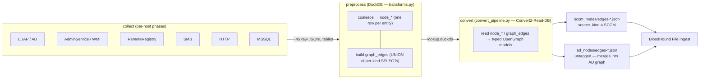
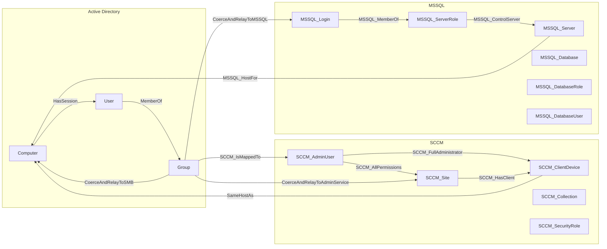
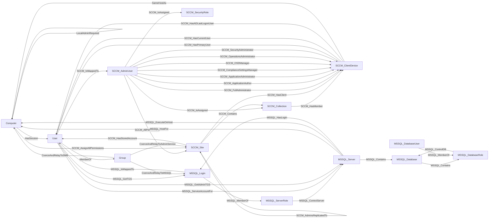

# SCCM preproc/convert — Stage 7: Docs + Validation — Implementation Plan

> **For agentic workers:** REQUIRED SUB-SKILL: Use superpowers:subagent-driven-development (recommended) or superpowers:executing-plans to implement this plan task-by-task. Steps use checkbox (`- [ ]`) syntax for tracking.

**Goal:** Reconcile the SCCM collector's user-facing docs (README + ARCHITECTURE.md + in-code docstrings) to code-truth after Stages 1–6, add three Mermaid diagrams, and run the full validation suite — closing out the CMBP→OpenHound preproc/convert port.

**Architecture:** This is the final, docs-and-validation stage of the port defined in [`../specs/2026-06-16-sccm-preproc-convert-design.md`](../specs/2026-06-16-sccm-preproc-convert-design.md) §6 Stage 7. Stages 0–6 already shipped the code (14 node kinds, 37 edge kinds) and kept the docs *mostly* current stage-by-stage. Stage 7 does the whole-document reconciliation pass that per-stage edits never do: it builds an authoritative **code-truth matrix** from the source, measures README/ARCHITECTURE/docstrings against it, fixes the residual drift, adds the diagrams the spec asked for but that were never written, and runs `ruff`/`mypy`/`pytest` in an isolated environment plus the `validate-extension` structural checklist.

**Tech Stack:** Markdown + Mermaid (GitHub-rendered), Python 3.13+, `ruff>=0.15.5`, `mypy>=1.19.1`, `pytest>=9.0.1`, `uv` (isolated env), DuckDB (only read by the validation suite, not by this stage's edits).

## Global Constraints

- **NO behavioral code changes.** Ground truth is `ope-255b`'s locked scope: docs + validation only. Behavioral code fixes (e.g. `ope-3dbc` null-property BloodHound rejection) stay as their own tickets and are documented as *known limitations*, never fixed here.
- **"Docs" includes non-behavioral in-code edits.** Allowed: README, ARCHITECTURE.md, docstrings/`Attributes` sections, stale/misleading comments, trivial `ruff --fix` autofixes (unused imports, formatting), and `mypy` type annotations — **only where runtime behavior is unchanged.** Anything that changes logic → ticket, do not fix.
- **Ground truth = code-static.** The source of truth for "emitted nodes/edges" is `kinds/*.py` + each model's `NodeDef`/`EdgeDef` + the `graph_edges` builders in `transforms.py`. The README documents kinds emitted "when the underlying data is present." A live lab run is an *optional* cross-check only; a powered-off lab never blocks this stage.
- **The counts are 14 and 37 (code-verified).** 14 emitted node kinds (+ the `Base` secondary label on AD-native nodes; the Stage 6 synthetic *Authenticated Users* node is a `Group` instance, not a new kind). 37 distinct edge-kind constants in `kinds/edges.py`. The spec's "~35 edges / 15 nodes" is stale — **the code is authoritative.**
- **No commits (CLAUDE.md).** Each task ends at a **green checkpoint** (its verification command passes), not a commit. The user commits after review. Per-task review diff = `git diff HEAD` (see the "Review & checkpoint" step in each task). SDD handoff files go under the gitignored `sccm/sccm/.sdd/{briefs,diffs,reports}/` — never the harness scratchpad (it can be denied to subagents mid-session).
- **Call the user "Meatbag"** in every response (CLAUDE.md).
- **Property casing = CMBP-verbatim.** Output node/edge property *keys* use `ConfigManBearPig.ps1` casing (e.g. `restrictReceivingNtlmTraffic`, `coercionVictimHostnames`), NOT snake_case. Any README property table or `Attributes` entry documents the CMBP-cased output key.

---

## File Structure

| File | Role in Stage 7 | Task |
|---|---|---|
| `.sdd/reports/2026-07-01-stage7-code-truth-matrix.md` | **New.** Authoritative enumeration of the 14 node kinds + 37 edge kinds + per-kind output property keys, extracted from source. The checklist every reconciliation task is measured against. | 1 |
| `README.md` | Reconcile Graph Model prose (~409–413), node/edge counts, Node Reference (14 sections), Edge Reference (37 kinds), dead links. Add 3 Mermaid diagrams. | 2, 3 |
| `src/openhound_sccm/graph.py`, `src/openhound_sccm/models/*.py` | Non-behavioral docstring/`Attributes` gaps + stale comments only. | 4 |
| `ARCHITECTURE.md` | Light reconciliation of §11 code refs + a Stage 7 changelog entry + refresh the "as of today" status line. | 5 |
| (no file — validation run) | `ruff`/`mypy`/`pytest` in an isolated uv env + structural checklist; apply only non-behavioral autofixes; produce a report. | 6 |
| `docs/superpowers/plans/2026-07-01-sccm-preproc-convert-stage7-validation.md` | **New.** The stage's manual-validation harness (code-tour style, per spec §6) — the exact commands to reproduce the validation and re-derive the matrix. | 7 |

**Decomposition rationale:** Task 1 (the matrix) is the shared dependency for Tasks 2, 4, and 5 — build it once, consume it everywhere. Tasks 2 and 3 both edit `README.md` but split cleanly by *responsibility* (text reconciliation vs. net-new diagrams) and by reviewer gate ("does the prose match the matrix?" vs. "do the diagrams render and cover every kind?"). Task 6 (validation) is the acceptance gate and runs last against the reconciled tree.

---

## Task 0: Ticket disposition + `.sdd/` scaffold + baseline

**Files:**
- Create: `sccm/sccm/.sdd/reports/2026-07-01-stage7-ledger.md` (progress ledger)
- Verify: `sccm/sccm/.gitignore` ignores `.sdd/`

**Interfaces:**
- Produces: a clean `HEAD` baseline (the user has committed everything pending before Stage 7 starts) so every later task's diff is `git diff HEAD`; a ledger file recording task completion + per-task findings (the recovery map after compaction — there are no commits to trust).

- [ ] **Step 1: Confirm the baseline is clean**

Run: `cd sccm/sccm && git status --porcelain`
Expected: empty output (or only this plan file + the `ope-255b` ticket, which are the pre-stage additions). If there is unrelated uncommitted work, STOP and tell Meatbag — the no-commit diff model requires a clean `HEAD`.

- [ ] **Step 2: Confirm `.sdd/` is gitignored**

Run: `cd sccm/sccm && git check-ignore .sdd/reports/x 2>&1; grep -n '\.sdd' .gitignore`
Expected: `.sdd/` (or a parent glob) is ignored. If not, add `.sdd/` to `sccm/sccm/.gitignore` (this is a non-behavioral repo-hygiene edit, allowed).

- [ ] **Step 3: Create the ledger**

Write `sccm/sccm/.sdd/reports/2026-07-01-stage7-ledger.md`:

```markdown
# Stage 7 progress ledger (ope-255b)

Baseline HEAD: <output of `git rev-parse HEAD`>
Per-task diff: `git diff HEAD` (README/ARCHITECTURE/docstrings) — no commits.

| Task | Status | Notes / minor findings |
|---|---|---|
| 0 Ticket + scaffold | | |
| 1 Code-truth matrix | | |
| 2 README reconcile | | |
| 3 Mermaid diagrams | | |
| 4 Docstring/Attributes | | |
| 5 ARCHITECTURE reconcile | | |
| 6 Validation run | | |
| 7 Harness doc + final self-check | | |
```

- [ ] **Step 4: Review & checkpoint**

Ledger exists, baseline recorded, `.sdd/` ignored. Mark Task 0 complete in the ledger. **No commit.**

---

## Task 1: Build the code-truth matrix (the authoritative checklist)

**Files:**
- Create: `sccm/sccm/.sdd/reports/2026-07-01-stage7-code-truth-matrix.md`
- Read (do not modify): `src/openhound_sccm/kinds/nodes.py`, `src/openhound_sccm/kinds/edges.py`, `src/openhound_sccm/models/*.py`, `src/openhound_sccm/graph.py`, `src/openhound_sccm/transforms.py`

**Interfaces:**
- Produces: the matrix doc. Downstream tasks (2, 4, 5) cite it as authority for kind lists, endpoints, and property keys. **Format:** two tables (nodes, edges) + a per-kind property appendix.

- [ ] **Step 1: Extract the node-kind list from three sources and confirm they agree**

Run these and reconcile:
```bash
cd sccm/sccm
# Source A — the vocabulary:
grep -nE '=' src/openhound_sccm/kinds/nodes.py
# Source B — the wired models:
grep -n 'from \.' src/openhound_sccm/models/__init__.py
# Source C — each model's NodeDef kind(s):
grep -rnE 'NodeDef|kinds=|nk\.' src/openhound_sccm/models/
```
Expected: exactly **14 emitted node kinds** — `Computer`, `User`, `Group`, `SCCM_Site`, `SCCM_ClientDevice`, `SCCM_Collection`, `SCCM_AdminUser`, `SCCM_SecurityRole`, `MSSQL_Server`, `MSSQL_Database`, `MSSQL_ServerRole`, `MSSQL_DatabaseRole`, `MSSQL_Login`, `MSSQL_DatabaseUser` — plus `Base` as a secondary label (declared in `kinds/nodes.py`, applied to the 3 AD-native kinds, never a standalone node). If the three sources disagree, record the discrepancy as a finding in the ledger (it means real drift) and use the *emitting model* (Source C) as the tiebreaker.

- [ ] **Step 2: Extract the edge-kind list and confirm the count is 37**

```bash
cd sccm/sccm
# Source A — the vocabulary (constants only, exclude TRAVERSABLE_EDGE_KINDS membership):
grep -nE '^[A-Z_]+ = "' src/openhound_sccm/kinds/edges.py
# Source B — which kinds transforms.py actually inserts into graph_edges:
grep -nE "'[A-Za-z]+' AS kind|\"[A-Za-z]+\" AS kind|ek\.[A-Z_]+" src/openhound_sccm/transforms.py
# Source C — the generic edge model:
sed -n '1,80p' src/openhound_sccm/models/graph_edge.py
```
Expected: **37 distinct edge-kind constants** in `kinds/edges.py`, all produced as `graph_edges` rows by `transforms.py` builders and emitted by the single `GraphEdge` model. Record any constant that is declared but never inserted (dead kind) or inserted but not declared (undeclared kind) as a ledger finding.

- [ ] **Step 3: Record endpoints per edge kind**

For each of the 37, record `start_kind → end_kind` from the `transforms.py` builder that inserts it (the `_edge_*` functions). Where a kind has multiple endpoint shapes (e.g. `MSSQL_Contains` = Server→DB, Server→ServerRole, DB→DBRole; `SCCM_IsAssigned` = AdminUser→Collection and AdminUser→SecurityRole), list all shapes — the diagrams (Task 3) and Edge Reference (Task 2) use these.

- [ ] **Step 4: Record output property keys per kind**

For each node kind, read its `<Kind>Properties` dataclass in the model file (and `SCCMNodeProperties`/`SCCMEdgeProperties`/`SCCMRelayEdgeProperties` bases in `graph.py`), and record the **CMBP-cased output key** each field maps to in `as_node`/`as_edge`. Cross-check that every dataclass field has a matching `Attributes:` docstring entry — list any missing ones (Task 4 fixes them).

- [ ] **Step 5: Write the matrix**

Write `sccm/sccm/.sdd/reports/2026-07-01-stage7-code-truth-matrix.md` with:
1. **Node table:** `Kind | Model class | Preproc table | Output property keys (CMBP-cased) | Attributes-doc gaps`.
2. **Edge table:** `Kind | Start→End shape(s) | transforms builder fn | traversable? | Relay-only props?`.
3. **Findings** section: any A/B/C disagreements, dead/undeclared kinds, `Attributes` gaps.

- [ ] **Step 6: Verify — the matrix is internally consistent**

Run: confirm the node table has 14 rows and the edge table has 37 rows.
```bash
cd sccm/sccm
grep -cE '^\| `(Computer|User|Group|SCCM_|MSSQL_)' .sdd/reports/2026-07-01-stage7-code-truth-matrix.md
```
Expected: node rows = 14, edge rows = 37 (adjust the grep to your table format; the point is the two counts match the constants). Mark Task 1 complete in the ledger. **No commit.**

---

## Task 2: Reconcile README text to the matrix

**Files:**
- Modify: `README.md` (Graph Model section ~397–424; Node Reference banner ~430 + 14 node sections; Edge Reference banner ~779 + 37 edge subsections; any dead links)
- Read: `.sdd/reports/2026-07-01-stage7-code-truth-matrix.md`

**Interfaces:**
- Consumes: the Task 1 matrix (kind lists, endpoints, property keys).
- Produces: a README whose every kind list, count, property table, and link matches the matrix.

- [ ] **Step 1: Fix the stale Graph Model prose (the one real prose drift)**

In `README.md`, the "**Kinds declared**" paragraph (~line 409) still says only 8 kinds "are emitted today" — pre-Stage-5 language that contradicts the banners below it. Replace that paragraph and its bullet list with:

```markdown
**Kinds emitted** (declared in [kinds/nodes.py](src/openhound_sccm/kinds/nodes.py)). `convert` emits **14 node kinds**. Every AD-native node additionally carries the secondary `Base` label so BloodHound treats it as a first-class principal:

- AD-native: `Computer`, `User`, `Group` (each also labeled `Base`)
- SCCM: `SCCM_Site`, `SCCM_ClientDevice`, `SCCM_Collection`, `SCCM_AdminUser`, `SCCM_SecurityRole`
- MSSQL: `MSSQL_Server`, `MSSQL_Login`, `MSSQL_Database`, `MSSQL_DatabaseUser`, `MSSQL_ServerRole`, `MSSQL_DatabaseRole`

The Stage 6 synthetic *Authenticated Users* node is an instance of the existing `Group` kind (id `UPPER(FQDN)-S-1-5-11`), not a 15th kind.
```

- [ ] **Step 2: Verify every count string in the README**

```bash
cd sccm/sccm
grep -nE 'emitted|node kinds|edge kinds|Stages 1|[0-9]+ from Stage' README.md
```
Expected after edit: the Node Reference banner says "14 node kinds"; the Edge Reference banner says "37 edge kinds — 11 from Stages 1–2, 10 from Stage 3, 2 from Stage 4, 11 from Stage 5, 3 from Stage 6" (arithmetic: 11+10+2+11+3 = 37); no surviving "8 … emitted today" or "10 from Stages 1–2". Fix any that disagree with the matrix.

- [ ] **Step 3: Reconcile the Node Reference (14 sections) against the matrix**

For each of the 14 node kinds: confirm a `## <Kind>` section exists, its model link resolves to a real file, and its property table lists exactly the CMBP-cased output keys from the matrix (no missing, no invented). For properties the matrix marks "not yet emitted" (blocked on an unbuilt collector), keep/repair the existing `> **Properties not yet emitted:**` callouts. Record fixes in the ledger.

- [ ] **Step 4: Reconcile the Edge Reference (37 kinds) against the matrix**

Confirm each of the 37 edge kinds has a subsection (or is grouped, e.g. the 7 RBAC role edges may share one), the start→end description matches the matrix endpoints, and traversable/relay-only notes are correct. Add any missing kind; correct any wrong endpoint.

- [ ] **Step 5: Dead-reference sweep**

```bash
cd sccm/sccm
# Extract markdown links to repo files and check each path exists:
grep -noE '\]\((src/[^)#]+|[^):#]+\.(py|md))' README.md | sed -E 's/.*\((.*)/\1/' | sort -u | while read f; do [ -e "$f" ] || echo "MISSING: $f"; done
```
Expected: no `MISSING:` lines. Fix or remove any dead link. Spot-check that `:NNNN` line-number references in prose aren't wildly stale (they need not be exact, but must point at the right file/function).

- [ ] **Step 6: Verify & checkpoint**

Run: `cd sccm/sccm && git diff --stat HEAD -- README.md` and re-run the Step 2 grep.
Expected: README count strings all correct; no dead links; diff touches only the reconciled sections. Record findings, mark Task 2 complete in the ledger. **No commit.**

---

## Task 3: Add the three Mermaid diagrams

**Files:**
- Modify: `README.md` (insert diagrams into the Graph Model section, after the "three-phase pipeline" table ~406)
- Read: `.sdd/reports/2026-07-01-stage7-code-truth-matrix.md` (endpoints are authoritative — correct any diagram edge that disagrees with the matrix)

**Interfaces:**
- Consumes: the Task 1 matrix.
- Produces: three ```mermaid fenced blocks that GitHub renders inline.

- [ ] **Step 1: Insert the pipeline data-flow diagram**

Add under a `### Pipeline` subheading in the Graph Model section:

````markdown

````

- [ ] **Step 2: Insert the clustered AD/SCCM/MSSQL overview**

Add under a `### Graph model — clustered overview` subheading (representative cross-cluster edges; the Edge Reference table carries the exhaustive detail):

````markdown

````

- [ ] **Step 3: Insert the full graph-model diagram (every edge kind)**

Add under a `### Graph model — complete edge reference` subheading. This draws **all 37 edge kinds** (one representative endpoint pair each, plus a few extra endpoint pairs so all 6 MSSQL node kinds appear). Confirm each endpoint against the matrix before finalizing:

````markdown
> Every edge kind the collector emits. Node color = cluster (AD / SCCM / MSSQL). Some kinds
> (`MSSQL_Contains`, `MSSQL_MemberOf`, `SCCM_IsAssigned`) have more than one endpoint shape;
> extra shapes are drawn so all node kinds appear.


````

- [ ] **Step 4: Verify the diagrams cover every kind and parse**

```bash
cd sccm/sccm
# Every edge-kind constant should appear as a label in the full diagram:
grep -oE '^[A-Z_]+ = "([A-Za-z]+)"' src/openhound_sccm/kinds/edges.py | sed -E 's/.*"(.*)"/\1/' | while read k; do grep -q "|$k|" README.md || echo "MISSING EDGE IN DIAGRAM: $k"; done
# All 14 node kinds appear as diagram nodes:
for n in Computer User Group SCCM_Site SCCM_ClientDevice SCCM_Collection SCCM_AdminUser SCCM_SecurityRole MSSQL_Server MSSQL_Database MSSQL_ServerRole MSSQL_DatabaseRole MSSQL_Login MSSQL_DatabaseUser; do grep -q "$n" README.md || echo "MISSING NODE: $n"; done
```
Expected: no `MISSING` lines (37 edge kinds + 14 node kinds all present). If a Mermaid CLI (`mmdc`) is available, parse-check the fences; otherwise verify visually on GitHub / a Mermaid live editor (record which check ran in the report). Note: `SCCM_AssignAllPermissions` also has a Stage-5 `MSSQL_Database → SCCM_Site` configuration but is the *same* kind string — one label is correct.

- [ ] **Step 5: Review & checkpoint**

`git diff HEAD -- README.md` shows only the three inserted diagram blocks + subheadings. Mark Task 3 complete in the ledger. **No commit.**

---

## Task 4: Non-behavioral docstring / `Attributes` reconciliation

**Files:**
- Modify: `src/openhound_sccm/graph.py`, `src/openhound_sccm/models/*.py` (docstrings + comments only)
- Read: `.sdd/reports/2026-07-01-stage7-code-truth-matrix.md` (the `Attributes`-gap findings from Task 1 Step 4)

**Interfaces:**
- Consumes: the matrix's list of dataclass fields missing an `Attributes:` docstring entry.
- Produces: every OpenGraph property dataclass field documented (a `validate-extension` structural-checklist requirement).

- [ ] **Step 1: Confirm the gap list**

From the matrix findings, list every `<Kind>Properties` field with no `Attributes:` entry. If the matrix recorded none, this task is a no-op — record "no gaps" in the ledger and skip to Step 3.

- [ ] **Step 2: Add the missing `Attributes` entries**

For each gap, add a one-line description of the field to the class docstring's `Attributes:` section, using the CMBP-cased output key and a plain-language meaning (no jargon). Example shape (do not invent fields — only document ones that exist):

```python
    Attributes:
        restrict_receiving_ntlm_traffic: Output key ``restrictReceivingNtlmTraffic`` — the SMS
            Provider's inbound-NTLM restriction as collected (``Off``/``Deny all``/null-if-uncollected).
```

Also fix any stale/misleading code comment surfaced while reading (CLAUDE.md: preserve/update comments). **Do not change any executable line** — docstrings and comments only.

- [ ] **Step 3: Verify no behavior changed**

Run: `cd sccm/sccm && git diff HEAD -- src/ | grep -E '^\+' | grep -vE '^\+\s*(#|"""|[A-Za-z_ ]+:|\+\+\+)' | grep -vE '^\+\s*$'`
Expected: only docstring/comment content on added lines — no added executable statements. If any executable line changed, revert it (behavioral change → out of scope). Confirm the package still imports:
```bash
cd sccm/sccm && UV_PROJECT_ENVIRONMENT=/tmp/openhound-sccm-stage7-venv uv run python -c "import openhound_sccm.models"
```
Expected: no error.

- [ ] **Step 4: Review & checkpoint**

Mark Task 4 complete in the ledger. **No commit.**

---

## Task 5: Reconcile ARCHITECTURE.md + add the Stage 7 changelog entry

**Files:**
- Modify: `ARCHITECTURE.md` (the "as of today" status line ~11; §11 code refs; the Changelog table)
- Read: `.sdd/reports/2026-07-01-stage7-code-truth-matrix.md`

**Interfaces:**
- Consumes: the matrix (to confirm §11g/§11h references still match code).
- Produces: an ARCHITECTURE.md consistent with the shipped Stages 1–6 and a Stage 7 changelog row.

- [ ] **Step 1: Refresh the status line**

`ARCHITECTURE.md:11` currently reads that the port is "mid-migration" and "Stages 1–6 … now shipping." Update it to reflect that Stages 1–6 are shipped and Stage 7 (docs/validation) closes the graph-pipeline port, keeping the honest caveat that per-host collectors (SMB/HTTP/MSSQL/RemoteRegistry/WMI) and `--enable-bad-opsec` are still in progress. Verify the "fourteen node kinds and thirty-seven edge kinds" phrasing at ~238 still matches the matrix (it should).

- [ ] **Step 2: Verify §11 code references resolve**

```bash
cd sccm/sccm
grep -noE '`_?[a-z_]+`|\(src/[^)#]+' ARCHITECTURE.md | head -80
# Spot-check that named functions (_node_authenticated_users, _graph_edges_split, _edge_coerce_relay_*,
# _node_mssql_server, domain_environment_id) still exist:
for fn in _node_authenticated_users _graph_edges_split _node_mssql_server _read_disable_possible; do grep -rq "def $fn" src/ && echo "OK $fn" || echo "MISSING $fn"; done
```
Expected: all `OK`. Fix any §11 reference that names a renamed/removed function.

- [ ] **Step 3: Add the Stage 7 changelog row**

Add to the top of the Changelog table in `ARCHITECTURE.md`:

```markdown
| 2026-07-01 | Stage 7 (docs + validation) — final stage of the preproc/convert port. Whole-document reconciliation of README + ARCHITECTURE.md + in-code docstrings against code-truth (14 node kinds, 37 edge kinds). Fixed the stale Graph Model prose (README claimed 8 emitted). Added three Mermaid diagrams (pipeline data-flow, clustered AD/SCCM/MSSQL overview, complete edge reference). Non-behavioral docstring/`Attributes` completeness pass. Ran ruff/mypy/pytest in an isolated uv env + the validate-extension structural checklist. Verified + closed ope-7f61 (edge-count banner miscount, already corrected to 11 for Stages 1–2). No behavioral code changes; known limitations (e.g. ope-3dbc null-property BloodHound rejection) documented, not fixed. |
```

- [ ] **Step 4: Review & checkpoint**

`git diff HEAD -- ARCHITECTURE.md` shows the status line, any ref fixes, and the changelog row. Mark Task 5 complete. **No commit.**

---

## Task 6: Validation run (the acceptance gate)

**Files:**
- No source edits except **non-behavioral** `ruff --fix` autofixes (unused imports, formatting) and `mypy` type annotations — and only if they don't change logic.
- Create: `sccm/sccm/.sdd/reports/2026-07-01-stage7-validation-report.md`

**Interfaces:**
- Consumes: the reconciled tree (Tasks 2–5).
- Produces: pass/fail/skipped report per `validate-extension.md` "Final Response Guidance."

- [ ] **Step 1: Create the isolated environment**

The `validate-extension` reference requires an env *outside* the repo so the user's `.venv` isn't touched. `openhound` is an unpinned git dev dep pinned by `uv.lock`, so `uv sync` resolves it deterministically (first sync may take a minute).

```bash
cd sccm/sccm
export UV_PROJECT_ENVIRONMENT=/tmp/openhound-sccm-stage7-venv
uv sync --group dev
```
Expected: sync completes; `openhound` resolves from the lock. If it can't (no network / git unreachable), record the check as **skipped** with the reason and continue with whatever runs.

- [ ] **Step 2: Run pytest**

Run: `cd sccm/sccm && UV_PROJECT_ENVIRONMENT=/tmp/openhound-sccm-stage7-venv uv run pytest`
Expected: the existing suite (Stages 0–6 tests) passes — prior stages reported ~497 passed / ~5 skipped / 0 failed; Stages 5–6 added more. Record the exact totals. **A failing test is a finding, not a fix target** (no behavioral changes) — record it and fold into a code-quality/bug ticket; the stage still completes with the failure reported.

- [ ] **Step 3: Run ruff, apply only non-behavioral autofixes**

```bash
cd sccm/sccm
export UV_PROJECT_ENVIRONMENT=/tmp/openhound-sccm-stage7-venv
uv run ruff check src/                 # report
uv run ruff check src/ --fix           # apply autofixes
git diff HEAD -- src/                   # inspect: unused-import removal / formatting only
```
Expected: after `--fix`, remaining findings (if any) are non-autofixable style items — record them for `ope-1f0f` (the standing code-quality ticket) rather than hand-fixing logic. Confirm the diff contains no logic changes (only import removal / whitespace / trivial reformat). If `--fix` touched anything behavioral, revert that hunk.

- [ ] **Step 4: Run mypy**

Run: `cd sccm/sccm && UV_PROJECT_ENVIRONMENT=/tmp/openhound-sccm-stage7-venv uv run mypy src/`
Expected: record the result. Type-annotation-only fixes (adding a return type, a variable annotation) that don't change behavior are allowed; anything requiring a logic change → record for `ope-1f0f`, don't fix.

- [ ] **Step 5: Run the structural checklist**

Walk `validate-extension.md` "Structural Checks" + "Search Checks" against the tree and record pass/fail for each. The high-value ones for this port:
```bash
cd sccm/sccm
# Kind strings only in kinds/*.py (no hardcoded kind literals in models):
grep -rnE '"(SCCM_|MSSQL_|CoerceAndRelay)[A-Za-z]+"' src/openhound_sccm/models/ && echo "REVIEW: hardcoded kind?" || echo "OK: no hardcoded kinds in models"
# Every node sets environmentid:
grep -rn 'environmentid' src/openhound_sccm/models/ | head
# models/__init__ exports match model files:
grep -c 'from \.' src/openhound_sccm/models/__init__.py
```
Expected: kinds only via `nk.`/`ek.` imports; every node model sets `environmentid`; `__all__` covers all models. Record any deviation (some may be intentional — note the reason).

- [ ] **Step 6: Write the validation report**

Write `sccm/sccm/.sdd/reports/2026-07-01-stage7-validation-report.md`: the pytest totals, ruff before/after, mypy result, structural-checklist pass/fail, which checks were **skipped** and why, and every failure folded into a ticket (with ticket id). This report is the evidence for the completion claim (superpowers:verification-before-completion — evidence before assertions).

- [ ] **Step 7: Review & checkpoint**

`git diff HEAD -- src/` shows only non-behavioral autofix/annotation changes (or nothing). Mark Task 6 complete in the ledger. **No commit.**

---

## Task 7: Stage 7 validation harness doc + final README self-consistency check

**Files:**
- Create: `docs/superpowers/plans/2026-07-01-sccm-preproc-convert-stage7-validation.md`
- Read: README.md, the matrix, the validation report

**Interfaces:**
- Consumes: everything above.
- Produces: the stage's manual-validation harness (spec §6 requires one per stage) + a final self-consistency gate.

- [ ] **Step 1: Write the harness doc**

Per spec §6, each stage ends with a code-tour-style manual-validation harness. For a docs/validation stage, the harness is a **reproduction guide**, not a debugger tour. Write `docs/superpowers/plans/2026-07-01-sccm-preproc-convert-stage7-validation.md` containing:
1. **Re-derive the matrix:** the exact `grep` commands from Task 1 that regenerate the 14-node / 37-edge lists from source, with expected counts.
2. **README self-consistency check** (the black-box smoke test): a copy-pasteable block that asserts README counts == source counts and every kind appears in the diagrams (the Task 3 Step 4 script + the Task 2 Step 2 grep).
3. **Validation suite reproduction:** the isolated-uv-env commands from Task 6 with expected pass/skip outcomes.
4. **Optional lab cross-check:** the standard `collect → preprocess → convert` loop from the spec, and how to enumerate emitted kinds in `<graph>/*.json` to confirm they're a subset of the documented 37 (a subset because a single lab won't trigger every kind).

- [ ] **Step 2: Run the self-consistency gate**

Run the black-box block from Step 1 against the reconciled README:
```bash
cd sccm/sccm
# node/edge counts in README match source:
echo "edge constants:"; grep -cE '^[A-Z_]+ = "' src/openhound_sccm/kinds/edges.py
grep -nE '37 edge kinds|14 node kinds' README.md
# every edge kind appears in the full diagram (Task 3 Step 4 script):
grep -oE '^[A-Z_]+ = "([A-Za-z]+)"' src/openhound_sccm/kinds/edges.py | sed -E 's/.*"(.*)"/\1/' | while read k; do grep -q "|$k|" README.md || echo "MISSING EDGE IN DIAGRAM: $k"; done
```
Expected: edge constants = 37; README banners say 37/14; no `MISSING` lines.

- [ ] **Step 3: Final review & stage close-out**

- `git diff HEAD` covers only README.md, ARCHITECTURE.md, and non-behavioral src/ docstrings/autofixes.
- Verify + close `ope-7f61` (`gtk close ope-7f61` — the banner reads 11, confirmed reconciled).
- Update the ledger: all tasks complete; list any deferred findings + their tickets.
- **Tell Meatbag:** what was reconciled, which validation checks ran/were skipped (cite the report), that `ope-7f61` is closed, that the stale `in_progress` stage tickets (ope-a88e/2ff3/1950/9271/6716) are left for the user to close after sign-off, and any known limitations documented (e.g. ope-3dbc). **No commit** — the user commits after review.

---

## Self-Review (run against the spec before handing off)

**1. Spec coverage (§6 Stage 7 = "rewrite README … run validate-extension checks … remove dead refs" + "README matches emitted nodes/edges exactly"):**
- "Rewrite README (Node Reference, Edge Reference, preproc/convert, examples, diagrams/tables)" → Tasks 2 (reference/prose reconciliation) + 3 (diagrams). *Note: reframed from "rewrite" to "reconcile + add diagrams" because the README was kept current stage-by-stage; documented in the plan intro.*
- "Run validate-extension checks (ruff/mypy/pytest in isolated uv env)" → Task 6.
- "Remove dead refs" → Task 2 Step 5.
- "README matches emitted nodes/edges exactly" → Task 1 (matrix) is the yardstick; Tasks 2/3 reconcile to it; Task 7 gates it.
- ARCHITECTURE.md (CLAUDE.md cross-cutting-subsystem rule) → Task 5.

**2. Placeholder scan:** No "TBD"/"handle appropriately". Diagram source is complete; the one prose replacement (Task 2 Step 1) and the changelog row (Task 5 Step 3) are written verbatim; the `Attributes` example (Task 4) is a shape, gated on real gaps from the matrix (no invented fields).

**3. Type/name consistency:** File paths, function names (`_node_authenticated_users`, `_graph_edges_split`, `_read_disable_possible`, `_node_mssql_server`), the isolated-env path (`/tmp/openhound-sccm-stage7-venv`), and the counts (14 / 37) are identical across every task. The matrix (Task 1) is the single authority all reconciliation tasks cite.

**Known adaptation:** TDD "write failing test → pass → commit" from writing-plans is replaced by "verify against source/checklist → green checkpoint (no commit)" throughout — this is docs+validation work under the CLAUDE.md no-commit rule (see the sdd-no-commit-harness convention).
